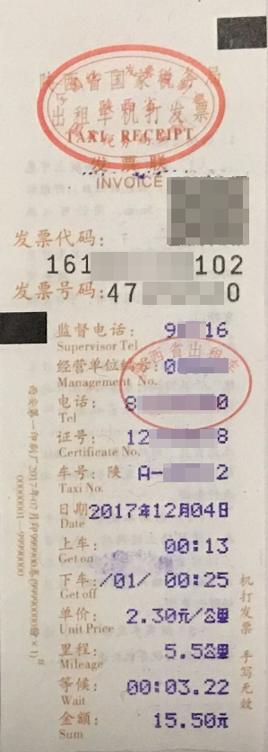

# 出租车发票识别<a name="ocr_03_0110"></a>

## 功能介绍<a name="section2043184785415"></a>

识别出租车发票中的文字信息，并以json格式返回识别的结构化结果。该接口的使用限制请参见[约束与限制](https://support.huaweicloud.com/productdesc-ocr/ocr_01_0006.html#section17)，详细使用指导请参见[OCR服务使用简介](https://support.huaweicloud.com/qs-ocr/ocr_05_0001.html)章节。

**图 1**  出租车发票识别示例图<a name="fig2256104262716"></a>  


> **说明：** 
>如果图片中包含多张卡证票据，请调用[智能分类识别](智能分类识别.md)服务。

## 调试<a name="section11267199217"></a>

您可以在[API Explorer](https://apiexplorer.developer.huaweicloud.com/apiexplorer/doc?product=OCR&api=RecognizeTaxiInvoice)中调试该接口。

## 前提条件<a name="section17299143617379"></a>

在使用出租车发票识别之前，需要您完成服务申请和认证鉴权，具体操作流程请参见[申请服务](申请服务.md)和[认证鉴权](认证鉴权.md)章节。

> **说明：** 
>用户首次使用需要先[申请开通](https://console.huaweicloud.com/ocr/?region=cn-north-4#/ocr/overview)。服务只需要开通一次即可，后面使用时无需再次申请。如未开通服务，调用服务时会提示ModelArts.4204报错，请在调用服务前先进入控制台开通服务，并注意开通服务区域与调用服务的区域保持一致。

## URI<a name="section3201239551"></a>

POST  https://\{endpoint\}/v2/\{project\_id\}/ocr/taxi-invoice

**表 1**  路径参数

<a name="table1757114411019"></a>
<table><thead align="left"><tr id="row244311551906"><th class="cellrowborder" valign="top" width="20%" id="mcps1.2.4.1.1"><p id="p15443125512018"><a name="p15443125512018"></a><a name="p15443125512018"></a>参数</p>
</th>
<th class="cellrowborder" valign="top" width="20%" id="mcps1.2.4.1.2"><p id="p14431555504"><a name="p14431555504"></a><a name="p14431555504"></a>是否必选</p>
</th>
<th class="cellrowborder" valign="top" width="60%" id="mcps1.2.4.1.3"><p id="p1444145517013"><a name="p1444145517013"></a><a name="p1444145517013"></a>说明</p>
</th>
</tr>
</thead>
<tbody><tr id="row613718443010"><td class="cellrowborder" valign="top" width="20%" headers="mcps1.2.4.1.1 "><p id="p191375441708"><a name="p191375441708"></a><a name="p191375441708"></a>endpoint</p>
</td>
<td class="cellrowborder" valign="top" width="20%" headers="mcps1.2.4.1.2 "><p id="p81375441015"><a name="p81375441015"></a><a name="p81375441015"></a>是</p>
</td>
<td class="cellrowborder" valign="top" width="60%" headers="mcps1.2.4.1.3 "><p id="p1928291782612"><a name="p1928291782612"></a><a name="p1928291782612"></a>指定承载REST服务端点的服务器域名或IP，不同服务不同区域的endpoint不同，您可以从<a href="终端节点.md">终端节点</a>中获取。</p>
<p id="p85151503246"><a name="p85151503246"></a><a name="p85151503246"></a>例如，OCR服务在<span class="parmvalue" id="parmvalue832520377716"><a name="parmvalue832520377716"></a><a name="parmvalue832520377716"></a>“华北-北京四”</span>区域的<span class="parmname" id="parmname211216411978"><a name="parmname211216411978"></a><a name="parmname211216411978"></a>“endpoint”</span>为<span class="parmvalue" id="parmvalue998414713715"><a name="parmvalue998414713715"></a><a name="parmvalue998414713715"></a>“ocr.cn-north-4.myhuaweicloud.com”</span>。</p>
</td>
</tr>
<tr id="row205461118368"><td class="cellrowborder" valign="top" width="20%" headers="mcps1.2.4.1.1 "><p id="p95451117360"><a name="p95451117360"></a><a name="p95451117360"></a>project_id</p>
</td>
<td class="cellrowborder" valign="top" width="20%" headers="mcps1.2.4.1.2 "><p id="p16541111361"><a name="p16541111361"></a><a name="p16541111361"></a>是</p>
</td>
<td class="cellrowborder" valign="top" width="60%" headers="mcps1.2.4.1.3 "><p id="p20544119368"><a name="p20544119368"></a><a name="p20544119368"></a>项目ID，您可以从<a href="获取项目ID.md">获取项目ID</a>中获取。</p>
</td>
</tr>
</tbody>
</table>

## 请求参数<a name="section78131321175514"></a>

**表 2**  请求Header参数

<a name="table723982483111"></a>
<table><thead align="left"><tr id="row52401924193111"><th class="cellrowborder" valign="top" width="20%" id="mcps1.2.5.1.1"><p id="p1924082410316"><a name="p1924082410316"></a><a name="p1924082410316"></a>参数</p>
</th>
<th class="cellrowborder" valign="top" width="20%" id="mcps1.2.5.1.2"><p id="p12404242315"><a name="p12404242315"></a><a name="p12404242315"></a>是否必选</p>
</th>
<th class="cellrowborder" valign="top" width="20%" id="mcps1.2.5.1.3"><p id="p1924019242314"><a name="p1924019242314"></a><a name="p1924019242314"></a>参数类型</p>
</th>
<th class="cellrowborder" valign="top" width="40%" id="mcps1.2.5.1.4"><p id="p92404245319"><a name="p92404245319"></a><a name="p92404245319"></a>描述</p>
</th>
</tr>
</thead>
<tbody><tr id="row1624062423110"><td class="cellrowborder" valign="top" width="20%" headers="mcps1.2.5.1.1 "><p id="p82401524193115"><a name="p82401524193115"></a><a name="p82401524193115"></a>X-Auth-Token</p>
</td>
<td class="cellrowborder" valign="top" width="20%" headers="mcps1.2.5.1.2 "><p id="p1224017242315"><a name="p1224017242315"></a><a name="p1224017242315"></a>是</p>
</td>
<td class="cellrowborder" valign="top" width="20%" headers="mcps1.2.5.1.3 "><p id="p1424016242318"><a name="p1424016242318"></a><a name="p1424016242318"></a>String</p>
</td>
<td class="cellrowborder" valign="top" width="40%" headers="mcps1.2.5.1.4 "><p id="p62408249311"><a name="p62408249311"></a><a name="p62408249311"></a>用户Token。</p>
<p id="p87711532113213"><a name="p87711532113213"></a><a name="p87711532113213"></a>Token认证就是在调用API的时候将Token加到请求消息头，从而通过身份认证，获得操作API的权限，响应消息头中X-Subject-Token的值即为Token。</p>
</td>
</tr>
<tr id="row5181151419124"><td class="cellrowborder" valign="top" width="20%" headers="mcps1.2.5.1.1 "><p id="p620162911477"><a name="p620162911477"></a><a name="p620162911477"></a>Content-Type</p>
</td>
<td class="cellrowborder" valign="top" width="20%" headers="mcps1.2.5.1.2 "><p id="p122082984710"><a name="p122082984710"></a><a name="p122082984710"></a>是</p>
</td>
<td class="cellrowborder" valign="top" width="20%" headers="mcps1.2.5.1.3 "><p id="p12017295472"><a name="p12017295472"></a><a name="p12017295472"></a>String</p>
</td>
<td class="cellrowborder" valign="top" width="40%" headers="mcps1.2.5.1.4 "><p id="p62022944710"><a name="p62022944710"></a><a name="p62022944710"></a>发送的实体的MIME类型，参数值为“application/json”。</p>
</td>
</tr>
</tbody>
</table>

**表 3**  请求Body参数

<a name="table12874063514"></a>
<table><thead align="left"><tr id="row1132134012356"><th class="cellrowborder" valign="top" width="15.770000000000001%" id="mcps1.2.5.1.1"><p id="p2032164033519"><a name="p2032164033519"></a><a name="p2032164033519"></a>参数</p>
</th>
<th class="cellrowborder" valign="top" width="16.09%" id="mcps1.2.5.1.2"><p id="p032116403353"><a name="p032116403353"></a><a name="p032116403353"></a>是否必选</p>
</th>
<th class="cellrowborder" valign="top" width="13.270000000000001%" id="mcps1.2.5.1.3"><p id="p1432144083518"><a name="p1432144083518"></a><a name="p1432144083518"></a>参数类型</p>
</th>
<th class="cellrowborder" valign="top" width="54.87%" id="mcps1.2.5.1.4"><p id="p232115408352"><a name="p232115408352"></a><a name="p232115408352"></a>说明</p>
</th>
</tr>
</thead>
<tbody><tr id="row1232124033519"><td class="cellrowborder" valign="top" width="15.770000000000001%" headers="mcps1.2.5.1.1 "><p id="p7321124083513"><a name="p7321124083513"></a><a name="p7321124083513"></a>image</p>
</td>
<td class="cellrowborder" valign="top" width="16.09%" headers="mcps1.2.5.1.2 "><p id="p5814551626"><a name="p5814551626"></a><a name="p5814551626"></a>否，该参数与url二选一</p>
</td>
<td class="cellrowborder" valign="top" width="13.270000000000001%" headers="mcps1.2.5.1.3 "><p id="p832124013517"><a name="p832124013517"></a><a name="p832124013517"></a>String</p>
</td>
<td class="cellrowborder" valign="top" width="54.87%" headers="mcps1.2.5.1.4 "><p id="p14943171191916"><a name="p14943171191916"></a><a name="p14943171191916"></a>图像数据，base64编码，要求base64编码后大小不超过10MB。</p>
<p id="p1432194023513"><a name="p1432194023513"></a><a name="p1432194023513"></a>图片最小边不小于15px，最长边不超过4096px，支持JPEG、JPG、PNG、BMP、TIFF格式。</p>
</td>
</tr>
<tr id="row1042544161818"><td class="cellrowborder" valign="top" width="15.770000000000001%" headers="mcps1.2.5.1.1 "><p id="p14453132574912"><a name="p14453132574912"></a><a name="p14453132574912"></a>url</p>
</td>
<td class="cellrowborder" valign="top" width="16.09%" headers="mcps1.2.5.1.2 "><p id="p1453192511499"><a name="p1453192511499"></a><a name="p1453192511499"></a>否，该参数与image二选一</p>
</td>
<td class="cellrowborder" valign="top" width="13.270000000000001%" headers="mcps1.2.5.1.3 "><p id="p045315256490"><a name="p045315256490"></a><a name="p045315256490"></a>String</p>
</td>
<td class="cellrowborder" valign="top" width="54.87%" headers="mcps1.2.5.1.4 "><p id="p86827584714"><a name="p86827584714"></a><a name="p86827584714"></a>图片的url路径，目前支持：</p>
<a name="ul42174521583"></a><a name="ul42174521583"></a><ul id="ul42174521583"><li>公网http/https url</li><li>OBS提供的url，使用OBS数据需要进行授权。包括对服务授权、临时授权、匿名公开授权，详情参见<a href="配置OBS访问权限.md">配置OBS访问权限</a>。</li></ul>
<div class="note" id="note1822116578284"><a name="note1822116578284"></a><a name="note1822116578284"></a><span class="notetitle"> 说明： </span><div class="notebody"><a name="ul99367258155"></a><a name="ul99367258155"></a><ul id="ul99367258155"><li>接口响应时间依赖于图片的下载时间，如果图片下载时间过长，会返回接口调用失败。</li></ul>
<a name="ul156081829151514"></a><a name="ul156081829151514"></a><ul id="ul156081829151514"><li>请保证被检测图片所在的存储服务稳定可靠，推荐使用OBS服务存储图片数据。</li></ul>
</div></div>
</td>
</tr>
</tbody>
</table>

## 响应参数<a name="section1075536115617"></a>

根据识别的结果，可能有不同的HTTP响应状态码（status code），状态码和响应参数说明如下。

**状态码： 200**

**表 4**  响应Body参数

<a name="responseParameter"></a>
<table><thead align="left"><tr id="row1811422917348"><th class="cellrowborder" valign="top" width="24.05%" id="mcps1.2.4.1.1"><p id="p11115929103411"><a name="p11115929103411"></a><a name="p11115929103411"></a>参数</p>
</th>
<th class="cellrowborder" valign="top" width="16.57%" id="mcps1.2.4.1.2"><p id="p2011592993413"><a name="p2011592993413"></a><a name="p2011592993413"></a>参数类型</p>
</th>
<th class="cellrowborder" valign="top" width="59.38%" id="mcps1.2.4.1.3"><p id="p71168298344"><a name="p71168298344"></a><a name="p71168298344"></a>描述</p>
</th>
</tr>
</thead>
<tbody><tr id="row1811402973420"><td class="cellrowborder" valign="top" width="24.05%" headers="mcps1.2.4.1.1 "><p id="p31162295342"><a name="p31162295342"></a><a name="p31162295342"></a>result</p>
</td>
<td class="cellrowborder" valign="top" width="16.57%" headers="mcps1.2.4.1.2 "><p id="p2011652918349"><a name="p2011652918349"></a><a name="p2011652918349"></a><a href="#response_TaxiInvoiceResultBody">TaxiInvoiceResult</a> object</p>
</td>
<td class="cellrowborder" valign="top" width="59.38%" headers="mcps1.2.4.1.3 "><p id="p1711711290345"><a name="p1711711290345"></a><a name="p1711711290345"></a>调用成功时表示调用结果。</p>
<p id="p81171295342"><a name="p81171295342"></a><a name="p81171295342"></a>调用失败时无此字段。</p>
</td>
</tr>
</tbody>
</table>

**表 5**  TaxiInvoiceResult

<a name="response_TaxiInvoiceResultBody"></a>
<table><thead align="left"><tr id="row1211882919345"><th class="cellrowborder" valign="top" width="24.05%" id="mcps1.2.4.1.1"><p id="p17119202912345"><a name="p17119202912345"></a><a name="p17119202912345"></a>参数</p>
</th>
<th class="cellrowborder" valign="top" width="16.57%" id="mcps1.2.4.1.2"><p id="p17120122943418"><a name="p17120122943418"></a><a name="p17120122943418"></a>参数类型</p>
</th>
<th class="cellrowborder" valign="top" width="59.38%" id="mcps1.2.4.1.3"><p id="p3120152919340"><a name="p3120152919340"></a><a name="p3120152919340"></a>描述</p>
</th>
</tr>
</thead>
<tbody><tr id="row81188297347"><td class="cellrowborder" valign="top" width="24.05%" headers="mcps1.2.4.1.1 "><p id="p1212012919344"><a name="p1212012919344"></a><a name="p1212012919344"></a>location</p>
</td>
<td class="cellrowborder" valign="top" width="16.57%" headers="mcps1.2.4.1.2 "><p id="p16121929113410"><a name="p16121929113410"></a><a name="p16121929113410"></a>String</p>
</td>
<td class="cellrowborder" valign="top" width="59.38%" headers="mcps1.2.4.1.3 "><p id="p91211729203419"><a name="p91211729203419"></a><a name="p91211729203419"></a>归属地区。</p>
</td>
</tr>
<tr id="row111181029153417"><td class="cellrowborder" valign="top" width="24.05%" headers="mcps1.2.4.1.1 "><p id="p161217295346"><a name="p161217295346"></a><a name="p161217295346"></a>code</p>
</td>
<td class="cellrowborder" valign="top" width="16.57%" headers="mcps1.2.4.1.2 "><p id="p1712218292342"><a name="p1712218292342"></a><a name="p1712218292342"></a>String</p>
</td>
<td class="cellrowborder" valign="top" width="59.38%" headers="mcps1.2.4.1.3 "><p id="p91221729143414"><a name="p91221729143414"></a><a name="p91221729143414"></a>发票代码。</p>
</td>
</tr>
<tr id="row4118102912341"><td class="cellrowborder" valign="top" width="24.05%" headers="mcps1.2.4.1.1 "><p id="p1312352903410"><a name="p1312352903410"></a><a name="p1312352903410"></a>number</p>
</td>
<td class="cellrowborder" valign="top" width="16.57%" headers="mcps1.2.4.1.2 "><p id="p14123152943418"><a name="p14123152943418"></a><a name="p14123152943418"></a>String</p>
</td>
<td class="cellrowborder" valign="top" width="59.38%" headers="mcps1.2.4.1.3 "><p id="p81231229143414"><a name="p81231229143414"></a><a name="p81231229143414"></a>发票号码。</p>
</td>
</tr>
<tr id="row1711892911345"><td class="cellrowborder" valign="top" width="24.05%" headers="mcps1.2.4.1.1 "><p id="p512492953417"><a name="p512492953417"></a><a name="p512492953417"></a>phone_number</p>
</td>
<td class="cellrowborder" valign="top" width="16.57%" headers="mcps1.2.4.1.2 "><p id="p151245294344"><a name="p151245294344"></a><a name="p151245294344"></a>String</p>
</td>
<td class="cellrowborder" valign="top" width="59.38%" headers="mcps1.2.4.1.3 "><p id="p4124182903416"><a name="p4124182903416"></a><a name="p4124182903416"></a>电话（包括电话、监督电话）。</p>
</td>
</tr>
<tr id="row14118182915348"><td class="cellrowborder" valign="top" width="24.05%" headers="mcps1.2.4.1.1 "><p id="p112517296348"><a name="p112517296348"></a><a name="p112517296348"></a>company</p>
</td>
<td class="cellrowborder" valign="top" width="16.57%" headers="mcps1.2.4.1.2 "><p id="p3125929153418"><a name="p3125929153418"></a><a name="p3125929153418"></a>String</p>
</td>
<td class="cellrowborder" valign="top" width="59.38%" headers="mcps1.2.4.1.3 "><p id="p11125112963419"><a name="p11125112963419"></a><a name="p11125112963419"></a>单位。</p>
</td>
</tr>
<tr id="row15118129163410"><td class="cellrowborder" valign="top" width="24.05%" headers="mcps1.2.4.1.1 "><p id="p1412692983415"><a name="p1412692983415"></a><a name="p1412692983415"></a>taxi_number</p>
</td>
<td class="cellrowborder" valign="top" width="16.57%" headers="mcps1.2.4.1.2 "><p id="p3126102913344"><a name="p3126102913344"></a><a name="p3126102913344"></a>String</p>
</td>
<td class="cellrowborder" valign="top" width="59.38%" headers="mcps1.2.4.1.3 "><p id="p1512682914348"><a name="p1512682914348"></a><a name="p1512682914348"></a>车号。</p>
</td>
</tr>
<tr id="row411819290348"><td class="cellrowborder" valign="top" width="24.05%" headers="mcps1.2.4.1.1 "><p id="p101271829183418"><a name="p101271829183418"></a><a name="p101271829183418"></a>certificate_number</p>
</td>
<td class="cellrowborder" valign="top" width="16.57%" headers="mcps1.2.4.1.2 "><p id="p112792953411"><a name="p112792953411"></a><a name="p112792953411"></a>String</p>
</td>
<td class="cellrowborder" valign="top" width="59.38%" headers="mcps1.2.4.1.3 "><p id="p141272293346"><a name="p141272293346"></a><a name="p141272293346"></a>证号。</p>
</td>
</tr>
<tr id="row311892915341"><td class="cellrowborder" valign="top" width="24.05%" headers="mcps1.2.4.1.1 "><p id="p12128182973416"><a name="p12128182973416"></a><a name="p12128182973416"></a>identification_number</p>
</td>
<td class="cellrowborder" valign="top" width="16.57%" headers="mcps1.2.4.1.2 "><p id="p312832913347"><a name="p312832913347"></a><a name="p312832913347"></a>String</p>
</td>
<td class="cellrowborder" valign="top" width="59.38%" headers="mcps1.2.4.1.3 "><p id="p7128112914348"><a name="p7128112914348"></a><a name="p7128112914348"></a>识别编号。</p>
</td>
</tr>
<tr id="row1211817297349"><td class="cellrowborder" valign="top" width="24.05%" headers="mcps1.2.4.1.1 "><p id="p512922911346"><a name="p512922911346"></a><a name="p512922911346"></a>date</p>
</td>
<td class="cellrowborder" valign="top" width="16.57%" headers="mcps1.2.4.1.2 "><p id="p4129142914340"><a name="p4129142914340"></a><a name="p4129142914340"></a>String</p>
</td>
<td class="cellrowborder" valign="top" width="59.38%" headers="mcps1.2.4.1.3 "><p id="p1212915299346"><a name="p1212915299346"></a><a name="p1212915299346"></a>开票日期。</p>
</td>
</tr>
<tr id="row7118829133413"><td class="cellrowborder" valign="top" width="24.05%" headers="mcps1.2.4.1.1 "><p id="p14130429163415"><a name="p14130429163415"></a><a name="p14130429163415"></a>boarding_time</p>
</td>
<td class="cellrowborder" valign="top" width="16.57%" headers="mcps1.2.4.1.2 "><p id="p81306295347"><a name="p81306295347"></a><a name="p81306295347"></a>String</p>
</td>
<td class="cellrowborder" valign="top" width="59.38%" headers="mcps1.2.4.1.3 "><p id="p1913012911343"><a name="p1913012911343"></a><a name="p1913012911343"></a>上车时间。</p>
</td>
</tr>
<tr id="row7118729133416"><td class="cellrowborder" valign="top" width="24.05%" headers="mcps1.2.4.1.1 "><p id="p11311293341"><a name="p11311293341"></a><a name="p11311293341"></a>alighting_time</p>
</td>
<td class="cellrowborder" valign="top" width="16.57%" headers="mcps1.2.4.1.2 "><p id="p31311029153414"><a name="p31311029153414"></a><a name="p31311029153414"></a>String</p>
</td>
<td class="cellrowborder" valign="top" width="59.38%" headers="mcps1.2.4.1.3 "><p id="p12131229123418"><a name="p12131229123418"></a><a name="p12131229123418"></a>下车时间。</p>
</td>
</tr>
<tr id="row611852916343"><td class="cellrowborder" valign="top" width="24.05%" headers="mcps1.2.4.1.1 "><p id="p2013282963414"><a name="p2013282963414"></a><a name="p2013282963414"></a>time</p>
</td>
<td class="cellrowborder" valign="top" width="16.57%" headers="mcps1.2.4.1.2 "><p id="p1913218291340"><a name="p1913218291340"></a><a name="p1913218291340"></a>String</p>
</td>
<td class="cellrowborder" valign="top" width="59.38%" headers="mcps1.2.4.1.3 "><p id="p3132112914346"><a name="p3132112914346"></a><a name="p3132112914346"></a>时间(起止时间、上下车时间)。</p>
</td>
</tr>
<tr id="row20118029193410"><td class="cellrowborder" valign="top" width="24.05%" headers="mcps1.2.4.1.1 "><p id="p713313294341"><a name="p713313294341"></a><a name="p713313294341"></a>unit_price</p>
</td>
<td class="cellrowborder" valign="top" width="16.57%" headers="mcps1.2.4.1.2 "><p id="p613362943418"><a name="p613362943418"></a><a name="p613362943418"></a>String</p>
</td>
<td class="cellrowborder" valign="top" width="59.38%" headers="mcps1.2.4.1.3 "><p id="p20134102910349"><a name="p20134102910349"></a><a name="p20134102910349"></a>单价。</p>
</td>
</tr>
<tr id="row121191329123419"><td class="cellrowborder" valign="top" width="24.05%" headers="mcps1.2.4.1.1 "><p id="p6134329193414"><a name="p6134329193414"></a><a name="p6134329193414"></a>distance</p>
</td>
<td class="cellrowborder" valign="top" width="16.57%" headers="mcps1.2.4.1.2 "><p id="p4134229163416"><a name="p4134229163416"></a><a name="p4134229163416"></a>String</p>
</td>
<td class="cellrowborder" valign="top" width="59.38%" headers="mcps1.2.4.1.3 "><p id="p1135729113410"><a name="p1135729113410"></a><a name="p1135729113410"></a>总里程。</p>
</td>
</tr>
<tr id="row1811952923418"><td class="cellrowborder" valign="top" width="24.05%" headers="mcps1.2.4.1.1 "><p id="p181355294346"><a name="p181355294346"></a><a name="p181355294346"></a>waiting_time</p>
</td>
<td class="cellrowborder" valign="top" width="16.57%" headers="mcps1.2.4.1.2 "><p id="p1313512297345"><a name="p1313512297345"></a><a name="p1313512297345"></a>String</p>
</td>
<td class="cellrowborder" valign="top" width="59.38%" headers="mcps1.2.4.1.3 "><p id="p513562919341"><a name="p513562919341"></a><a name="p513562919341"></a>等候时间。</p>
</td>
</tr>
<tr id="row3119142918349"><td class="cellrowborder" valign="top" width="24.05%" headers="mcps1.2.4.1.1 "><p id="p17136162915344"><a name="p17136162915344"></a><a name="p17136162915344"></a>fare</p>
</td>
<td class="cellrowborder" valign="top" width="16.57%" headers="mcps1.2.4.1.2 "><p id="p1613632914344"><a name="p1613632914344"></a><a name="p1613632914344"></a>String</p>
</td>
<td class="cellrowborder" valign="top" width="59.38%" headers="mcps1.2.4.1.3 "><p id="p2136182917342"><a name="p2136182917342"></a><a name="p2136182917342"></a>金额。</p>
</td>
</tr>
<tr id="row111191629103418"><td class="cellrowborder" valign="top" width="24.05%" headers="mcps1.2.4.1.1 "><p id="p7137202917348"><a name="p7137202917348"></a><a name="p7137202917348"></a>fuel_oil_surcharge</p>
</td>
<td class="cellrowborder" valign="top" width="16.57%" headers="mcps1.2.4.1.2 "><p id="p121371294346"><a name="p121371294346"></a><a name="p121371294346"></a>String</p>
</td>
<td class="cellrowborder" valign="top" width="59.38%" headers="mcps1.2.4.1.3 "><p id="p141381529183417"><a name="p141381529183417"></a><a name="p141381529183417"></a>燃油附加费。</p>
</td>
</tr>
<tr id="row1911972933412"><td class="cellrowborder" valign="top" width="24.05%" headers="mcps1.2.4.1.1 "><p id="p121381829203415"><a name="p121381829203415"></a><a name="p121381829203415"></a>call_service_surcharge</p>
</td>
<td class="cellrowborder" valign="top" width="16.57%" headers="mcps1.2.4.1.2 "><p id="p1313802919343"><a name="p1313802919343"></a><a name="p1313802919343"></a>String</p>
</td>
<td class="cellrowborder" valign="top" width="59.38%" headers="mcps1.2.4.1.3 "><p id="p31395294348"><a name="p31395294348"></a><a name="p31395294348"></a>电调费（预约费）。</p>
</td>
</tr>
<tr id="row1211902910341"><td class="cellrowborder" valign="top" width="24.05%" headers="mcps1.2.4.1.1 "><p id="p713911295342"><a name="p713911295342"></a><a name="p713911295342"></a>total</p>
</td>
<td class="cellrowborder" valign="top" width="16.57%" headers="mcps1.2.4.1.2 "><p id="p713952983419"><a name="p713952983419"></a><a name="p713952983419"></a>String</p>
</td>
<td class="cellrowborder" valign="top" width="59.38%" headers="mcps1.2.4.1.3 "><p id="p181401029123410"><a name="p181401029123410"></a><a name="p181401029123410"></a>实收金额。</p>
</td>
</tr>
<tr id="row15119142911346"><td class="cellrowborder" valign="top" width="24.05%" headers="mcps1.2.4.1.1 "><p id="p0140329163410"><a name="p0140329163410"></a><a name="p0140329163410"></a>confidence</p>
</td>
<td class="cellrowborder" valign="top" width="16.57%" headers="mcps1.2.4.1.2 "><p id="p71406291347"><a name="p71406291347"></a><a name="p71406291347"></a>Object</p>
</td>
<td class="cellrowborder" valign="top" width="59.38%" headers="mcps1.2.4.1.3 "><p id="p7109195671219"><a name="p7109195671219"></a><a name="p7109195671219"></a>相关字段的置信度信息，置信度越大，表示本次识别的对应字段的可靠性越高，在统计意义上，置信度越大，准确率越高。</p>
<p id="p172221229153512"><a name="p172221229153512"></a><a name="p172221229153512"></a>置信度由算法给出，不直接等价于对应字段的准确率。</p>
</td>
</tr>
</tbody>
</table>

**状态码： 400**

**表 6**  响应Body参数

<a name="table981673217532"></a>
<table><thead align="left"><tr id="row1684143313538"><th class="cellrowborder" valign="top" width="24.05%" id="mcps1.2.4.1.1"><p id="p16841033195313"><a name="p16841033195313"></a><a name="p16841033195313"></a>参数</p>
</th>
<th class="cellrowborder" valign="top" width="16.57%" id="mcps1.2.4.1.2"><p id="p1841533135310"><a name="p1841533135310"></a><a name="p1841533135310"></a>参数类型</p>
</th>
<th class="cellrowborder" valign="top" width="59.38%" id="mcps1.2.4.1.3"><p id="p1984133335319"><a name="p1984133335319"></a><a name="p1984133335319"></a>说明</p>
</th>
</tr>
</thead>
<tbody><tr id="row1966031124818"><td class="cellrowborder" valign="top" width="24.05%" headers="mcps1.2.4.1.1 "><p id="p015103418485"><a name="p015103418485"></a><a name="p015103418485"></a>error_code</p>
</td>
<td class="cellrowborder" valign="top" width="16.57%" headers="mcps1.2.4.1.2 "><p id="p615103417483"><a name="p615103417483"></a><a name="p615103417483"></a>String</p>
</td>
<td class="cellrowborder" valign="top" width="59.38%" headers="mcps1.2.4.1.3 "><p id="p131511834124813"><a name="p131511834124813"></a><a name="p131511834124813"></a>调用失败时的错误码，具体请参见<a href="错误码.md">错误码</a>。</p>
<p id="p143717550113"><a name="p143717550113"></a><a name="p143717550113"></a>当出现错误码<span class="parmname" id="parmname179861912181220"><a name="parmname179861912181220"></a><a name="parmname179861912181220"></a>“ModelArts.4204”</span>时，请参考<a href="https://support.huaweicloud.com/ocr_faq/ocr_01_0031.html" target="_blank" rel="noopener noreferrer">为什么调用API时提示“ModelArts.4204”？</a>章节。</p>
<p id="p8152103414820"><a name="p8152103414820"></a><a name="p8152103414820"></a>调用成功时无此字段。</p>
</td>
</tr>
<tr id="row896613119486"><td class="cellrowborder" valign="top" width="24.05%" headers="mcps1.2.4.1.1 "><p id="p11152103410488"><a name="p11152103410488"></a><a name="p11152103410488"></a>error_msg</p>
</td>
<td class="cellrowborder" valign="top" width="16.57%" headers="mcps1.2.4.1.2 "><p id="p131525341482"><a name="p131525341482"></a><a name="p131525341482"></a>String</p>
</td>
<td class="cellrowborder" valign="top" width="59.38%" headers="mcps1.2.4.1.3 "><p id="p19152113416487"><a name="p19152113416487"></a><a name="p19152113416487"></a>调用失败时的错误信息。</p>
<p id="p7152934204815"><a name="p7152934204815"></a><a name="p7152934204815"></a>调用成功时无此字段。</p>
</td>
</tr>
</tbody>
</table>

## 请求示例<a name="section936719128305"></a>

> **说明：** 
>-   “endpoint“即调用API的请求地址，不同服务不同区域的“endpoint“不同，具体请参见[终端节点](终端节点.md)。
>    例如，出租车发票识别服务部署在“华北-北京四“区域的“endpoint“为“ocr.cn-north-4.myhuaweicloud.com“，请求URL为“https://ocr.cn-north-4.myhuaweicloud.com/v2/\{project\_id\}/ocr/taxi-invoice“，“project\_id“为项目ID，获取方法请参见[获取项目ID](获取项目ID.md)
>-   如何获取Token具体操作请参见[构造请求](构造请求.md)。

-   请求示例（方式一：使用图片的base64编码）

    ```
    POST  https://{endpoint}/v2/{project_id}/ocr/taxi-invoice 
    Request Header:   
    Content-Type: application/json   
    X-Auth-Token: MIINRwYJKoZIhvcNAQcCoIINODCCDTQCAQExDTALBglghkgBZQMEAgEwgguVBgkqhkiG...
    Request Body: 
    {
       "image":"/9j/4AAQSkZJRgABAgEASABIAAD/4RFZRXhpZgAATU0AKgAAAA..."
    }
    ```

-   请求示例（方式二：使用图片URL）

    ```
    POST  https://{endpoint}/v2/{project_id}/ocr/taxi-invoice 
    Request Header:   
    Content-Type: application/json   
    X-Auth-Token: MIINRwYJKoZIhvcNAQcCoIINODCCDTQCAQExDTALBglghkgBZQMEAgEwgguVBgkqhkiG...
    Request Body: 
    {
       "url":"https://BucketName.obs.xxxx.com/ObjectName"
    }
    ```

-   Python3语言请求代码示例（其他语言参照下列示例编写或使用OCR SDK）

    ```
    # encoding:utf-8
    
    import requests
    import base64
    
    url = "https://{endpoint}/v2/{project_id}/ocr/taxi-invoice"
    token = "用户获取得到的实际token值"
    headers = {'Content-Type': 'application/json', 'X-Auth-Token': token}
    
    imagepath = r'./data/taxi-invoice-demo.png'
    with open(imagepath, "rb") as bin_data:
        image_data = bin_data.read()
    image_base64 = base64.b64encode(image_data).decode("utf-8")  # 使用图片的base64编码
    payload = {"image": image_base64} # url与image参数二选一
    response = requests.post(url, headers=headers, json=payload)
    print(response.text)
    ```


## 响应示例<a name="section88879440418"></a>

**状态码：200**

成功响应示例

```
{
    "result": {
        "location": "上海市", 
        "code": "130XXXXXXXX88", 
        "number": "00XXXX08", 
        "phone_number": "62XXX22", 
        "company": "", 
        "taxi_number": "GXXXXXX", 
        "certificate_number": "3XXXX9", 
        "identification_number": "", 
        "date": "2019-03-15", 
        "boarding_time": "12:03", 
        "alighting_time": "12:15", 
        "time": "12:03-12:15", 
        "unit_price": "￥2.50", 
        "distance": "7.8", 
        "waiting_time": "00:02:09", 
        "fare": "￥29.00", 
        "fuel_oil_surcharge": "￥0.00", 
        "call_service_surcharge": "￥0.00", 
        "total": "￥29.00",        
        "confidence": {
            "location": 0.9977, 
            "code": 0.9998, 
            "number": 0.9976, 
            "phone_number": 0.859, 
            "company": 0, 
            "taxi_number": 0.9607, 
            "certificate_number": 0.9411, 
            "identification_number": 0, 
            "date": 0.9665, 
            "boarding_time": 0.9847, 
            "alighting_time": 0.9798, 
            "time": 0.9798, 
            "unit_price": 0.9174, 
            "distance": 0.9731, 
            "waiting_time": 0.9936, 
            "fare": 0.9896, 
            "fuel_oil_surcharge": 0.8433, 
            "call_service_surcharge": 0.7843, 
            "total": 0.9896      
       }   
    }
}
```

**状态码：400**

失败响应示例

```
{
    "error_code": "AIS.0103", 
    "error_msg": "The image size does not meet the requirements." 
}
```

## 状态码<a name="section1280281011018"></a>

<a name="table59811812815"></a>
<table><thead align="left"><tr id="row109811881280"><th class="cellrowborder" valign="top" width="30%" id="mcps1.1.3.1.1"><p id="p6981987818"><a name="p6981987818"></a><a name="p6981987818"></a>状态码</p>
</th>
<th class="cellrowborder" valign="top" width="70%" id="mcps1.1.3.1.2"><p id="p39821086818"><a name="p39821086818"></a><a name="p39821086818"></a>描述</p>
</th>
</tr>
</thead>
<tbody><tr id="row99821816814"><td class="cellrowborder" valign="top" width="30%" headers="mcps1.1.3.1.1 "><p id="p39821881387"><a name="p39821881387"></a><a name="p39821881387"></a>200</p>
</td>
<td class="cellrowborder" valign="top" width="70%" headers="mcps1.1.3.1.2 "><p id="p20982189818"><a name="p20982189818"></a><a name="p20982189818"></a>成功响应。</p>
</td>
</tr>
<tr id="row477317212816"><td class="cellrowborder" valign="top" width="30%" headers="mcps1.1.3.1.1 "><p id="p577317219819"><a name="p577317219819"></a><a name="p577317219819"></a>400</p>
</td>
<td class="cellrowborder" valign="top" width="70%" headers="mcps1.1.3.1.2 "><p id="p177311219818"><a name="p177311219818"></a><a name="p177311219818"></a>失败响应。</p>
</td>
</tr>
</tbody>
</table>

状态码请参见[状态码](状态码.md)。

## 错误码<a name="section545533743312"></a>

错误码请参见[错误码](错误码.md)。

