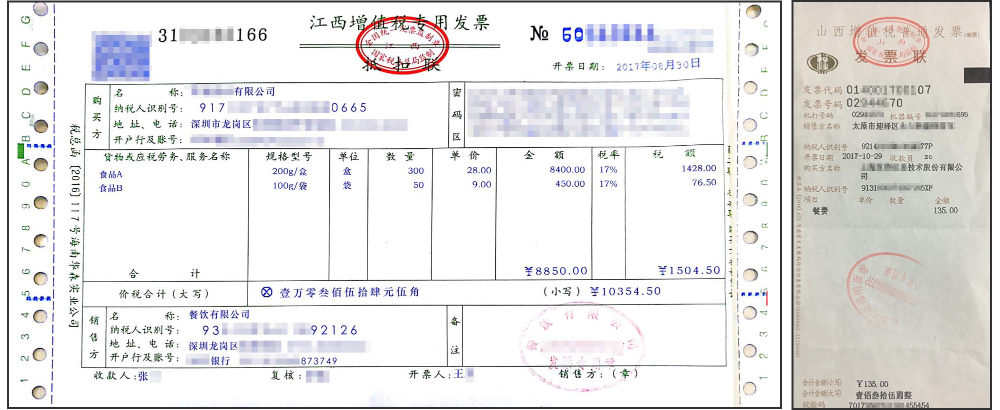

# 增值税发票识别<a name="ocr_03_0019"></a>

## 功能介绍<a name="section1654664362216"></a>

识别增值税发票的类别，以及图片中的文字内容，并以json格式返回识别的结构化结果，不支持真伪验证。该接口的使用限制请参见[约束与限制](https://support.huaweicloud.com/productdesc-ocr/ocr_01_0006.html#section15)，详细使用指导请参见[OCR服务使用简介](https://support.huaweicloud.com/qs-ocr/ocr_05_0001.html)章节。

**图 1**  增值税发票识别示例图<a name="fig729082318265"></a>  


> **说明：** 
>-   该增值税发票仅限于中华人民共和国境内使用的增值税发票。
>-   支持的增值税发票包括：增值税专用发票、增值税普通发票、增值税电子普通发票（含通行费发票）、增值税普通发票（卷票）。
>-   如果图片中包含多张卡证票据，请调用[智能分类识别](智能分类识别.md)服务。

## 调试<a name="section122631713121910"></a>

您可以在[API Explorer](https://apiexplorer.developer.huaweicloud.com/apiexplorer/doc?product=OCR&api=RecognizeVatInvoice)中调试该接口。

## 前提条件<a name="section17299143617379"></a>

在使用增值税发票识别之前，需要您完成服务申请和认证鉴权，具体操作流程请参见[申请服务](申请服务.md)和[认证鉴权](认证鉴权.md)章节。

> **说明：** 
>用户首次使用需要先[申请开通](https://console.huaweicloud.com/ocr/?region=cn-north-4#/ocr/overview)。服务只需要开通一次即可，后面使用时无需再次申请。如未开通服务，调用服务时会提示ModelArts.4204报错，请在调用服务前先进入控制台开通服务，并注意开通服务区域与调用服务的区域保持一致。

## URI<a name="zh-cn_topic_0080955351_section5596537"></a>

POST https://\{endpoint\}/v2/\{project\_id\}/ocr/vat-invoice

**表 1**  路径参数

<a name="table1757114411019"></a>
<table><thead align="left"><tr id="row244311551906"><th class="cellrowborder" valign="top" width="20%" id="mcps1.2.4.1.1"><p id="p15443125512018"><a name="p15443125512018"></a><a name="p15443125512018"></a>参数</p>
</th>
<th class="cellrowborder" valign="top" width="20%" id="mcps1.2.4.1.2"><p id="p14431555504"><a name="p14431555504"></a><a name="p14431555504"></a>是否必选</p>
</th>
<th class="cellrowborder" valign="top" width="60%" id="mcps1.2.4.1.3"><p id="p1444145517013"><a name="p1444145517013"></a><a name="p1444145517013"></a>说明</p>
</th>
</tr>
</thead>
<tbody><tr id="row613718443010"><td class="cellrowborder" valign="top" width="20%" headers="mcps1.2.4.1.1 "><p id="p191375441708"><a name="p191375441708"></a><a name="p191375441708"></a>endpoint</p>
</td>
<td class="cellrowborder" valign="top" width="20%" headers="mcps1.2.4.1.2 "><p id="p81375441015"><a name="p81375441015"></a><a name="p81375441015"></a>是</p>
</td>
<td class="cellrowborder" valign="top" width="60%" headers="mcps1.2.4.1.3 "><p id="p1928291782612"><a name="p1928291782612"></a><a name="p1928291782612"></a>指定承载REST服务端点的服务器域名或IP，不同服务不同区域的endpoint不同，您可以从<a href="终端节点.md">终端节点</a>中获取。</p>
<p id="p85151503246"><a name="p85151503246"></a><a name="p85151503246"></a>例如，OCR服务在<span class="parmvalue" id="parmvalue832520377716"><a name="parmvalue832520377716"></a><a name="parmvalue832520377716"></a>“华北-北京四”</span>区域的<span class="parmname" id="parmname211216411978"><a name="parmname211216411978"></a><a name="parmname211216411978"></a>“endpoint”</span>为<span class="parmvalue" id="parmvalue998414713715"><a name="parmvalue998414713715"></a><a name="parmvalue998414713715"></a>“ocr.cn-north-4.myhuaweicloud.com”</span>。</p>
</td>
</tr>
<tr id="row37381035113513"><td class="cellrowborder" valign="top" width="20%" headers="mcps1.2.4.1.1 "><p id="p10738335113519"><a name="p10738335113519"></a><a name="p10738335113519"></a>project_id</p>
</td>
<td class="cellrowborder" valign="top" width="20%" headers="mcps1.2.4.1.2 "><p id="p19738133503514"><a name="p19738133503514"></a><a name="p19738133503514"></a>是</p>
</td>
<td class="cellrowborder" valign="top" width="60%" headers="mcps1.2.4.1.3 "><p id="p873823523516"><a name="p873823523516"></a><a name="p873823523516"></a>项目ID，您可以从<a href="获取项目ID.md">获取项目ID</a>中获取。</p>
</td>
</tr>
</tbody>
</table>

## 请求参数<a name="zh-cn_topic_0080955351_section50368838"></a>

**表 2**  请求Header参数

<a name="table723982483111"></a>
<table><thead align="left"><tr id="row52401924193111"><th class="cellrowborder" valign="top" width="20%" id="mcps1.2.5.1.1"><p id="p1924082410316"><a name="p1924082410316"></a><a name="p1924082410316"></a>参数</p>
</th>
<th class="cellrowborder" valign="top" width="20%" id="mcps1.2.5.1.2"><p id="p12404242315"><a name="p12404242315"></a><a name="p12404242315"></a>是否必选</p>
</th>
<th class="cellrowborder" valign="top" width="20%" id="mcps1.2.5.1.3"><p id="p1924019242314"><a name="p1924019242314"></a><a name="p1924019242314"></a>参数类型</p>
</th>
<th class="cellrowborder" valign="top" width="40%" id="mcps1.2.5.1.4"><p id="p92404245319"><a name="p92404245319"></a><a name="p92404245319"></a>描述</p>
</th>
</tr>
</thead>
<tbody><tr id="row1624062423110"><td class="cellrowborder" valign="top" width="20%" headers="mcps1.2.5.1.1 "><p id="p82401524193115"><a name="p82401524193115"></a><a name="p82401524193115"></a>X-Auth-Token</p>
</td>
<td class="cellrowborder" valign="top" width="20%" headers="mcps1.2.5.1.2 "><p id="p1224017242315"><a name="p1224017242315"></a><a name="p1224017242315"></a>是</p>
</td>
<td class="cellrowborder" valign="top" width="20%" headers="mcps1.2.5.1.3 "><p id="p1424016242318"><a name="p1424016242318"></a><a name="p1424016242318"></a>String</p>
</td>
<td class="cellrowborder" valign="top" width="40%" headers="mcps1.2.5.1.4 "><p id="p62408249311"><a name="p62408249311"></a><a name="p62408249311"></a>用户Token。</p>
<p id="p87711532113213"><a name="p87711532113213"></a><a name="p87711532113213"></a>Token认证就是在调用API的时候将Token加到请求消息头，从而通过身份认证，获得操作API的权限，响应消息头中X-Subject-Token的值即为Token。</p>
</td>
</tr>
<tr id="row101516572119"><td class="cellrowborder" valign="top" width="20%" headers="mcps1.2.5.1.1 "><p id="p620162911477"><a name="p620162911477"></a><a name="p620162911477"></a>Content-Type</p>
</td>
<td class="cellrowborder" valign="top" width="20%" headers="mcps1.2.5.1.2 "><p id="p122082984710"><a name="p122082984710"></a><a name="p122082984710"></a>是</p>
</td>
<td class="cellrowborder" valign="top" width="20%" headers="mcps1.2.5.1.3 "><p id="p12017295472"><a name="p12017295472"></a><a name="p12017295472"></a>String</p>
</td>
<td class="cellrowborder" valign="top" width="40%" headers="mcps1.2.5.1.4 "><p id="p62022944710"><a name="p62022944710"></a><a name="p62022944710"></a>发送的实体的MIME类型，参数值为“application/json”。</p>
</td>
</tr>
</tbody>
</table>

**表 3**  请求Body参数

<a name="zh-cn_topic_0080955351_table49879860151539"></a>
<table><thead align="left"><tr id="zh-cn_topic_0080955351_row953289151539"><th class="cellrowborder" valign="top" width="15.770000000000001%" id="mcps1.2.5.1.1"><p id="zh-cn_topic_0080955351_p10107569151539"><a name="zh-cn_topic_0080955351_p10107569151539"></a><a name="zh-cn_topic_0080955351_p10107569151539"></a>参数</p>
</th>
<th class="cellrowborder" valign="top" width="16.09%" id="mcps1.2.5.1.2"><p id="zh-cn_topic_0080955351_p13406737151539"><a name="zh-cn_topic_0080955351_p13406737151539"></a><a name="zh-cn_topic_0080955351_p13406737151539"></a>是否必选</p>
</th>
<th class="cellrowborder" valign="top" width="13.270000000000001%" id="mcps1.2.5.1.3"><p id="zh-cn_topic_0080955351_p12203922151539"><a name="zh-cn_topic_0080955351_p12203922151539"></a><a name="zh-cn_topic_0080955351_p12203922151539"></a>参数类型</p>
</th>
<th class="cellrowborder" valign="top" width="54.87%" id="mcps1.2.5.1.4"><p id="zh-cn_topic_0080955351_p48993627151539"><a name="zh-cn_topic_0080955351_p48993627151539"></a><a name="zh-cn_topic_0080955351_p48993627151539"></a>说明</p>
</th>
</tr>
</thead>
<tbody><tr id="zh-cn_topic_0080955351_row9060885151539"><td class="cellrowborder" valign="top" width="15.770000000000001%" headers="mcps1.2.5.1.1 "><p id="zh-cn_topic_0080955351_p62843112151539"><a name="zh-cn_topic_0080955351_p62843112151539"></a><a name="zh-cn_topic_0080955351_p62843112151539"></a>image</p>
</td>
<td class="cellrowborder" valign="top" width="16.09%" headers="mcps1.2.5.1.2 "><p id="zh-cn_topic_0080955351_p57127291151539"><a name="zh-cn_topic_0080955351_p57127291151539"></a><a name="zh-cn_topic_0080955351_p57127291151539"></a>否，该参数与url二选一</p>
</td>
<td class="cellrowborder" valign="top" width="13.270000000000001%" headers="mcps1.2.5.1.3 "><p id="zh-cn_topic_0080955351_p63907830151539"><a name="zh-cn_topic_0080955351_p63907830151539"></a><a name="zh-cn_topic_0080955351_p63907830151539"></a>String</p>
</td>
<td class="cellrowborder" valign="top" width="54.87%" headers="mcps1.2.5.1.4 "><p id="zh-cn_topic_0080955351_p9151746151539"><a name="zh-cn_topic_0080955351_p9151746151539"></a><a name="zh-cn_topic_0080955351_p9151746151539"></a>图像数据，base64编码，要求base64编码后大小不超过10MB。图片最小边不小于100px，最长边不超过8192px，支持JPEG、JPG、PNG、BMP、TIFF格式。</p>
</td>
</tr>
<tr id="zh-cn_topic_0080955351_row9018009195224"><td class="cellrowborder" valign="top" width="15.770000000000001%" headers="mcps1.2.5.1.1 "><p id="zh-cn_topic_0082818466_p14053218195224"><a name="zh-cn_topic_0082818466_p14053218195224"></a><a name="zh-cn_topic_0082818466_p14053218195224"></a>url</p>
</td>
<td class="cellrowborder" valign="top" width="16.09%" headers="mcps1.2.5.1.2 "><p id="zh-cn_topic_0082818466_p64568902195224"><a name="zh-cn_topic_0082818466_p64568902195224"></a><a name="zh-cn_topic_0082818466_p64568902195224"></a>否，该参数与image二选一</p>
</td>
<td class="cellrowborder" valign="top" width="13.270000000000001%" headers="mcps1.2.5.1.3 "><p id="zh-cn_topic_0082818466_p62698574195224"><a name="zh-cn_topic_0082818466_p62698574195224"></a><a name="zh-cn_topic_0082818466_p62698574195224"></a>String</p>
</td>
<td class="cellrowborder" valign="top" width="54.87%" headers="mcps1.2.5.1.4 "><p id="p86827584714"><a name="p86827584714"></a><a name="p86827584714"></a>图片的url路径，目前支持：</p>
<a name="ul42174521583"></a><a name="ul42174521583"></a><ul id="ul42174521583"><li>公网http/https url</li><li>OBS提供的url，使用OBS数据需要进行授权。包括对服务授权、临时授权、匿名公开授权，详情参见<a href="配置OBS访问权限.md">配置OBS访问权限</a>。</li></ul>
<div class="note" id="note1822116578284"><a name="note1822116578284"></a><a name="note1822116578284"></a><span class="notetitle"> 说明： </span><div class="notebody"><a name="ul99367258155"></a><a name="ul99367258155"></a><ul id="ul99367258155"><li>接口响应时间依赖于图片的下载时间，如果图片下载时间过长，会返回接口调用失败。</li></ul>
<a name="ul156081829151514"></a><a name="ul156081829151514"></a><ul id="ul156081829151514"><li>请保证被检测图片所在的存储服务稳定可靠，推荐使用OBS服务存储图片数据。</li></ul>
</div></div>
</td>
</tr>
<tr id="row2918103151516"><td class="cellrowborder" valign="top" width="15.770000000000001%" headers="mcps1.2.5.1.1 "><p id="p5374169111510"><a name="p5374169111510"></a><a name="p5374169111510"></a>advanced_mode</p>
</td>
<td class="cellrowborder" valign="top" width="16.09%" headers="mcps1.2.5.1.2 "><p id="p537489111518"><a name="p537489111518"></a><a name="p537489111518"></a>否</p>
</td>
<td class="cellrowborder" valign="top" width="13.270000000000001%" headers="mcps1.2.5.1.3 "><p id="p0374792156"><a name="p0374792156"></a><a name="p0374792156"></a>Boolean</p>
</td>
<td class="cellrowborder" valign="top" width="54.87%" headers="mcps1.2.5.1.4 "><p id="p1137514951511"><a name="p1137514951511"></a><a name="p1137514951511"></a>默认为false，如果传参为true，则返回更多字段，具体请参见<a href="#zh-cn_topic_0080955351_table57578428152029">表7</a>。</p>
</td>
</tr>
</tbody>
</table>

## 响应参数<a name="zh-cn_topic_0080955351_section50666366"></a>

根据识别的结果，可能有不同的HTTP响应状态码（status code），状态码和响应参数说明如下。

**状态码： 200**

**表 4**  响应Body参数

<a name="responseParameter"></a>
<table><thead align="left"><tr id="row112991545555"><th class="cellrowborder" valign="top" width="24.05%" id="mcps1.2.4.1.1"><p id="p1730064175517"><a name="p1730064175517"></a><a name="p1730064175517"></a>参数</p>
</th>
<th class="cellrowborder" valign="top" width="16.57%" id="mcps1.2.4.1.2"><p id="p133009412555"><a name="p133009412555"></a><a name="p133009412555"></a>参数类型</p>
</th>
<th class="cellrowborder" valign="top" width="59.38%" id="mcps1.2.4.1.3"><p id="p173002415512"><a name="p173002415512"></a><a name="p173002415512"></a>描述</p>
</th>
</tr>
</thead>
<tbody><tr id="row1529915445516"><td class="cellrowborder" valign="top" width="24.05%" headers="mcps1.2.4.1.1 "><p id="p11301341553"><a name="p11301341553"></a><a name="p11301341553"></a>result</p>
</td>
<td class="cellrowborder" valign="top" width="16.57%" headers="mcps1.2.4.1.2 "><p id="p1330115418552"><a name="p1330115418552"></a><a name="p1330115418552"></a><a href="#response_RecognizeVatInvoiceResultResponse">VatInvoiceResult</a> object</p>
</td>
<td class="cellrowborder" valign="top" width="59.38%" headers="mcps1.2.4.1.3 "><p id="p630144125515"><a name="p630144125515"></a><a name="p630144125515"></a>调用成功时表示调用结果。</p>
<p id="p3301154175516"><a name="p3301154175516"></a><a name="p3301154175516"></a>调用失败时无此字段。</p>
</td>
</tr>
</tbody>
</table>

**表 5**  VatInvoiceResult

<a name="response_RecognizeVatInvoiceResultResponse"></a>
<table><thead align="left"><tr id="row193028495513"><th class="cellrowborder" valign="top" width="24.05%" id="mcps1.2.4.1.1"><p id="p030419413557"><a name="p030419413557"></a><a name="p030419413557"></a>参数</p>
</th>
<th class="cellrowborder" valign="top" width="16.57%" id="mcps1.2.4.1.2"><p id="p63041046552"><a name="p63041046552"></a><a name="p63041046552"></a>参数类型</p>
</th>
<th class="cellrowborder" valign="top" width="59.38%" id="mcps1.2.4.1.3"><p id="p1430419410551"><a name="p1430419410551"></a><a name="p1430419410551"></a>描述</p>
</th>
</tr>
</thead>
<tbody><tr id="row730204205514"><td class="cellrowborder" valign="top" width="24.05%" headers="mcps1.2.4.1.1 "><p id="p63041945558"><a name="p63041945558"></a><a name="p63041945558"></a>type</p>
</td>
<td class="cellrowborder" valign="top" width="16.57%" headers="mcps1.2.4.1.2 "><p id="p1130494115520"><a name="p1130494115520"></a><a name="p1130494115520"></a>String</p>
</td>
<td class="cellrowborder" valign="top" width="59.38%" headers="mcps1.2.4.1.3 "><p id="p17241741142216"><a name="p17241741142216"></a><a name="p17241741142216"></a><span class="keyword" id="keyword562912916217"><a name="keyword562912916217"></a><a name="keyword562912916217"></a>增值税发票</span>类型，可选值如下所示。</p>
<a name="ul163971831162211"></a><a name="ul163971831162211"></a><ul id="ul163971831162211"><li>special：增值税专用发票</li><li>normal：增值税普通发票</li><li>electronic：增值税电子普通发票（含通行费发票）</li><li>roll：增值税普通发票（卷票）</li></ul>
</td>
</tr>
<tr id="row173025412559"><td class="cellrowborder" valign="top" width="24.05%" headers="mcps1.2.4.1.1 "><p id="p143061148553"><a name="p143061148553"></a><a name="p143061148553"></a>serial_number</p>
</td>
<td class="cellrowborder" valign="top" width="16.57%" headers="mcps1.2.4.1.2 "><p id="p113060415518"><a name="p113060415518"></a><a name="p113060415518"></a>String</p>
</td>
<td class="cellrowborder" valign="top" width="59.38%" headers="mcps1.2.4.1.3 "><p id="p12789840114318"><a name="p12789840114318"></a><a name="p12789840114318"></a>发票联次。</p>
<p id="p4506441132313"><a name="p4506441132313"></a><a name="p4506441132313"></a>当<span class="parmname" id="parmname312615493438"><a name="parmname312615493438"></a><a name="parmname312615493438"></a>“advanced_mode”</span>设置为<span class="parmvalue" id="parmvalue7619658114316"><a name="parmvalue7619658114316"></a><a name="parmvalue7619658114316"></a>“true”</span>时才返回。</p>
</td>
</tr>
<tr id="row163026420556"><td class="cellrowborder" valign="top" width="24.05%" headers="mcps1.2.4.1.1 "><p id="p173075412555"><a name="p173075412555"></a><a name="p173075412555"></a>attribution</p>
</td>
<td class="cellrowborder" valign="top" width="16.57%" headers="mcps1.2.4.1.2 "><p id="p183079425514"><a name="p183079425514"></a><a name="p183079425514"></a>String</p>
</td>
<td class="cellrowborder" valign="top" width="59.38%" headers="mcps1.2.4.1.3 "><p id="p1457645194512"><a name="p1457645194512"></a><a name="p1457645194512"></a>发票归属地。</p>
<p id="p8255135762316"><a name="p8255135762316"></a><a name="p8255135762316"></a>当<span class="parmname" id="parmname18383227448"><a name="parmname18383227448"></a><a name="parmname18383227448"></a>“advanced_mode”</span>设置为<span class="parmvalue" id="parmvalue1583892214440"><a name="parmvalue1583892214440"></a><a name="parmvalue1583892214440"></a>“true”</span>时才返回。</p>
</td>
</tr>
<tr id="row11302134115516"><td class="cellrowborder" valign="top" width="24.05%" headers="mcps1.2.4.1.1 "><p id="p14307164185517"><a name="p14307164185517"></a><a name="p14307164185517"></a>supervision_seal</p>
</td>
<td class="cellrowborder" valign="top" width="16.57%" headers="mcps1.2.4.1.2 "><p id="p53071415555"><a name="p53071415555"></a><a name="p53071415555"></a>Array of strings</p>
</td>
<td class="cellrowborder" valign="top" width="59.38%" headers="mcps1.2.4.1.3 "><p id="p195761751204517"><a name="p195761751204517"></a><a name="p195761751204517"></a>发票监制章。</p>
<p id="p234101313249"><a name="p234101313249"></a><a name="p234101313249"></a>当<span class="parmname" id="parmname18956228104414"><a name="parmname18956228104414"></a><a name="parmname18956228104414"></a>“advanced_mode”</span>设置为<span class="parmvalue" id="parmvalue16956162844418"><a name="parmvalue16956162844418"></a><a name="parmvalue16956162844418"></a>“true”</span>时才返回。</p>
</td>
</tr>
<tr id="row830214105517"><td class="cellrowborder" valign="top" width="24.05%" headers="mcps1.2.4.1.1 "><p id="p1330815414559"><a name="p1330815414559"></a><a name="p1330815414559"></a>code</p>
</td>
<td class="cellrowborder" valign="top" width="16.57%" headers="mcps1.2.4.1.2 "><p id="p33086445514"><a name="p33086445514"></a><a name="p33086445514"></a>String</p>
</td>
<td class="cellrowborder" valign="top" width="59.38%" headers="mcps1.2.4.1.3 "><p id="p430884185512"><a name="p430884185512"></a><a name="p430884185512"></a>发票代码。</p>
</td>
</tr>
<tr id="row103021845552"><td class="cellrowborder" valign="top" width="24.05%" headers="mcps1.2.4.1.1 "><p id="p83082414553"><a name="p83082414553"></a><a name="p83082414553"></a>machine_number</p>
</td>
<td class="cellrowborder" valign="top" width="16.57%" headers="mcps1.2.4.1.2 "><p id="p18309194105518"><a name="p18309194105518"></a><a name="p18309194105518"></a>String</p>
</td>
<td class="cellrowborder" valign="top" width="59.38%" headers="mcps1.2.4.1.3 "><p id="p1451363618501"><a name="p1451363618501"></a><a name="p1451363618501"></a>机器编号。</p>
<p id="p1441363532412"><a name="p1441363532412"></a><a name="p1441363532412"></a>当<span class="parmname" id="parmname14346153517442"><a name="parmname14346153517442"></a><a name="parmname14346153517442"></a>“advanced_mode”</span>设置为<span class="parmvalue" id="parmvalue10346123594417"><a name="parmvalue10346123594417"></a><a name="parmvalue10346123594417"></a>“true”</span>时才返回。</p>
</td>
</tr>
<tr id="row330254125517"><td class="cellrowborder" valign="top" width="24.05%" headers="mcps1.2.4.1.1 "><p id="p113094416559"><a name="p113094416559"></a><a name="p113094416559"></a>print_number</p>
</td>
<td class="cellrowborder" valign="top" width="16.57%" headers="mcps1.2.4.1.2 "><p id="p143091346553"><a name="p143091346553"></a><a name="p143091346553"></a>String</p>
</td>
<td class="cellrowborder" valign="top" width="59.38%" headers="mcps1.2.4.1.3 "><p id="p1551393612503"><a name="p1551393612503"></a><a name="p1551393612503"></a>机打号码。</p>
<p id="p1742345872414"><a name="p1742345872414"></a><a name="p1742345872414"></a>当<span class="parmname" id="parmname982323984417"><a name="parmname982323984417"></a><a name="parmname982323984417"></a>“advanced_mode”</span>设置为<span class="parmvalue" id="parmvalue20823193914446"><a name="parmvalue20823193914446"></a><a name="parmvalue20823193914446"></a>“true”</span>时才返回。</p>
</td>
</tr>
<tr id="row630224175517"><td class="cellrowborder" valign="top" width="24.05%" headers="mcps1.2.4.1.1 "><p id="p173107475510"><a name="p173107475510"></a><a name="p173107475510"></a>check_code</p>
</td>
<td class="cellrowborder" valign="top" width="16.57%" headers="mcps1.2.4.1.2 "><p id="p73104411555"><a name="p73104411555"></a><a name="p73104411555"></a>String</p>
</td>
<td class="cellrowborder" valign="top" width="59.38%" headers="mcps1.2.4.1.3 "><p id="p7310145558"><a name="p7310145558"></a><a name="p7310145558"></a>发票校验码，特定类型增值税发票内不存在该信息时返回空字符串。</p>
</td>
</tr>
<tr id="row1530294185516"><td class="cellrowborder" valign="top" width="24.05%" headers="mcps1.2.4.1.1 "><p id="p1131084135516"><a name="p1131084135516"></a><a name="p1131084135516"></a>number</p>
</td>
<td class="cellrowborder" valign="top" width="16.57%" headers="mcps1.2.4.1.2 "><p id="p1531112475514"><a name="p1531112475514"></a><a name="p1531112475514"></a>String</p>
</td>
<td class="cellrowborder" valign="top" width="59.38%" headers="mcps1.2.4.1.3 "><p id="p731184105514"><a name="p731184105514"></a><a name="p731184105514"></a>发票号码。</p>
</td>
</tr>
<tr id="row330214413557"><td class="cellrowborder" valign="top" width="24.05%" headers="mcps1.2.4.1.1 "><p id="p153124485513"><a name="p153124485513"></a><a name="p153124485513"></a>issue_date</p>
</td>
<td class="cellrowborder" valign="top" width="16.57%" headers="mcps1.2.4.1.2 "><p id="p113123465512"><a name="p113123465512"></a><a name="p113123465512"></a>String</p>
</td>
<td class="cellrowborder" valign="top" width="59.38%" headers="mcps1.2.4.1.3 "><p id="p15312848551"><a name="p15312848551"></a><a name="p15312848551"></a>开票日期。</p>
</td>
</tr>
<tr id="row1730216411557"><td class="cellrowborder" valign="top" width="24.05%" headers="mcps1.2.4.1.1 "><p id="p13121542555"><a name="p13121542555"></a><a name="p13121542555"></a>encryption_block</p>
</td>
<td class="cellrowborder" valign="top" width="16.57%" headers="mcps1.2.4.1.2 "><p id="p6313844559"><a name="p6313844559"></a><a name="p6313844559"></a>String</p>
</td>
<td class="cellrowborder" valign="top" width="59.38%" headers="mcps1.2.4.1.3 "><p id="p831320412555"><a name="p831320412555"></a><a name="p831320412555"></a>密码区。</p>
</td>
</tr>
<tr id="row93036455516"><td class="cellrowborder" valign="top" width="24.05%" headers="mcps1.2.4.1.1 "><p id="p231314165516"><a name="p231314165516"></a><a name="p231314165516"></a>buyer_name</p>
</td>
<td class="cellrowborder" valign="top" width="16.57%" headers="mcps1.2.4.1.2 "><p id="p113131445511"><a name="p113131445511"></a><a name="p113131445511"></a>String</p>
</td>
<td class="cellrowborder" valign="top" width="59.38%" headers="mcps1.2.4.1.3 "><p id="p831414475512"><a name="p831414475512"></a><a name="p831414475512"></a>购买方名称。</p>
</td>
</tr>
<tr id="row5303184105513"><td class="cellrowborder" valign="top" width="24.05%" headers="mcps1.2.4.1.1 "><p id="p183141940551"><a name="p183141940551"></a><a name="p183141940551"></a>buyer_id</p>
</td>
<td class="cellrowborder" valign="top" width="16.57%" headers="mcps1.2.4.1.2 "><p id="p193141741550"><a name="p193141741550"></a><a name="p193141741550"></a>String</p>
</td>
<td class="cellrowborder" valign="top" width="59.38%" headers="mcps1.2.4.1.3 "><p id="p16314540552"><a name="p16314540552"></a><a name="p16314540552"></a>购买方纳税人识别号。</p>
</td>
</tr>
<tr id="row230315413550"><td class="cellrowborder" valign="top" width="24.05%" headers="mcps1.2.4.1.1 "><p id="p23141343555"><a name="p23141343555"></a><a name="p23141343555"></a>buyer_address</p>
</td>
<td class="cellrowborder" valign="top" width="16.57%" headers="mcps1.2.4.1.2 "><p id="p1531519475515"><a name="p1531519475515"></a><a name="p1531519475515"></a>String</p>
</td>
<td class="cellrowborder" valign="top" width="59.38%" headers="mcps1.2.4.1.3 "><p id="p1731514195511"><a name="p1731514195511"></a><a name="p1731514195511"></a>购买方地址、电话。</p>
</td>
</tr>
<tr id="row7303045554"><td class="cellrowborder" valign="top" width="24.05%" headers="mcps1.2.4.1.1 "><p id="p2315948558"><a name="p2315948558"></a><a name="p2315948558"></a>buyer_bank</p>
</td>
<td class="cellrowborder" valign="top" width="16.57%" headers="mcps1.2.4.1.2 "><p id="p113150411551"><a name="p113150411551"></a><a name="p113150411551"></a>String</p>
</td>
<td class="cellrowborder" valign="top" width="59.38%" headers="mcps1.2.4.1.3 "><p id="p431514145515"><a name="p431514145515"></a><a name="p431514145515"></a>购买方开户行及帐号。</p>
</td>
</tr>
<tr id="row123038425513"><td class="cellrowborder" valign="top" width="24.05%" headers="mcps1.2.4.1.1 "><p id="p63161041552"><a name="p63161041552"></a><a name="p63161041552"></a>seller_name</p>
</td>
<td class="cellrowborder" valign="top" width="16.57%" headers="mcps1.2.4.1.2 "><p id="p13166415557"><a name="p13166415557"></a><a name="p13166415557"></a>String</p>
</td>
<td class="cellrowborder" valign="top" width="59.38%" headers="mcps1.2.4.1.3 "><p id="p1731624135511"><a name="p1731624135511"></a><a name="p1731624135511"></a>销售方名称。</p>
</td>
</tr>
<tr id="row130314416553"><td class="cellrowborder" valign="top" width="24.05%" headers="mcps1.2.4.1.1 "><p id="p53166412550"><a name="p53166412550"></a><a name="p53166412550"></a>seller_id</p>
</td>
<td class="cellrowborder" valign="top" width="16.57%" headers="mcps1.2.4.1.2 "><p id="p731714416554"><a name="p731714416554"></a><a name="p731714416554"></a>String</p>
</td>
<td class="cellrowborder" valign="top" width="59.38%" headers="mcps1.2.4.1.3 "><p id="p131711475516"><a name="p131711475516"></a><a name="p131711475516"></a>销售方纳税人识别号。</p>
</td>
</tr>
<tr id="row63031419551"><td class="cellrowborder" valign="top" width="24.05%" headers="mcps1.2.4.1.1 "><p id="p183176420553"><a name="p183176420553"></a><a name="p183176420553"></a>seller_address</p>
</td>
<td class="cellrowborder" valign="top" width="16.57%" headers="mcps1.2.4.1.2 "><p id="p103171542558"><a name="p103171542558"></a><a name="p103171542558"></a>String</p>
</td>
<td class="cellrowborder" valign="top" width="59.38%" headers="mcps1.2.4.1.3 "><p id="p8317640557"><a name="p8317640557"></a><a name="p8317640557"></a>销售方地址、电话。</p>
</td>
</tr>
<tr id="row5303144554"><td class="cellrowborder" valign="top" width="24.05%" headers="mcps1.2.4.1.1 "><p id="p10318641559"><a name="p10318641559"></a><a name="p10318641559"></a>seller_bank</p>
</td>
<td class="cellrowborder" valign="top" width="16.57%" headers="mcps1.2.4.1.2 "><p id="p10318164155510"><a name="p10318164155510"></a><a name="p10318164155510"></a>String</p>
</td>
<td class="cellrowborder" valign="top" width="59.38%" headers="mcps1.2.4.1.3 "><p id="p1131834105519"><a name="p1131834105519"></a><a name="p1131834105519"></a>销售方开户行及帐号。</p>
</td>
</tr>
<tr id="row230311414553"><td class="cellrowborder" valign="top" width="24.05%" headers="mcps1.2.4.1.1 "><p id="p103185412559"><a name="p103185412559"></a><a name="p103185412559"></a>subtotal_amount</p>
</td>
<td class="cellrowborder" valign="top" width="16.57%" headers="mcps1.2.4.1.2 "><p id="p18319949556"><a name="p18319949556"></a><a name="p18319949556"></a>String</p>
</td>
<td class="cellrowborder" valign="top" width="59.38%" headers="mcps1.2.4.1.3 "><p id="p231974205513"><a name="p231974205513"></a><a name="p231974205513"></a>合计金额。</p>
</td>
</tr>
<tr id="row33033445519"><td class="cellrowborder" valign="top" width="24.05%" headers="mcps1.2.4.1.1 "><p id="p23191647557"><a name="p23191647557"></a><a name="p23191647557"></a>subtotal_tax</p>
</td>
<td class="cellrowborder" valign="top" width="16.57%" headers="mcps1.2.4.1.2 "><p id="p731915475520"><a name="p731915475520"></a><a name="p731915475520"></a>String</p>
</td>
<td class="cellrowborder" valign="top" width="59.38%" headers="mcps1.2.4.1.3 "><p id="p14320542557"><a name="p14320542557"></a><a name="p14320542557"></a>合计税额。</p>
</td>
</tr>
<tr id="row13031642551"><td class="cellrowborder" valign="top" width="24.05%" headers="mcps1.2.4.1.1 "><p id="p33201246550"><a name="p33201246550"></a><a name="p33201246550"></a>total</p>
</td>
<td class="cellrowborder" valign="top" width="16.57%" headers="mcps1.2.4.1.2 "><p id="p53202495515"><a name="p53202495515"></a><a name="p53202495515"></a>String</p>
</td>
<td class="cellrowborder" valign="top" width="59.38%" headers="mcps1.2.4.1.3 "><p id="p19320104105518"><a name="p19320104105518"></a><a name="p19320104105518"></a>价税合计。</p>
</td>
</tr>
<tr id="row830314416552"><td class="cellrowborder" valign="top" width="24.05%" headers="mcps1.2.4.1.1 "><p id="p232011435518"><a name="p232011435518"></a><a name="p232011435518"></a>total_in_words</p>
</td>
<td class="cellrowborder" valign="top" width="16.57%" headers="mcps1.2.4.1.2 "><p id="p2032124115514"><a name="p2032124115514"></a><a name="p2032124115514"></a>String</p>
</td>
<td class="cellrowborder" valign="top" width="59.38%" headers="mcps1.2.4.1.3 "><p id="p167249725217"><a name="p167249725217"></a><a name="p167249725217"></a>价税合计（大写）。</p>
<p id="p1713731992510"><a name="p1713731992510"></a><a name="p1713731992510"></a>当<span class="parmname" id="parmname18655950144411"><a name="parmname18655950144411"></a><a name="parmname18655950144411"></a>“advanced_mode”</span>设置为<span class="parmvalue" id="parmvalue465505016441"><a name="parmvalue465505016441"></a><a name="parmvalue465505016441"></a>“true”</span>时才返回。</p>
</td>
</tr>
<tr id="row33031744557"><td class="cellrowborder" valign="top" width="24.05%" headers="mcps1.2.4.1.1 "><p id="p193211348556"><a name="p193211348556"></a><a name="p193211348556"></a>remarks</p>
</td>
<td class="cellrowborder" valign="top" width="16.57%" headers="mcps1.2.4.1.2 "><p id="p1232114416558"><a name="p1232114416558"></a><a name="p1232114416558"></a>String</p>
</td>
<td class="cellrowborder" valign="top" width="59.38%" headers="mcps1.2.4.1.3 "><p id="p16724677521"><a name="p16724677521"></a><a name="p16724677521"></a>备注。</p>
<p id="p1281973352512"><a name="p1281973352512"></a><a name="p1281973352512"></a>当<span class="parmname" id="parmname9631254184413"><a name="parmname9631254184413"></a><a name="parmname9631254184413"></a>“advanced_mode”</span>设置为<span class="parmvalue" id="parmvalue263119549441"><a name="parmvalue263119549441"></a><a name="parmvalue263119549441"></a>“true”</span>时才返回。</p>
</td>
</tr>
<tr id="row130318415516"><td class="cellrowborder" valign="top" width="24.05%" headers="mcps1.2.4.1.1 "><p id="p732254105514"><a name="p732254105514"></a><a name="p732254105514"></a>receiver</p>
</td>
<td class="cellrowborder" valign="top" width="16.57%" headers="mcps1.2.4.1.2 "><p id="p7322134185512"><a name="p7322134185512"></a><a name="p7322134185512"></a>String</p>
</td>
<td class="cellrowborder" valign="top" width="59.38%" headers="mcps1.2.4.1.3 "><p id="p1725107175210"><a name="p1725107175210"></a><a name="p1725107175210"></a>收款人。</p>
<p id="p438185904410"><a name="p438185904410"></a><a name="p438185904410"></a>当<span class="parmname" id="parmname555655912445"><a name="parmname555655912445"></a><a name="parmname555655912445"></a>“advanced_mode”</span>设置为<span class="parmvalue" id="parmvalue555620599442"><a name="parmvalue555620599442"></a><a name="parmvalue555620599442"></a>“true”</span>时才返回。</p>
</td>
</tr>
<tr id="row53035420558"><td class="cellrowborder" valign="top" width="24.05%" headers="mcps1.2.4.1.1 "><p id="p6322134145515"><a name="p6322134145515"></a><a name="p6322134145515"></a>reviewer</p>
</td>
<td class="cellrowborder" valign="top" width="16.57%" headers="mcps1.2.4.1.2 "><p id="p1632210414556"><a name="p1632210414556"></a><a name="p1632210414556"></a>String</p>
</td>
<td class="cellrowborder" valign="top" width="59.38%" headers="mcps1.2.4.1.3 "><p id="p77258719520"><a name="p77258719520"></a><a name="p77258719520"></a>复核。</p>
<p id="p1485914662618"><a name="p1485914662618"></a><a name="p1485914662618"></a>当<span class="parmname" id="parmname1344444511"><a name="parmname1344444511"></a><a name="parmname1344444511"></a>“advanced_mode”</span>设置为<span class="parmvalue" id="parmvalue12341746454"><a name="parmvalue12341746454"></a><a name="parmvalue12341746454"></a>“true”</span>时才返回。</p>
</td>
</tr>
<tr id="row63034465514"><td class="cellrowborder" valign="top" width="24.05%" headers="mcps1.2.4.1.1 "><p id="p4323241550"><a name="p4323241550"></a><a name="p4323241550"></a>issuer</p>
</td>
<td class="cellrowborder" valign="top" width="16.57%" headers="mcps1.2.4.1.2 "><p id="p232315414558"><a name="p232315414558"></a><a name="p232315414558"></a>String</p>
</td>
<td class="cellrowborder" valign="top" width="59.38%" headers="mcps1.2.4.1.3 "><p id="p17251473527"><a name="p17251473527"></a><a name="p17251473527"></a>开票人。</p>
<p id="p12948220152610"><a name="p12948220152610"></a><a name="p12948220152610"></a>当<span class="parmname" id="parmname18945091451"><a name="parmname18945091451"></a><a name="parmname18945091451"></a>“advanced_mode”</span>设置为<span class="parmvalue" id="parmvalue15945191458"><a name="parmvalue15945191458"></a><a name="parmvalue15945191458"></a>“true”</span>时才返回。</p>
</td>
</tr>
<tr id="row7303342556"><td class="cellrowborder" valign="top" width="24.05%" headers="mcps1.2.4.1.1 "><p id="p103242455519"><a name="p103242455519"></a><a name="p103242455519"></a>seller_seal</p>
</td>
<td class="cellrowborder" valign="top" width="16.57%" headers="mcps1.2.4.1.2 "><p id="p1232454115513"><a name="p1232454115513"></a><a name="p1232454115513"></a>Array of strings</p>
</td>
<td class="cellrowborder" valign="top" width="59.38%" headers="mcps1.2.4.1.3 "><p id="p872512719529"><a name="p872512719529"></a><a name="p872512719529"></a>销售方发票专用章。</p>
<p id="p62461637192618"><a name="p62461637192618"></a><a name="p62461637192618"></a>当<span class="parmname" id="parmname755813149456"><a name="parmname755813149456"></a><a name="parmname755813149456"></a>“advanced_mode”</span>设置为<span class="parmvalue" id="parmvalue95581514194516"><a name="parmvalue95581514194516"></a><a name="parmvalue95581514194516"></a>“true”</span>时才返回。</p>
</td>
</tr>
<tr id="row113032411553"><td class="cellrowborder" valign="top" width="24.05%" headers="mcps1.2.4.1.1 "><p id="p1332416419556"><a name="p1332416419556"></a><a name="p1332416419556"></a>item_list</p>
</td>
<td class="cellrowborder" valign="top" width="16.57%" headers="mcps1.2.4.1.2 "><p id="p12299173519219"><a name="p12299173519219"></a><a name="p12299173519219"></a>Array of <a href="#response_RecognizeVatInvoiceItemsResponse">ItemList</a> objects</p>
</td>
<td class="cellrowborder" valign="top" width="59.38%" headers="mcps1.2.4.1.3 "><p id="p143255420558"><a name="p143255420558"></a><a name="p143255420558"></a>货物或应税劳务列表。</p>
</td>
</tr>
<tr id="row59911747172514"><td class="cellrowborder" valign="top" width="24.05%" headers="mcps1.2.4.1.1 "><p id="p1999210479252"><a name="p1999210479252"></a><a name="p1999210479252"></a>confidence</p>
</td>
<td class="cellrowborder" valign="top" width="16.57%" headers="mcps1.2.4.1.2 "><p id="p1999216477259"><a name="p1999216477259"></a><a name="p1999216477259"></a>Object</p>
</td>
<td class="cellrowborder" valign="top" width="59.38%" headers="mcps1.2.4.1.3 "><p id="p125734118265"><a name="p125734118265"></a><a name="p125734118265"></a>各个字段的置信度。</p>
<p id="p17573171132619"><a name="p17573171132619"></a><a name="p17573171132619"></a>当<span class="parmname" id="parmname145733113267"><a name="parmname145733113267"></a><a name="parmname145733113267"></a>“advanced_mode”</span>设置为<span class="parmvalue" id="parmvalue3573161182616"><a name="parmvalue3573161182616"></a><a name="parmvalue3573161182616"></a>“true”</span>时才返回。</p>
</td>
</tr>
</tbody>
</table>

**表 6**  ItemList

<a name="response_RecognizeVatInvoiceItemsResponse"></a>
<table><thead align="left"><tr id="row143258475515"><th class="cellrowborder" valign="top" width="24.05%" id="mcps1.2.4.1.1"><p id="p1832654125517"><a name="p1832654125517"></a><a name="p1832654125517"></a>参数</p>
</th>
<th class="cellrowborder" valign="top" width="16.57%" id="mcps1.2.4.1.2"><p id="p1932674175514"><a name="p1932674175514"></a><a name="p1932674175514"></a>参数类型</p>
</th>
<th class="cellrowborder" valign="top" width="59.38%" id="mcps1.2.4.1.3"><p id="p1832794145517"><a name="p1832794145517"></a><a name="p1832794145517"></a>描述</p>
</th>
</tr>
</thead>
<tbody><tr id="row13258485512"><td class="cellrowborder" valign="top" width="24.05%" headers="mcps1.2.4.1.1 "><p id="p8327348551"><a name="p8327348551"></a><a name="p8327348551"></a>name</p>
</td>
<td class="cellrowborder" valign="top" width="16.57%" headers="mcps1.2.4.1.2 "><p id="p1732712435514"><a name="p1732712435514"></a><a name="p1732712435514"></a>String</p>
</td>
<td class="cellrowborder" valign="top" width="59.38%" headers="mcps1.2.4.1.3 "><p id="p1232714165516"><a name="p1232714165516"></a><a name="p1232714165516"></a>货物或应税劳务、服务名称。</p>
</td>
</tr>
<tr id="row1232519420551"><td class="cellrowborder" valign="top" width="24.05%" headers="mcps1.2.4.1.1 "><p id="p173283416559"><a name="p173283416559"></a><a name="p173283416559"></a>specification</p>
</td>
<td class="cellrowborder" valign="top" width="16.57%" headers="mcps1.2.4.1.2 "><p id="p123289445513"><a name="p123289445513"></a><a name="p123289445513"></a>String</p>
</td>
<td class="cellrowborder" valign="top" width="59.38%" headers="mcps1.2.4.1.3 "><p id="p732812415554"><a name="p732812415554"></a><a name="p732812415554"></a>规格型号。</p>
</td>
</tr>
<tr id="row43261455516"><td class="cellrowborder" valign="top" width="24.05%" headers="mcps1.2.4.1.1 "><p id="p15328154145520"><a name="p15328154145520"></a><a name="p15328154145520"></a>unit</p>
</td>
<td class="cellrowborder" valign="top" width="16.57%" headers="mcps1.2.4.1.2 "><p id="p332974135514"><a name="p332974135514"></a><a name="p332974135514"></a>String</p>
</td>
<td class="cellrowborder" valign="top" width="59.38%" headers="mcps1.2.4.1.3 "><p id="p932910417557"><a name="p932910417557"></a><a name="p932910417557"></a>单位。</p>
</td>
</tr>
<tr id="row53261413550"><td class="cellrowborder" valign="top" width="24.05%" headers="mcps1.2.4.1.1 "><p id="p14329642553"><a name="p14329642553"></a><a name="p14329642553"></a>quantity</p>
</td>
<td class="cellrowborder" valign="top" width="16.57%" headers="mcps1.2.4.1.2 "><p id="p63291945556"><a name="p63291945556"></a><a name="p63291945556"></a>String</p>
</td>
<td class="cellrowborder" valign="top" width="59.38%" headers="mcps1.2.4.1.3 "><p id="p103294435511"><a name="p103294435511"></a><a name="p103294435511"></a>数量。</p>
</td>
</tr>
<tr id="row1332619414555"><td class="cellrowborder" valign="top" width="24.05%" headers="mcps1.2.4.1.1 "><p id="p17330542550"><a name="p17330542550"></a><a name="p17330542550"></a>unit_price</p>
</td>
<td class="cellrowborder" valign="top" width="16.57%" headers="mcps1.2.4.1.2 "><p id="p1133014465510"><a name="p1133014465510"></a><a name="p1133014465510"></a>String</p>
</td>
<td class="cellrowborder" valign="top" width="59.38%" headers="mcps1.2.4.1.3 "><p id="p0330104165513"><a name="p0330104165513"></a><a name="p0330104165513"></a>单价。</p>
</td>
</tr>
<tr id="row133263412553"><td class="cellrowborder" valign="top" width="24.05%" headers="mcps1.2.4.1.1 "><p id="p33301042550"><a name="p33301042550"></a><a name="p33301042550"></a>license_plate_number</p>
</td>
<td class="cellrowborder" valign="top" width="16.57%" headers="mcps1.2.4.1.2 "><p id="p933034185513"><a name="p933034185513"></a><a name="p933034185513"></a>String</p>
</td>
<td class="cellrowborder" valign="top" width="59.38%" headers="mcps1.2.4.1.3 "><p id="p1878635105216"><a name="p1878635105216"></a><a name="p1878635105216"></a>车牌号码。</p>
<p id="p102231558132612"><a name="p102231558132612"></a><a name="p102231558132612"></a>当<span class="parmname" id="parmname39713336458"><a name="parmname39713336458"></a><a name="parmname39713336458"></a>“advanced_mode”</span>设置为<span class="parmvalue" id="parmvalue5971113317456"><a name="parmvalue5971113317456"></a><a name="parmvalue5971113317456"></a>“true”</span>时才返回。</p>
</td>
</tr>
<tr id="row14326640559"><td class="cellrowborder" valign="top" width="24.05%" headers="mcps1.2.4.1.1 "><p id="p1533116414554"><a name="p1533116414554"></a><a name="p1533116414554"></a>amount</p>
</td>
<td class="cellrowborder" valign="top" width="16.57%" headers="mcps1.2.4.1.2 "><p id="p433144115517"><a name="p433144115517"></a><a name="p433144115517"></a>String</p>
</td>
<td class="cellrowborder" valign="top" width="59.38%" headers="mcps1.2.4.1.3 "><p id="p193314419555"><a name="p193314419555"></a><a name="p193314419555"></a>金额。</p>
</td>
</tr>
<tr id="row1032612412552"><td class="cellrowborder" valign="top" width="24.05%" headers="mcps1.2.4.1.1 "><p id="p18340145553"><a name="p18340145553"></a><a name="p18340145553"></a>tax_rate</p>
</td>
<td class="cellrowborder" valign="top" width="16.57%" headers="mcps1.2.4.1.2 "><p id="p13419435515"><a name="p13419435515"></a><a name="p13419435515"></a>String</p>
</td>
<td class="cellrowborder" valign="top" width="59.38%" headers="mcps1.2.4.1.3 "><p id="p18341742555"><a name="p18341742555"></a><a name="p18341742555"></a>税率。</p>
</td>
</tr>
<tr id="row1232654145519"><td class="cellrowborder" valign="top" width="24.05%" headers="mcps1.2.4.1.1 "><p id="p5341745551"><a name="p5341745551"></a><a name="p5341745551"></a>tax</p>
</td>
<td class="cellrowborder" valign="top" width="16.57%" headers="mcps1.2.4.1.2 "><p id="p19341547558"><a name="p19341547558"></a><a name="p19341547558"></a>String</p>
</td>
<td class="cellrowborder" valign="top" width="59.38%" headers="mcps1.2.4.1.3 "><p id="p103411548552"><a name="p103411548552"></a><a name="p103411548552"></a>税额。</p>
</td>
</tr>
<tr id="row133267412552"><td class="cellrowborder" valign="top" width="24.05%" headers="mcps1.2.4.1.1 "><p id="p20342344552"><a name="p20342344552"></a><a name="p20342344552"></a>end_date</p>
</td>
<td class="cellrowborder" valign="top" width="16.57%" headers="mcps1.2.4.1.2 "><p id="p934284195513"><a name="p934284195513"></a><a name="p934284195513"></a>String</p>
</td>
<td class="cellrowborder" valign="top" width="59.38%" headers="mcps1.2.4.1.3 "><p id="p137874511522"><a name="p137874511522"></a><a name="p137874511522"></a>通行日期止。</p>
<p id="p2453342172711"><a name="p2453342172711"></a><a name="p2453342172711"></a>当<span class="parmname" id="parmname15059479451"><a name="parmname15059479451"></a><a name="parmname15059479451"></a>“advanced_mode”</span>设置为<span class="parmvalue" id="parmvalue4505847104513"><a name="parmvalue4505847104513"></a><a name="parmvalue4505847104513"></a>“true”</span>时才返回。</p>
</td>
</tr>
<tr id="row432610414552"><td class="cellrowborder" valign="top" width="24.05%" headers="mcps1.2.4.1.1 "><p id="p234274205513"><a name="p234274205513"></a><a name="p234274205513"></a>start_date</p>
</td>
<td class="cellrowborder" valign="top" width="16.57%" headers="mcps1.2.4.1.2 "><p id="p5542545554"><a name="p5542545554"></a><a name="p5542545554"></a>String</p>
</td>
<td class="cellrowborder" valign="top" width="59.38%" headers="mcps1.2.4.1.3 "><p id="p37878515526"><a name="p37878515526"></a><a name="p37878515526"></a>通行日期起。</p>
<p id="p2376131142720"><a name="p2376131142720"></a><a name="p2376131142720"></a>当<span class="parmname" id="parmname2014284318457"><a name="parmname2014284318457"></a><a name="parmname2014284318457"></a>“advanced_mode”</span>设置为<span class="parmvalue" id="parmvalue11421443174515"><a name="parmvalue11421443174515"></a><a name="parmvalue11421443174515"></a>“true”</span>时才返回。</p>
</td>
</tr>
<tr id="row1932610415510"><td class="cellrowborder" valign="top" width="24.05%" headers="mcps1.2.4.1.1 "><p id="p3542184175514"><a name="p3542184175514"></a><a name="p3542184175514"></a>vehicle_type</p>
</td>
<td class="cellrowborder" valign="top" width="16.57%" headers="mcps1.2.4.1.2 "><p id="p854218418550"><a name="p854218418550"></a><a name="p854218418550"></a>String</p>
</td>
<td class="cellrowborder" valign="top" width="59.38%" headers="mcps1.2.4.1.3 "><p id="p17787451185219"><a name="p17787451185219"></a><a name="p17787451185219"></a>车辆类型。</p>
<p id="p1746131552712"><a name="p1746131552712"></a><a name="p1746131552712"></a>当<span class="parmname" id="parmname1356373894511"><a name="parmname1356373894511"></a><a name="parmname1356373894511"></a>“advanced_mode”</span>设置为<span class="parmvalue" id="parmvalue8563938124515"><a name="parmvalue8563938124515"></a><a name="parmvalue8563938124515"></a>“true”</span>时才返回。</p>
</td>
</tr>
</tbody>
</table>

**状态码： 400**

**表 7**  响应Body参数

<a name="zh-cn_topic_0080955351_table57578428152029"></a>
<table><thead align="left"><tr id="zh-cn_topic_0080955351_row43179280152029"><th class="cellrowborder" valign="top" width="24.05%" id="mcps1.2.4.1.1"><p id="zh-cn_topic_0080955351_p7860819152029"><a name="zh-cn_topic_0080955351_p7860819152029"></a><a name="zh-cn_topic_0080955351_p7860819152029"></a>参数</p>
</th>
<th class="cellrowborder" valign="top" width="16.57%" id="mcps1.2.4.1.2"><p id="zh-cn_topic_0080955351_p32746582152029"><a name="zh-cn_topic_0080955351_p32746582152029"></a><a name="zh-cn_topic_0080955351_p32746582152029"></a>参数类型</p>
</th>
<th class="cellrowborder" valign="top" width="59.38%" id="mcps1.2.4.1.3"><p id="zh-cn_topic_0080955351_p35227457152029"><a name="zh-cn_topic_0080955351_p35227457152029"></a><a name="zh-cn_topic_0080955351_p35227457152029"></a>说明</p>
</th>
</tr>
</thead>
<tbody><tr id="zh-cn_topic_0080955351_row23515589152029"><td class="cellrowborder" valign="top" width="24.05%" headers="mcps1.2.4.1.1 "><p id="zh-cn_topic_0080955351_p25714562152029"><a name="zh-cn_topic_0080955351_p25714562152029"></a><a name="zh-cn_topic_0080955351_p25714562152029"></a>error_code</p>
</td>
<td class="cellrowborder" valign="top" width="16.57%" headers="mcps1.2.4.1.2 "><p id="zh-cn_topic_0080955351_p2504796152029"><a name="zh-cn_topic_0080955351_p2504796152029"></a><a name="zh-cn_topic_0080955351_p2504796152029"></a>String</p>
</td>
<td class="cellrowborder" valign="top" width="59.38%" headers="mcps1.2.4.1.3 "><p id="zh-cn_topic_0080955351_p60245514105956"><a name="zh-cn_topic_0080955351_p60245514105956"></a><a name="zh-cn_topic_0080955351_p60245514105956"></a>调用失败时的错误码，具体请参见<a href="错误码.md">错误码</a>。</p>
<p id="p143717550113"><a name="p143717550113"></a><a name="p143717550113"></a>当出现错误码<span class="parmname" id="parmname179861912181220"><a name="parmname179861912181220"></a><a name="parmname179861912181220"></a>“ModelArts.4204”</span>时，请参考<a href="https://support.huaweicloud.com/ocr_faq/ocr_01_0031.html" target="_blank" rel="noopener noreferrer">为什么调用API时提示“ModelArts.4204”？</a>章节。</p>
<p id="zh-cn_topic_0080955351_p5338721105956"><a name="zh-cn_topic_0080955351_p5338721105956"></a><a name="zh-cn_topic_0080955351_p5338721105956"></a>调用成功时无此字段。</p>
</td>
</tr>
<tr id="zh-cn_topic_0080955351_row14057230152029"><td class="cellrowborder" valign="top" width="24.05%" headers="mcps1.2.4.1.1 "><p id="zh-cn_topic_0080955351_p64893870152029"><a name="zh-cn_topic_0080955351_p64893870152029"></a><a name="zh-cn_topic_0080955351_p64893870152029"></a>error_msg</p>
</td>
<td class="cellrowborder" valign="top" width="16.57%" headers="mcps1.2.4.1.2 "><p id="zh-cn_topic_0080955351_p21912135152029"><a name="zh-cn_topic_0080955351_p21912135152029"></a><a name="zh-cn_topic_0080955351_p21912135152029"></a>String</p>
</td>
<td class="cellrowborder" valign="top" width="59.38%" headers="mcps1.2.4.1.3 "><p id="zh-cn_topic_0080955351_p66722601105956"><a name="zh-cn_topic_0080955351_p66722601105956"></a><a name="zh-cn_topic_0080955351_p66722601105956"></a>调用失败时的错误信息。</p>
<p id="zh-cn_topic_0080955351_p63632502105956"><a name="zh-cn_topic_0080955351_p63632502105956"></a><a name="zh-cn_topic_0080955351_p63632502105956"></a>调用成功时无此字段。</p>
</td>
</tr>
</tbody>
</table>

## 请求示例<a name="section1954774694915"></a>

> **说明：** 
>-   “endpoint“即调用API的请求地址，不同服务不同区域的“endpoint“不同，具体请参见[终端节点](终端节点.md)。
>    例如，增值税发票识别服务部署在“华北-北京四“区域的“endpoint“为“ocr.cn-north-4.myhuaweicloud.com“，请求URL为“https://ocr.cn-north-4.myhuaweicloud.com/v2/\{project\_id\}/ocr/vat-invoice“，“project\_id“为项目ID，获取方法请参见[获取项目ID](获取项目ID.md)
>-   如何获取Token具体操作请参见[构造请求](构造请求.md)。

-   请求示例（方式一：使用图片的base64编码）

    ```
    POST https://{endpoint}/v2/{project_id}/ocr/vat-invoice 
     Request Header:   
     Content-Type: application/json   
     X-Auth-Token: MIINRwYJKoZIhvcNAQcCoIINODCCDTQCAQExDTALBglghkgBZQMEAgEwgguVBgkqhkiG...      
     Request Body:
     {   
        "image":"/9j/4AAQSkZJRgABAgEASABIAAD/4RFZRXhpZgAATU0AKgAAAAj...",
        "advanced_mode": true
      }
    ```


-   请求示例（方式二：使用图片URL）

    ```
    POST https://{endpoint}/v2/{project_id}/ocr/vat-invoice 
     Request Header:   
     Content-Type: application/json   
     X-Auth-Token: MIINRwYJKoZIhvcNAQcCoIINODCCDTQCAQExDTALBglghkgBZQMEAgEwgguVBgkqhkiG...     
     Request Body:
     {
         "url":"https://BucketName.obs.xxxx.com/ObjectName",
         "advanced_mode": true
      }
    ```


-   Python3语言请求代码示例（其他语言参照下列示例编写或使用OCR SDK）

    ```
    # encoding:utf-8
    
    import requests
    import base64
    
    url = "https://{endpoint}/v2/{project_id}/ocr/vat-invoice"
    token = "用户获取得到的实际token值"
    headers = {'Content-Type': 'application/json', 'X-Auth-Token': token}
    
    imagepath = r'./data/vat-invoice-demo.png'
    with open(imagepath, "rb") as bin_data:
        image_data = bin_data.read()
    image_base64 = base64.b64encode(image_data).decode("utf-8")  # 使用图片的base64编码
    payload = {"image": image_base64}  # url与image参数二选一
    response = requests.post(url, headers=headers, json=payload)
    print(response.text)
    ```


## 响应示例<a name="section187201818741"></a>

**状态码：200**

成功响应示例

```
{
    "result": {
        "type": "special", 
        "serial_number": "第二联：发票联"，
        "attribution": "深圳", 
        "supervision_seal": [
            "全国统一发票监制章", 
            "深圳", 
            "国家税务总局监制"
        ], 
        "code": "310316XXXX", 
        "check_code": "", 
        "machine_number": "310316XXXX", 
        "print_number": "", 
        "number": "60543XXX", 
        "issue_date": "2017年08月30日", 
        "encryption_block": "6/+1+733<672085+063>82>30<1872/1<>*312671<9<1-11208-746599*6/>+7>2163+141-8737*4932+7970*11892126>0*-+7+78>1", 
        "buyer_name": "XX有限公司", 
        "buyer_id": "917107277650880665", 
        "buyer_address": "XXXX", 
        "buyer_bank": "XX银行20384543252XXXX", 
        "seller_name": "餐饮有限公司", 
        "seller_id": "9351099411892126", 
        "seller_address": "XXXX", 
        "seller_bank": "XX银行991101526087XXXX", 
        "subtotal_amount": "￥8850.00", 
        "subtotal_tax": "￥1504.50", 
        "total": "￥10354.50", 
        "total_in_words": "肆仟肆佰玖拾圆整", 
        "remarks": "校验码11XXXXXXXXXXX", 
        "receiver": "XX", 
        "reviewer": "XX", 
        "issuer": "XX", 
        "seller_seal": [
            "深圳市XXX有限公司", 
            "91440300736259277E", 
            "发票专用章"
        ], 
        "item_list": [
            {
                "name": "食品A", 
                "specification": "200g/盒", 
                "unit": "盒", 
                "quantity": "300", 
                "unit_price": "28.00", 
                "license_plate_number": "", 
                "vehicle_type": "", 
                "start_date": "", 
                "end_date": "", 
                "amount": "8400.00", 
                "tax_rate": "17%", 
                "tax": "1428.00"
            }
        ]
        "confidence": {
            "type": 0.9960, 
            "serial_number": 0.9652, 
            "attribution": 0.9960, 
            "supervision_seal": [
                0.9970, 
                0.9945, 
                0.9960
            ], 
            "code": 0.99999, 
            "check_code": 0.8430, 
            "machine_number": 0.9070, 
            "print_number": 0.0000, 
            "number": 1.9856, 
            "issue_date": 0.9848, 
            "encryption_block": 0.9922, 
            "buyer_name": 0.9854, 
            "buyer_id": 0.9869, 
            "buyer_address": 0.0000, 
            "buyer_bank": 0. 0000, 
            "seller_name": 0.9883, 
            "seller_id": 0.9914, 
            "seller_address": 0.9952, 
            "seller_bank": 0.9829, 
            "subtotal_amount": 0.9533, 
            "subtotal_tax": 0.9167, 
            "total": 0.9444, 
            "total_in_words": 0.9854, 
            "remarks": 0.8762, 
            "receiver": 0.9850, 
            "reviewer": 0.9759, 
            "issuer": 0.9872, 
            "seller_seal": [
                0.9883, 
                0.9914, 
                0.9999
            ], 
            "item_list": [
                {
                    "name": 0.9779, 
                    "specification": 0.0000, 
                    "unit": 0.0000, 
                    "quantity": 0. 0000, 
                    "unit_price": 0. 0000, 
                    "license_plate_number": 0. 0000, 
                    "vehicle_type": 0. 0000, 
                    "start_date": 0. 0000, 
                    "end_date": 0. 0000, 
                    "amount": 0.8227, 
                    "tax_rate": 0.5183, 
                    "tax": 0.8394
                }
            ]
        }
    }
}
```

**状态码：400**

失败响应示例

```
{
    "error_code": "AIS.0103",
    "error_msg": "The image size does not meet the requirements."
}
```

## 状态码<a name="zh-cn_topic_0080955351_section59700980145140"></a>

<a name="table59811812815"></a>
<table><thead align="left"><tr id="row109811881280"><th class="cellrowborder" valign="top" width="30%" id="mcps1.1.3.1.1"><p id="p6981987818"><a name="p6981987818"></a><a name="p6981987818"></a>状态码</p>
</th>
<th class="cellrowborder" valign="top" width="70%" id="mcps1.1.3.1.2"><p id="p39821086818"><a name="p39821086818"></a><a name="p39821086818"></a>描述</p>
</th>
</tr>
</thead>
<tbody><tr id="row99821816814"><td class="cellrowborder" valign="top" width="30%" headers="mcps1.1.3.1.1 "><p id="p39821881387"><a name="p39821881387"></a><a name="p39821881387"></a>200</p>
</td>
<td class="cellrowborder" valign="top" width="70%" headers="mcps1.1.3.1.2 "><p id="p20982189818"><a name="p20982189818"></a><a name="p20982189818"></a>成功响应。</p>
</td>
</tr>
<tr id="row477317212816"><td class="cellrowborder" valign="top" width="30%" headers="mcps1.1.3.1.1 "><p id="p577317219819"><a name="p577317219819"></a><a name="p577317219819"></a>400</p>
</td>
<td class="cellrowborder" valign="top" width="70%" headers="mcps1.1.3.1.2 "><p id="p177311219818"><a name="p177311219818"></a><a name="p177311219818"></a>失败响应。</p>
</td>
</tr>
</tbody>
</table>

状态码请参见[状态码](状态码.md)。

## 错误码<a name="section545533743312"></a>

错误码请参见[错误码](错误码.md)。

