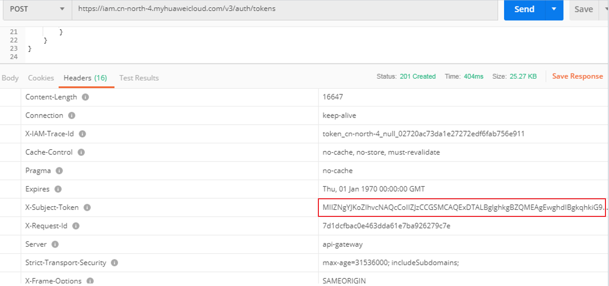
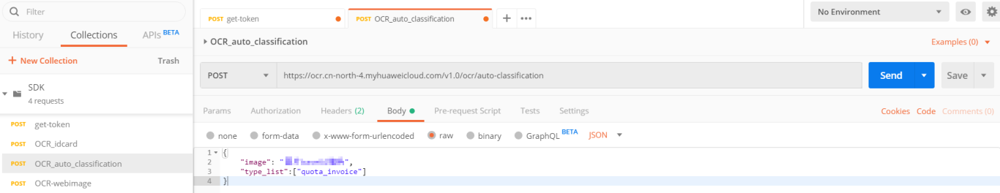

# 如何使用智能分类识别

本节通过如何使用Postman调用智能分类识别API，实现一次性对同张图片中的多个卡证、票据进行检测和识别。

## 前提条件

-   确保已开通服务，具体操作请参见[申请服务](https://support.huaweicloud.com/api-ocr/ocr_03_0043.html)。
-   确保已配置环境，具体操作请参见[如何使用Postman调用华为云OCR服务](https://support.huaweicloud.com/qs-ocr/ocr_05_0003.html)。

## 操作步骤

1.  Token认证。
    1.  在Postman界面上，单击左侧导航树“get-token“，选中Body的配置项，添加华为云账户、密码及智能分类识别服务部署的区域“cn-north-4“。

        获取token的华为云服务所在区域需要和调用的服务所在区域需一致，否则会导致调用失败。

        **图 1**  Body配置页  
        

    2.  单击右上角“Send“，发送“POST https://iam.cn-north-4.myhuaweicloud.com/v3/auth/tokens“。

        获取返回结果中的token值（Token有效期为24小时）。

        **图 2**  返回结果  
        

2.  调用智能分类识别服务。
    1.  单击“OCR\_auto\_classification“，选中“Headers“配置项，复制token值到“X-Auth-Token“。

        **图 3**  Headers配置项  
        

    2.  单击“Body“，复制图片的base64编码值到参数image中。

        获取图片的base64编码操作请参见[如何获取图片的base64编码值](https://support.huaweicloud.com/ocr_faq/ocr_01_0032.html)章节。

    3.  添加智能分类识别服务的请求参数"type\_list"，可以指定识别票据类型为"quota\_invoice"，API参数详情参考[智能分类识别](https://support.huaweicloud.com/api-ocr/ocr_03_0113.html)。

        **图 4**  票据类型  
        

    4.  单击右上角“Send“发送请求，查看识别结果，API示例详情请参考[智能分类识别](https://support.huaweicloud.com/api-ocr/ocr_03_0113.html)。

        **图 5**  识别结果  
        

        若请求失败，则返回错误码及对应的错误信息说明，详细错误码信息请参见[状态码](状态码.md)。

