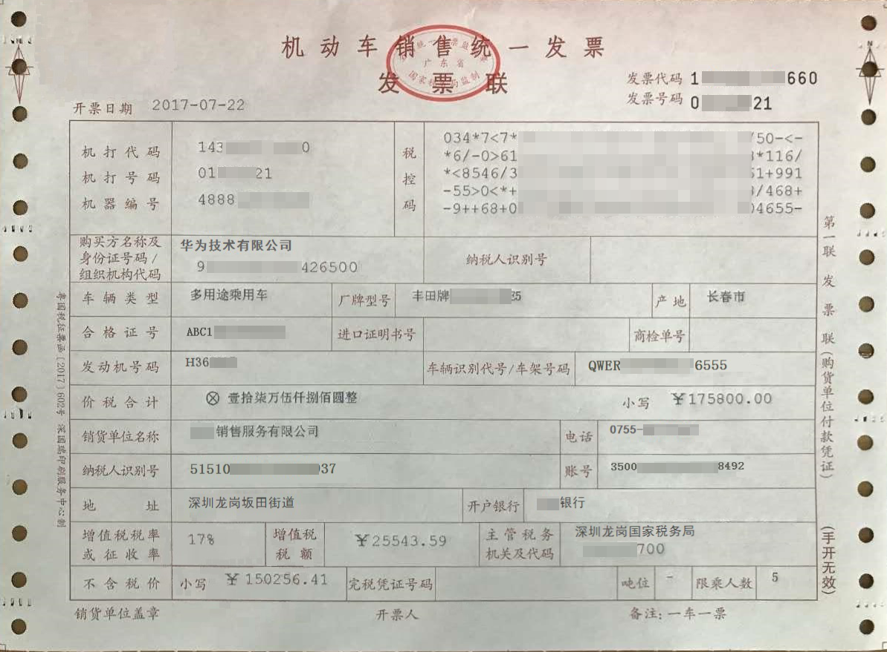

# 机动车销售发票识别<a name="ocr_03_0041"></a>

## 功能介绍<a name="section2663135132410"></a>

识别机动车销售发票图片中的文字内容，并将识别的结果以json格式返回给用户。该接口的使用限制请参见[约束与限制](https://support.huaweicloud.com/productdesc-ocr/ocr_01_0006.html#section16)，详细使用指导请参见[OCR服务使用简介](https://support.huaweicloud.com/qs-ocr/ocr_05_0001.html)章节。

**图 1**  机动车销售发票识别示例图<a name="fig2440191112720"></a>  


> **说明：** 
>如果图片中包含多张卡证票据，请调用[智能分类识别](智能分类识别.md)服务。

## 调试<a name="section1049069122017"></a>

您可以在[API Explorer](https://apiexplorer.developer.huaweicloud.com/apiexplorer/doc?product=OCR&api=RecognizeMvsInvoice)中调试该接口。

## 前提条件<a name="section17299143617379"></a>

在使用机动车销售发票识别之前，需要您完成服务申请和认证鉴权，具体操作流程请参见[申请服务](申请服务.md)和[认证鉴权](认证鉴权.md)章节。

> **说明：** 
>用户首次使用需要先[申请开通](https://console.huaweicloud.com/ocr/?region=cn-north-4#/ocr/overview)。服务只需要开通一次即可，后面使用时无需再次申请。如未开通服务，调用服务时会提示ModelArts.4204报错，请在调用服务前先进入控制台开通服务，并注意开通服务区域与调用服务的区域保持一致。

## URI<a name="zh-cn_topic_0082818466_section5596537"></a>

POST https://\{endpoint\}/v2/\{project\_id\}/ocr/mvs-invoice

**表 1**  路径参数

<a name="table1757114411019"></a>
<table><thead align="left"><tr id="row244311551906"><th class="cellrowborder" valign="top" width="20%" id="mcps1.2.4.1.1"><p id="p15443125512018"><a name="p15443125512018"></a><a name="p15443125512018"></a>参数</p>
</th>
<th class="cellrowborder" valign="top" width="20%" id="mcps1.2.4.1.2"><p id="p14431555504"><a name="p14431555504"></a><a name="p14431555504"></a>是否必选</p>
</th>
<th class="cellrowborder" valign="top" width="60%" id="mcps1.2.4.1.3"><p id="p1444145517013"><a name="p1444145517013"></a><a name="p1444145517013"></a>说明</p>
</th>
</tr>
</thead>
<tbody><tr id="row613718443010"><td class="cellrowborder" valign="top" width="20%" headers="mcps1.2.4.1.1 "><p id="p191375441708"><a name="p191375441708"></a><a name="p191375441708"></a>endpoint</p>
</td>
<td class="cellrowborder" valign="top" width="20%" headers="mcps1.2.4.1.2 "><p id="p81375441015"><a name="p81375441015"></a><a name="p81375441015"></a>是</p>
</td>
<td class="cellrowborder" valign="top" width="60%" headers="mcps1.2.4.1.3 "><p id="p1928291782612"><a name="p1928291782612"></a><a name="p1928291782612"></a>指定承载REST服务端点的服务器域名或IP，不同服务不同区域的endpoint不同，您可以从<a href="终端节点.md">终端节点</a>中获取。</p>
<p id="p85151503246"><a name="p85151503246"></a><a name="p85151503246"></a>例如，OCR服务在<span class="parmvalue" id="parmvalue832520377716"><a name="parmvalue832520377716"></a><a name="parmvalue832520377716"></a>“华北-北京四”</span>区域的<span class="parmname" id="parmname211216411978"><a name="parmname211216411978"></a><a name="parmname211216411978"></a>“endpoint”</span>为<span class="parmvalue" id="parmvalue998414713715"><a name="parmvalue998414713715"></a><a name="parmvalue998414713715"></a>“ocr.cn-north-4.myhuaweicloud.com”</span>。</p>
</td>
</tr>
<tr id="row247285619353"><td class="cellrowborder" valign="top" width="20%" headers="mcps1.2.4.1.1 "><p id="p847215673512"><a name="p847215673512"></a><a name="p847215673512"></a>project_id</p>
</td>
<td class="cellrowborder" valign="top" width="20%" headers="mcps1.2.4.1.2 "><p id="p7472115613350"><a name="p7472115613350"></a><a name="p7472115613350"></a>是</p>
</td>
<td class="cellrowborder" valign="top" width="60%" headers="mcps1.2.4.1.3 "><p id="p2472175617353"><a name="p2472175617353"></a><a name="p2472175617353"></a>项目ID，您可以从<a href="获取项目ID.md">获取项目ID</a>中获取。</p>
</td>
</tr>
</tbody>
</table>

## 请求参数<a name="zh-cn_topic_0082818466_section50368838"></a>

**表 2**  请求Header参数

<a name="table723982483111"></a>
<table><thead align="left"><tr id="row52401924193111"><th class="cellrowborder" valign="top" width="20%" id="mcps1.2.5.1.1"><p id="p1924082410316"><a name="p1924082410316"></a><a name="p1924082410316"></a>参数</p>
</th>
<th class="cellrowborder" valign="top" width="20%" id="mcps1.2.5.1.2"><p id="p12404242315"><a name="p12404242315"></a><a name="p12404242315"></a>是否必选</p>
</th>
<th class="cellrowborder" valign="top" width="20%" id="mcps1.2.5.1.3"><p id="p1924019242314"><a name="p1924019242314"></a><a name="p1924019242314"></a>参数类型</p>
</th>
<th class="cellrowborder" valign="top" width="40%" id="mcps1.2.5.1.4"><p id="p92404245319"><a name="p92404245319"></a><a name="p92404245319"></a>描述</p>
</th>
</tr>
</thead>
<tbody><tr id="row1624062423110"><td class="cellrowborder" valign="top" width="20%" headers="mcps1.2.5.1.1 "><p id="p82401524193115"><a name="p82401524193115"></a><a name="p82401524193115"></a>X-Auth-Token</p>
</td>
<td class="cellrowborder" valign="top" width="20%" headers="mcps1.2.5.1.2 "><p id="p1224017242315"><a name="p1224017242315"></a><a name="p1224017242315"></a>是</p>
</td>
<td class="cellrowborder" valign="top" width="20%" headers="mcps1.2.5.1.3 "><p id="p1424016242318"><a name="p1424016242318"></a><a name="p1424016242318"></a>String</p>
</td>
<td class="cellrowborder" valign="top" width="40%" headers="mcps1.2.5.1.4 "><p id="p62408249311"><a name="p62408249311"></a><a name="p62408249311"></a>用户Token。</p>
<p id="p87711532113213"><a name="p87711532113213"></a><a name="p87711532113213"></a>Token认证就是在调用API的时候将Token加到请求消息头，从而通过身份认证，获得操作API的权限，响应消息头中X-Subject-Token的值即为Token。</p>
</td>
</tr>
<tr id="row5178125191210"><td class="cellrowborder" valign="top" width="20%" headers="mcps1.2.5.1.1 "><p id="p620162911477"><a name="p620162911477"></a><a name="p620162911477"></a>Content-Type</p>
</td>
<td class="cellrowborder" valign="top" width="20%" headers="mcps1.2.5.1.2 "><p id="p122082984710"><a name="p122082984710"></a><a name="p122082984710"></a>是</p>
</td>
<td class="cellrowborder" valign="top" width="20%" headers="mcps1.2.5.1.3 "><p id="p12017295472"><a name="p12017295472"></a><a name="p12017295472"></a>String</p>
</td>
<td class="cellrowborder" valign="top" width="40%" headers="mcps1.2.5.1.4 "><p id="p62022944710"><a name="p62022944710"></a><a name="p62022944710"></a>发送的实体的MIME类型，参数值为“application/json”。</p>
</td>
</tr>
</tbody>
</table>

**表 3**  请求Body参数

<a name="zh-cn_topic_0082818466_table49879860151539"></a>
<table><thead align="left"><tr id="zh-cn_topic_0082818466_row953289151539"><th class="cellrowborder" valign="top" width="15.770000000000001%" id="mcps1.2.5.1.1"><p id="zh-cn_topic_0082818466_p10107569151539"><a name="zh-cn_topic_0082818466_p10107569151539"></a><a name="zh-cn_topic_0082818466_p10107569151539"></a>参数</p>
</th>
<th class="cellrowborder" valign="top" width="16.09%" id="mcps1.2.5.1.2"><p id="zh-cn_topic_0082818466_p13406737151539"><a name="zh-cn_topic_0082818466_p13406737151539"></a><a name="zh-cn_topic_0082818466_p13406737151539"></a>是否必选</p>
</th>
<th class="cellrowborder" valign="top" width="13.270000000000001%" id="mcps1.2.5.1.3"><p id="zh-cn_topic_0082818466_p12203922151539"><a name="zh-cn_topic_0082818466_p12203922151539"></a><a name="zh-cn_topic_0082818466_p12203922151539"></a>参数类型</p>
</th>
<th class="cellrowborder" valign="top" width="54.87%" id="mcps1.2.5.1.4"><p id="zh-cn_topic_0082818466_p48993627151539"><a name="zh-cn_topic_0082818466_p48993627151539"></a><a name="zh-cn_topic_0082818466_p48993627151539"></a>说明</p>
</th>
</tr>
</thead>
<tbody><tr id="zh-cn_topic_0082818466_row9060885151539"><td class="cellrowborder" valign="top" width="15.770000000000001%" headers="mcps1.2.5.1.1 "><p id="zh-cn_topic_0082818466_p62843112151539"><a name="zh-cn_topic_0082818466_p62843112151539"></a><a name="zh-cn_topic_0082818466_p62843112151539"></a>image</p>
</td>
<td class="cellrowborder" valign="top" width="16.09%" headers="mcps1.2.5.1.2 "><p id="zh-cn_topic_0082818466_p57127291151539"><a name="zh-cn_topic_0082818466_p57127291151539"></a><a name="zh-cn_topic_0082818466_p57127291151539"></a>否，该参数与url二选一</p>
</td>
<td class="cellrowborder" valign="top" width="13.270000000000001%" headers="mcps1.2.5.1.3 "><p id="zh-cn_topic_0082818466_p63907830151539"><a name="zh-cn_topic_0082818466_p63907830151539"></a><a name="zh-cn_topic_0082818466_p63907830151539"></a>String</p>
</td>
<td class="cellrowborder" valign="top" width="54.87%" headers="mcps1.2.5.1.4 "><p id="zh-cn_topic_0082818466_p9151746151539"><a name="zh-cn_topic_0082818466_p9151746151539"></a><a name="zh-cn_topic_0082818466_p9151746151539"></a>图像数据，base64编码，要求base64编码后大小不超过10MB。图片最小边不小于100px，最长边不超过8000px。支持JPEG、JPG、PNG、BMP、TIFF格式。</p>
</td>
</tr>
<tr id="zh-cn_topic_0082818466_row9018009195224"><td class="cellrowborder" valign="top" width="15.770000000000001%" headers="mcps1.2.5.1.1 "><p id="zh-cn_topic_0082818466_p14053218195224"><a name="zh-cn_topic_0082818466_p14053218195224"></a><a name="zh-cn_topic_0082818466_p14053218195224"></a>url</p>
</td>
<td class="cellrowborder" valign="top" width="16.09%" headers="mcps1.2.5.1.2 "><p id="zh-cn_topic_0082818466_p64568902195224"><a name="zh-cn_topic_0082818466_p64568902195224"></a><a name="zh-cn_topic_0082818466_p64568902195224"></a>否，该参数与image二选一</p>
</td>
<td class="cellrowborder" valign="top" width="13.270000000000001%" headers="mcps1.2.5.1.3 "><p id="zh-cn_topic_0082818466_p62698574195224"><a name="zh-cn_topic_0082818466_p62698574195224"></a><a name="zh-cn_topic_0082818466_p62698574195224"></a>String</p>
</td>
<td class="cellrowborder" valign="top" width="54.87%" headers="mcps1.2.5.1.4 "><p id="p86827584714"><a name="p86827584714"></a><a name="p86827584714"></a>图片的url路径，目前支持：</p>
<a name="ul42174521583"></a><a name="ul42174521583"></a><ul id="ul42174521583"><li>公网http/https url</li><li>OBS提供的url，使用OBS数据需要进行授权。包括对服务授权、临时授权、匿名公开授权，详情参见<a href="配置OBS访问权限.md">配置OBS访问权限</a>。</li></ul>
<div class="note" id="note1822116578284"><a name="note1822116578284"></a><a name="note1822116578284"></a><span class="notetitle"> 说明： </span><div class="notebody"><a name="ul99367258155"></a><a name="ul99367258155"></a><ul id="ul99367258155"><li>接口响应时间依赖于图片的下载时间，如果图片下载时间过长，会返回接口调用失败。</li></ul>
<a name="ul156081829151514"></a><a name="ul156081829151514"></a><ul id="ul156081829151514"><li>请保证被检测图片所在的存储服务稳定可靠，推荐使用OBS服务存储图片数据。</li></ul>
</div></div>
</td>
</tr>
</tbody>
</table>

## 响应参数<a name="zh-cn_topic_0082818466_section50666366"></a>

根据识别的结果，可能有不同的HTTP响应状态码（status code），状态码和响应参数说明如下。

**状态码： 200**

**表 4**  响应Body参数

<a name="responseParameter"></a>
<table><thead align="left"><tr id="row4469155315582"><th class="cellrowborder" valign="top" width="24.05%" id="mcps1.2.4.1.1"><p id="p5470165318589"><a name="p5470165318589"></a><a name="p5470165318589"></a>参数</p>
</th>
<th class="cellrowborder" valign="top" width="16.57%" id="mcps1.2.4.1.2"><p id="p1747035311586"><a name="p1747035311586"></a><a name="p1747035311586"></a>参数类型</p>
</th>
<th class="cellrowborder" valign="top" width="59.38%" id="mcps1.2.4.1.3"><p id="p447112535589"><a name="p447112535589"></a><a name="p447112535589"></a>描述</p>
</th>
</tr>
</thead>
<tbody><tr id="row5470135320588"><td class="cellrowborder" valign="top" width="24.05%" headers="mcps1.2.4.1.1 "><p id="p17471125315581"><a name="p17471125315581"></a><a name="p17471125315581"></a>result</p>
</td>
<td class="cellrowborder" valign="top" width="16.57%" headers="mcps1.2.4.1.2 "><p id="p194712531583"><a name="p194712531583"></a><a name="p194712531583"></a><a href="#response_MvsInvoiceResultBody">MvsInvoiceResult</a> object</p>
</td>
<td class="cellrowborder" valign="top" width="59.38%" headers="mcps1.2.4.1.3 "><p id="p13472553105811"><a name="p13472553105811"></a><a name="p13472553105811"></a>调用成功时表示调用结果。</p>
<p id="p747295335818"><a name="p747295335818"></a><a name="p747295335818"></a>调用失败时无此字段。</p>
</td>
</tr>
</tbody>
</table>

**表 5**  MvsInvoiceResult

<a name="response_MvsInvoiceResultBody"></a>
<table><thead align="left"><tr id="row13473125365816"><th class="cellrowborder" valign="top" width="24.05%" id="mcps1.2.4.1.1"><p id="p124756537583"><a name="p124756537583"></a><a name="p124756537583"></a>参数</p>
</th>
<th class="cellrowborder" valign="top" width="16.57%" id="mcps1.2.4.1.2"><p id="p11475153175811"><a name="p11475153175811"></a><a name="p11475153175811"></a>参数类型</p>
</th>
<th class="cellrowborder" valign="top" width="59.38%" id="mcps1.2.4.1.3"><p id="p6475135312589"><a name="p6475135312589"></a><a name="p6475135312589"></a>描述</p>
</th>
</tr>
</thead>
<tbody><tr id="row204731533582"><td class="cellrowborder" valign="top" width="24.05%" headers="mcps1.2.4.1.1 "><p id="p17475853175814"><a name="p17475853175814"></a><a name="p17475853175814"></a>code</p>
</td>
<td class="cellrowborder" valign="top" width="16.57%" headers="mcps1.2.4.1.2 "><p id="p74761953185820"><a name="p74761953185820"></a><a name="p74761953185820"></a>String</p>
</td>
<td class="cellrowborder" valign="top" width="59.38%" headers="mcps1.2.4.1.3 "><p id="p44761753145813"><a name="p44761753145813"></a><a name="p44761753145813"></a>发票代码。</p>
</td>
</tr>
<tr id="row11473125325818"><td class="cellrowborder" valign="top" width="24.05%" headers="mcps1.2.4.1.1 "><p id="p11476253135817"><a name="p11476253135817"></a><a name="p11476253135817"></a>number</p>
</td>
<td class="cellrowborder" valign="top" width="16.57%" headers="mcps1.2.4.1.2 "><p id="p5477115385818"><a name="p5477115385818"></a><a name="p5477115385818"></a>String</p>
</td>
<td class="cellrowborder" valign="top" width="59.38%" headers="mcps1.2.4.1.3 "><p id="p1847715535588"><a name="p1847715535588"></a><a name="p1847715535588"></a>发票号码。</p>
</td>
</tr>
<tr id="row164731534586"><td class="cellrowborder" valign="top" width="24.05%" headers="mcps1.2.4.1.1 "><p id="p1477175345813"><a name="p1477175345813"></a><a name="p1477175345813"></a>machine_printed_code</p>
</td>
<td class="cellrowborder" valign="top" width="16.57%" headers="mcps1.2.4.1.2 "><p id="p34781253165817"><a name="p34781253165817"></a><a name="p34781253165817"></a>String</p>
</td>
<td class="cellrowborder" valign="top" width="59.38%" headers="mcps1.2.4.1.3 "><p id="p54780534589"><a name="p54780534589"></a><a name="p54780534589"></a>机打代码。</p>
</td>
</tr>
<tr id="row2473185305815"><td class="cellrowborder" valign="top" width="24.05%" headers="mcps1.2.4.1.1 "><p id="p16478135319582"><a name="p16478135319582"></a><a name="p16478135319582"></a>machine_printed_number</p>
</td>
<td class="cellrowborder" valign="top" width="16.57%" headers="mcps1.2.4.1.2 "><p id="p4478125305819"><a name="p4478125305819"></a><a name="p4478125305819"></a>String</p>
</td>
<td class="cellrowborder" valign="top" width="59.38%" headers="mcps1.2.4.1.3 "><p id="p1647995395817"><a name="p1647995395817"></a><a name="p1647995395817"></a>机打号码。</p>
</td>
</tr>
<tr id="row1547313539587"><td class="cellrowborder" valign="top" width="24.05%" headers="mcps1.2.4.1.1 "><p id="p19479053205810"><a name="p19479053205810"></a><a name="p19479053205810"></a>issue_date</p>
</td>
<td class="cellrowborder" valign="top" width="16.57%" headers="mcps1.2.4.1.2 "><p id="p154791153155816"><a name="p154791153155816"></a><a name="p154791153155816"></a>String</p>
</td>
<td class="cellrowborder" valign="top" width="59.38%" headers="mcps1.2.4.1.3 "><p id="p54808532582"><a name="p54808532582"></a><a name="p54808532582"></a>开票日期。</p>
</td>
</tr>
<tr id="row9473853155816"><td class="cellrowborder" valign="top" width="24.05%" headers="mcps1.2.4.1.1 "><p id="p4480553115812"><a name="p4480553115812"></a><a name="p4480553115812"></a>machine_number</p>
</td>
<td class="cellrowborder" valign="top" width="16.57%" headers="mcps1.2.4.1.2 "><p id="p548014535587"><a name="p548014535587"></a><a name="p548014535587"></a>String</p>
</td>
<td class="cellrowborder" valign="top" width="59.38%" headers="mcps1.2.4.1.3 "><p id="p9480185315810"><a name="p9480185315810"></a><a name="p9480185315810"></a>机器编号。</p>
</td>
</tr>
<tr id="row947315313588"><td class="cellrowborder" valign="top" width="24.05%" headers="mcps1.2.4.1.1 "><p id="p204811553155814"><a name="p204811553155814"></a><a name="p204811553155814"></a>buyer_name</p>
</td>
<td class="cellrowborder" valign="top" width="16.57%" headers="mcps1.2.4.1.2 "><p id="p184811853105813"><a name="p184811853105813"></a><a name="p184811853105813"></a>String</p>
</td>
<td class="cellrowborder" valign="top" width="59.38%" headers="mcps1.2.4.1.3 "><p id="p12482353115813"><a name="p12482353115813"></a><a name="p12482353115813"></a>购买方名称。</p>
</td>
</tr>
<tr id="row94731753175815"><td class="cellrowborder" valign="top" width="24.05%" headers="mcps1.2.4.1.1 "><p id="p1348265335816"><a name="p1348265335816"></a><a name="p1348265335816"></a>buyer_organization_number</p>
</td>
<td class="cellrowborder" valign="top" width="16.57%" headers="mcps1.2.4.1.2 "><p id="p44821537587"><a name="p44821537587"></a><a name="p44821537587"></a>String</p>
</td>
<td class="cellrowborder" valign="top" width="59.38%" headers="mcps1.2.4.1.3 "><p id="p10483175355812"><a name="p10483175355812"></a><a name="p10483175355812"></a>购买方身份证号码/组织机构代码。</p>
</td>
</tr>
<tr id="row114732053175812"><td class="cellrowborder" valign="top" width="24.05%" headers="mcps1.2.4.1.1 "><p id="p1948385335813"><a name="p1948385335813"></a><a name="p1948385335813"></a>buyer_id</p>
</td>
<td class="cellrowborder" valign="top" width="16.57%" headers="mcps1.2.4.1.2 "><p id="p448315313581"><a name="p448315313581"></a><a name="p448315313581"></a>String</p>
</td>
<td class="cellrowborder" valign="top" width="59.38%" headers="mcps1.2.4.1.3 "><p id="p8484145316588"><a name="p8484145316588"></a><a name="p8484145316588"></a>购买方纳税人识别号。</p>
</td>
</tr>
<tr id="row6473205305817"><td class="cellrowborder" valign="top" width="24.05%" headers="mcps1.2.4.1.1 "><p id="p448412533586"><a name="p448412533586"></a><a name="p448412533586"></a>seller_name</p>
</td>
<td class="cellrowborder" valign="top" width="16.57%" headers="mcps1.2.4.1.2 "><p id="p14484105318588"><a name="p14484105318588"></a><a name="p14484105318588"></a>String</p>
</td>
<td class="cellrowborder" valign="top" width="59.38%" headers="mcps1.2.4.1.3 "><p id="p12485653135818"><a name="p12485653135818"></a><a name="p12485653135818"></a>销货单位名称。</p>
</td>
</tr>
<tr id="row647355312587"><td class="cellrowborder" valign="top" width="24.05%" headers="mcps1.2.4.1.1 "><p id="p3485105311589"><a name="p3485105311589"></a><a name="p3485105311589"></a>seller_phone</p>
</td>
<td class="cellrowborder" valign="top" width="16.57%" headers="mcps1.2.4.1.2 "><p id="p154851532583"><a name="p154851532583"></a><a name="p154851532583"></a>String</p>
</td>
<td class="cellrowborder" valign="top" width="59.38%" headers="mcps1.2.4.1.3 "><p id="p04854537588"><a name="p04854537588"></a><a name="p04854537588"></a>销售方电话。</p>
</td>
</tr>
<tr id="row74731253155813"><td class="cellrowborder" valign="top" width="24.05%" headers="mcps1.2.4.1.1 "><p id="p1748675316588"><a name="p1748675316588"></a><a name="p1748675316588"></a>seller_id</p>
</td>
<td class="cellrowborder" valign="top" width="16.57%" headers="mcps1.2.4.1.2 "><p id="p9486155375812"><a name="p9486155375812"></a><a name="p9486155375812"></a>String</p>
</td>
<td class="cellrowborder" valign="top" width="59.38%" headers="mcps1.2.4.1.3 "><p id="p18486105375811"><a name="p18486105375811"></a><a name="p18486105375811"></a>销售方纳税人识别号。</p>
</td>
</tr>
<tr id="row3473155318583"><td class="cellrowborder" valign="top" width="24.05%" headers="mcps1.2.4.1.1 "><p id="p94871053115814"><a name="p94871053115814"></a><a name="p94871053115814"></a>seller_account</p>
</td>
<td class="cellrowborder" valign="top" width="16.57%" headers="mcps1.2.4.1.2 "><p id="p34871153115810"><a name="p34871153115810"></a><a name="p34871153115810"></a>String</p>
</td>
<td class="cellrowborder" valign="top" width="59.38%" headers="mcps1.2.4.1.3 "><p id="p15487753125813"><a name="p15487753125813"></a><a name="p15487753125813"></a>销售方账号。</p>
</td>
</tr>
<tr id="row1647325335811"><td class="cellrowborder" valign="top" width="24.05%" headers="mcps1.2.4.1.1 "><p id="p17488145311581"><a name="p17488145311581"></a><a name="p17488145311581"></a>seller_address</p>
</td>
<td class="cellrowborder" valign="top" width="16.57%" headers="mcps1.2.4.1.2 "><p id="p1848811537588"><a name="p1848811537588"></a><a name="p1848811537588"></a>String</p>
</td>
<td class="cellrowborder" valign="top" width="59.38%" headers="mcps1.2.4.1.3 "><p id="p848875315582"><a name="p848875315582"></a><a name="p848875315582"></a>销售方地址。</p>
</td>
</tr>
<tr id="row5473453105815"><td class="cellrowborder" valign="top" width="24.05%" headers="mcps1.2.4.1.1 "><p id="p19488853155813"><a name="p19488853155813"></a><a name="p19488853155813"></a>seller_bank</p>
</td>
<td class="cellrowborder" valign="top" width="16.57%" headers="mcps1.2.4.1.2 "><p id="p1148985385814"><a name="p1148985385814"></a><a name="p1148985385814"></a>String</p>
</td>
<td class="cellrowborder" valign="top" width="59.38%" headers="mcps1.2.4.1.3 "><p id="p7489155316580"><a name="p7489155316580"></a><a name="p7489155316580"></a>销售方开户行。</p>
</td>
</tr>
<tr id="row1847320533583"><td class="cellrowborder" valign="top" width="24.05%" headers="mcps1.2.4.1.1 "><p id="p1948995311581"><a name="p1948995311581"></a><a name="p1948995311581"></a>vehicle_type</p>
</td>
<td class="cellrowborder" valign="top" width="16.57%" headers="mcps1.2.4.1.2 "><p id="p1849016533580"><a name="p1849016533580"></a><a name="p1849016533580"></a>String</p>
</td>
<td class="cellrowborder" valign="top" width="59.38%" headers="mcps1.2.4.1.3 "><p id="p18490145385819"><a name="p18490145385819"></a><a name="p18490145385819"></a>车辆类型。</p>
</td>
</tr>
<tr id="row6473125319586"><td class="cellrowborder" valign="top" width="24.05%" headers="mcps1.2.4.1.1 "><p id="p20490653195813"><a name="p20490653195813"></a><a name="p20490653195813"></a>brand_model</p>
</td>
<td class="cellrowborder" valign="top" width="16.57%" headers="mcps1.2.4.1.2 "><p id="p349125335815"><a name="p349125335815"></a><a name="p349125335815"></a>String</p>
</td>
<td class="cellrowborder" valign="top" width="59.38%" headers="mcps1.2.4.1.3 "><p id="p20491125355815"><a name="p20491125355815"></a><a name="p20491125355815"></a>厂牌型号。</p>
</td>
</tr>
<tr id="row154731653125814"><td class="cellrowborder" valign="top" width="24.05%" headers="mcps1.2.4.1.1 "><p id="p1749295314581"><a name="p1749295314581"></a><a name="p1749295314581"></a>manufacturing_location</p>
</td>
<td class="cellrowborder" valign="top" width="16.57%" headers="mcps1.2.4.1.2 "><p id="p12492115345814"><a name="p12492115345814"></a><a name="p12492115345814"></a>String</p>
</td>
<td class="cellrowborder" valign="top" width="59.38%" headers="mcps1.2.4.1.3 "><p id="p134923531585"><a name="p134923531585"></a><a name="p134923531585"></a>产地。</p>
</td>
</tr>
<tr id="row19474105317584"><td class="cellrowborder" valign="top" width="24.05%" headers="mcps1.2.4.1.1 "><p id="p3492953115811"><a name="p3492953115811"></a><a name="p3492953115811"></a>quality_certificate</p>
</td>
<td class="cellrowborder" valign="top" width="16.57%" headers="mcps1.2.4.1.2 "><p id="p204937538585"><a name="p204937538585"></a><a name="p204937538585"></a>String</p>
</td>
<td class="cellrowborder" valign="top" width="59.38%" headers="mcps1.2.4.1.3 "><p id="p649315319585"><a name="p649315319585"></a><a name="p649315319585"></a>合格证号。</p>
</td>
</tr>
<tr id="row18474115320580"><td class="cellrowborder" valign="top" width="24.05%" headers="mcps1.2.4.1.1 "><p id="p1349365375813"><a name="p1349365375813"></a><a name="p1349365375813"></a>import_certificate</p>
</td>
<td class="cellrowborder" valign="top" width="16.57%" headers="mcps1.2.4.1.2 "><p id="p15494195313589"><a name="p15494195313589"></a><a name="p15494195313589"></a>String</p>
</td>
<td class="cellrowborder" valign="top" width="59.38%" headers="mcps1.2.4.1.3 "><p id="p1494453205819"><a name="p1494453205819"></a><a name="p1494453205819"></a>进口证明书号。</p>
</td>
</tr>
<tr id="row2474175315812"><td class="cellrowborder" valign="top" width="24.05%" headers="mcps1.2.4.1.1 "><p id="p1649445316585"><a name="p1649445316585"></a><a name="p1649445316585"></a>inspection_number</p>
</td>
<td class="cellrowborder" valign="top" width="16.57%" headers="mcps1.2.4.1.2 "><p id="p8494753195817"><a name="p8494753195817"></a><a name="p8494753195817"></a>String</p>
</td>
<td class="cellrowborder" valign="top" width="59.38%" headers="mcps1.2.4.1.3 "><p id="p16495185325814"><a name="p16495185325814"></a><a name="p16495185325814"></a>商检单号。</p>
</td>
</tr>
<tr id="row34748536584"><td class="cellrowborder" valign="top" width="24.05%" headers="mcps1.2.4.1.1 "><p id="p134978533584"><a name="p134978533584"></a><a name="p134978533584"></a>engine_number</p>
</td>
<td class="cellrowborder" valign="top" width="16.57%" headers="mcps1.2.4.1.2 "><p id="p17498135315815"><a name="p17498135315815"></a><a name="p17498135315815"></a>String</p>
</td>
<td class="cellrowborder" valign="top" width="59.38%" headers="mcps1.2.4.1.3 "><p id="p14498135312584"><a name="p14498135312584"></a><a name="p14498135312584"></a>发动机号码。</p>
</td>
</tr>
<tr id="row84742537588"><td class="cellrowborder" valign="top" width="24.05%" headers="mcps1.2.4.1.1 "><p id="p12499145325810"><a name="p12499145325810"></a><a name="p12499145325810"></a>vehicle_identification_number</p>
</td>
<td class="cellrowborder" valign="top" width="16.57%" headers="mcps1.2.4.1.2 "><p id="p8499175375819"><a name="p8499175375819"></a><a name="p8499175375819"></a>String</p>
</td>
<td class="cellrowborder" valign="top" width="59.38%" headers="mcps1.2.4.1.3 "><p id="p16499135345816"><a name="p16499135345816"></a><a name="p16499135345816"></a>车辆识别代号/车架号码。</p>
</td>
</tr>
<tr id="row54748534586"><td class="cellrowborder" valign="top" width="24.05%" headers="mcps1.2.4.1.1 "><p id="p16500195317583"><a name="p16500195317583"></a><a name="p16500195317583"></a>tonnage</p>
</td>
<td class="cellrowborder" valign="top" width="16.57%" headers="mcps1.2.4.1.2 "><p id="p7500115365817"><a name="p7500115365817"></a><a name="p7500115365817"></a>String</p>
</td>
<td class="cellrowborder" valign="top" width="59.38%" headers="mcps1.2.4.1.3 "><p id="p175000535586"><a name="p175000535586"></a><a name="p175000535586"></a>吨位。</p>
</td>
</tr>
<tr id="row17474195310589"><td class="cellrowborder" valign="top" width="24.05%" headers="mcps1.2.4.1.1 "><p id="p16500135385813"><a name="p16500135385813"></a><a name="p16500135385813"></a>seating_capacity</p>
</td>
<td class="cellrowborder" valign="top" width="16.57%" headers="mcps1.2.4.1.2 "><p id="p19501453105812"><a name="p19501453105812"></a><a name="p19501453105812"></a>String</p>
</td>
<td class="cellrowborder" valign="top" width="59.38%" headers="mcps1.2.4.1.3 "><p id="p10501135310581"><a name="p10501135310581"></a><a name="p10501135310581"></a>限乘人数。</p>
</td>
</tr>
<tr id="row11474353175817"><td class="cellrowborder" valign="top" width="24.05%" headers="mcps1.2.4.1.1 "><p id="p35011853155819"><a name="p35011853155819"></a><a name="p35011853155819"></a>tax_authority</p>
</td>
<td class="cellrowborder" valign="top" width="16.57%" headers="mcps1.2.4.1.2 "><p id="p115026538588"><a name="p115026538588"></a><a name="p115026538588"></a>String</p>
</td>
<td class="cellrowborder" valign="top" width="59.38%" headers="mcps1.2.4.1.3 "><p id="p11502353145818"><a name="p11502353145818"></a><a name="p11502353145818"></a>主管税务机关。</p>
</td>
</tr>
<tr id="row114741153175817"><td class="cellrowborder" valign="top" width="24.05%" headers="mcps1.2.4.1.1 "><p id="p12502155319585"><a name="p12502155319585"></a><a name="p12502155319585"></a>tax_authority_code</p>
</td>
<td class="cellrowborder" valign="top" width="16.57%" headers="mcps1.2.4.1.2 "><p id="p20504135315810"><a name="p20504135315810"></a><a name="p20504135315810"></a>String</p>
</td>
<td class="cellrowborder" valign="top" width="59.38%" headers="mcps1.2.4.1.3 "><p id="p0504125325814"><a name="p0504125325814"></a><a name="p0504125325814"></a>主管税务机关代码。</p>
</td>
</tr>
<tr id="row3474175375818"><td class="cellrowborder" valign="top" width="24.05%" headers="mcps1.2.4.1.1 "><p id="p65049536583"><a name="p65049536583"></a><a name="p65049536583"></a>tax_payment_receipt</p>
</td>
<td class="cellrowborder" valign="top" width="16.57%" headers="mcps1.2.4.1.2 "><p id="p10505105315820"><a name="p10505105315820"></a><a name="p10505105315820"></a>String</p>
</td>
<td class="cellrowborder" valign="top" width="59.38%" headers="mcps1.2.4.1.3 "><p id="p2505195315581"><a name="p2505195315581"></a><a name="p2505195315581"></a>完税凭证号码。</p>
</td>
</tr>
<tr id="row19474115319586"><td class="cellrowborder" valign="top" width="24.05%" headers="mcps1.2.4.1.1 "><p id="p0505115325810"><a name="p0505115325810"></a><a name="p0505115325810"></a>tax_rate</p>
</td>
<td class="cellrowborder" valign="top" width="16.57%" headers="mcps1.2.4.1.2 "><p id="p8505185315813"><a name="p8505185315813"></a><a name="p8505185315813"></a>String</p>
</td>
<td class="cellrowborder" valign="top" width="59.38%" headers="mcps1.2.4.1.3 "><p id="p450617539587"><a name="p450617539587"></a><a name="p450617539587"></a>增值税税率或征收率。</p>
</td>
</tr>
<tr id="row247425310583"><td class="cellrowborder" valign="top" width="24.05%" headers="mcps1.2.4.1.1 "><p id="p13506115315819"><a name="p13506115315819"></a><a name="p13506115315819"></a>tax</p>
</td>
<td class="cellrowborder" valign="top" width="16.57%" headers="mcps1.2.4.1.2 "><p id="p1750675385813"><a name="p1750675385813"></a><a name="p1750675385813"></a>String</p>
</td>
<td class="cellrowborder" valign="top" width="59.38%" headers="mcps1.2.4.1.3 "><p id="p105071253175814"><a name="p105071253175814"></a><a name="p105071253175814"></a>增值税税额。</p>
</td>
</tr>
<tr id="row447465335816"><td class="cellrowborder" valign="top" width="24.05%" headers="mcps1.2.4.1.1 "><p id="p165075532588"><a name="p165075532588"></a><a name="p165075532588"></a>tax_exclusive_price</p>
</td>
<td class="cellrowborder" valign="top" width="16.57%" headers="mcps1.2.4.1.2 "><p id="p9507185310580"><a name="p9507185310580"></a><a name="p9507185310580"></a>String</p>
</td>
<td class="cellrowborder" valign="top" width="59.38%" headers="mcps1.2.4.1.3 "><p id="p8507195315812"><a name="p8507195315812"></a><a name="p8507195315812"></a>不含税价。</p>
</td>
</tr>
<tr id="row847425375818"><td class="cellrowborder" valign="top" width="24.05%" headers="mcps1.2.4.1.1 "><p id="p10508853105813"><a name="p10508853105813"></a><a name="p10508853105813"></a>total</p>
</td>
<td class="cellrowborder" valign="top" width="16.57%" headers="mcps1.2.4.1.2 "><p id="p4518125319581"><a name="p4518125319581"></a><a name="p4518125319581"></a>String</p>
</td>
<td class="cellrowborder" valign="top" width="59.38%" headers="mcps1.2.4.1.3 "><p id="p1551945313581"><a name="p1551945313581"></a><a name="p1551945313581"></a>价税合计。</p>
</td>
</tr>
<tr id="row3474135385814"><td class="cellrowborder" valign="top" width="24.05%" headers="mcps1.2.4.1.1 "><p id="p1351975319586"><a name="p1351975319586"></a><a name="p1351975319586"></a>total_chinese</p>
</td>
<td class="cellrowborder" valign="top" width="16.57%" headers="mcps1.2.4.1.2 "><p id="p25191534581"><a name="p25191534581"></a><a name="p25191534581"></a>String</p>
</td>
<td class="cellrowborder" valign="top" width="59.38%" headers="mcps1.2.4.1.3 "><p id="p1952025312587"><a name="p1952025312587"></a><a name="p1952025312587"></a>价税合计大写。</p>
</td>
</tr>
<tr id="row9474165311586"><td class="cellrowborder" valign="top" width="24.05%" headers="mcps1.2.4.1.1 "><p id="p1652025314586"><a name="p1652025314586"></a><a name="p1652025314586"></a>fiscal_code</p>
</td>
<td class="cellrowborder" valign="top" width="16.57%" headers="mcps1.2.4.1.2 "><p id="p5521853195819"><a name="p5521853195819"></a><a name="p5521853195819"></a>String</p>
</td>
<td class="cellrowborder" valign="top" width="59.38%" headers="mcps1.2.4.1.3 "><p id="p352145317583"><a name="p352145317583"></a><a name="p352145317583"></a>税控码。</p>
</td>
</tr>
</tbody>
</table>

**状态码： 400**

**表 6**  响应Body参数

<a name="zh-cn_topic_0080955351_table57578428152029"></a>
<table><thead align="left"><tr id="zh-cn_topic_0080955351_row43179280152029"><th class="cellrowborder" valign="top" width="24.05%" id="mcps1.2.4.1.1"><p id="zh-cn_topic_0080955351_p7860819152029"><a name="zh-cn_topic_0080955351_p7860819152029"></a><a name="zh-cn_topic_0080955351_p7860819152029"></a>参数</p>
</th>
<th class="cellrowborder" valign="top" width="16.57%" id="mcps1.2.4.1.2"><p id="zh-cn_topic_0080955351_p32746582152029"><a name="zh-cn_topic_0080955351_p32746582152029"></a><a name="zh-cn_topic_0080955351_p32746582152029"></a>参数类型</p>
</th>
<th class="cellrowborder" valign="top" width="59.38%" id="mcps1.2.4.1.3"><p id="zh-cn_topic_0080955351_p35227457152029"><a name="zh-cn_topic_0080955351_p35227457152029"></a><a name="zh-cn_topic_0080955351_p35227457152029"></a>说明</p>
</th>
</tr>
</thead>
<tbody><tr id="zh-cn_topic_0080955351_row23515589152029"><td class="cellrowborder" valign="top" width="24.05%" headers="mcps1.2.4.1.1 "><p id="zh-cn_topic_0080955351_p25714562152029"><a name="zh-cn_topic_0080955351_p25714562152029"></a><a name="zh-cn_topic_0080955351_p25714562152029"></a>error_code</p>
</td>
<td class="cellrowborder" valign="top" width="16.57%" headers="mcps1.2.4.1.2 "><p id="zh-cn_topic_0080955351_p2504796152029"><a name="zh-cn_topic_0080955351_p2504796152029"></a><a name="zh-cn_topic_0080955351_p2504796152029"></a>String</p>
</td>
<td class="cellrowborder" valign="top" width="59.38%" headers="mcps1.2.4.1.3 "><p id="zh-cn_topic_0080955351_p60245514105956"><a name="zh-cn_topic_0080955351_p60245514105956"></a><a name="zh-cn_topic_0080955351_p60245514105956"></a>调用失败时的错误码，具体请参见<a href="错误码.md">错误码</a>。</p>
<p id="p143717550113"><a name="p143717550113"></a><a name="p143717550113"></a>当出现错误码<span class="parmname" id="parmname179861912181220"><a name="parmname179861912181220"></a><a name="parmname179861912181220"></a>“ModelArts.4204”</span>时，请参考<a href="https://support.huaweicloud.com/ocr_faq/ocr_01_0031.html" target="_blank" rel="noopener noreferrer">为什么调用API时提示“ModelArts.4204”？</a>章节。</p>
<p id="zh-cn_topic_0080955351_p5338721105956"><a name="zh-cn_topic_0080955351_p5338721105956"></a><a name="zh-cn_topic_0080955351_p5338721105956"></a>调用成功时无此字段。</p>
</td>
</tr>
<tr id="zh-cn_topic_0080955351_row14057230152029"><td class="cellrowborder" valign="top" width="24.05%" headers="mcps1.2.4.1.1 "><p id="zh-cn_topic_0080955351_p64893870152029"><a name="zh-cn_topic_0080955351_p64893870152029"></a><a name="zh-cn_topic_0080955351_p64893870152029"></a>error_msg</p>
</td>
<td class="cellrowborder" valign="top" width="16.57%" headers="mcps1.2.4.1.2 "><p id="zh-cn_topic_0080955351_p21912135152029"><a name="zh-cn_topic_0080955351_p21912135152029"></a><a name="zh-cn_topic_0080955351_p21912135152029"></a>String</p>
</td>
<td class="cellrowborder" valign="top" width="59.38%" headers="mcps1.2.4.1.3 "><p id="zh-cn_topic_0080955351_p66722601105956"><a name="zh-cn_topic_0080955351_p66722601105956"></a><a name="zh-cn_topic_0080955351_p66722601105956"></a>调用失败时的错误信息。</p>
<p id="zh-cn_topic_0080955351_p63632502105956"><a name="zh-cn_topic_0080955351_p63632502105956"></a><a name="zh-cn_topic_0080955351_p63632502105956"></a>调用成功时无此字段。</p>
</td>
</tr>
</tbody>
</table>

## 请求示例<a name="section1792819511526"></a>

> **说明：** 
>-   “endpoint“即调用API的请求地址，不同服务不同区域的“endpoint“不同，具体请参见[终端节点](终端节点.md)。
>    例如，机动车销售发票识别服务部署在“华北-北京四“区域的“endpoint“为“ocr.cn-north-4.myhuaweicloud.com“，请求URL为“https://ocr.cn-north-4.myhuaweicloud.com/v2/\{project\_id\}/ocr/mvs-invoice“，“project\_id“为项目ID，获取方法请参见[获取项目ID](获取项目ID.md)
>-   如何获取Token具体操作请参见[构造请求](构造请求.md)。

-   请求示例（方式一：使用图片的base64编码）

    ```
    POST https://{endpoint}/v2/{project_id}/ocr/mvs-invoice 
        
     Request Header:   
     Content-Type: application/json   
     X-Auth-Token: MIINRwYJKoZIhvcNAQcCoIINODCCDTQCAQExDTALBglghkgBZQMEAgEwgguVBgkqhkiG...      
     Request Body:
     { 
        "image":"/9j/4AAQSkZJRgABAgEASABIAAD/4RFZRXhpZgAATU0AKgAAAA..."
      }
    ```


-   请求示例（方式二：使用图片URL）

    ```
    POST https://{endpoint}/v2/{project_id}/ocr/mvs-invoice
        
     Request Header:   
     Content-Type: application/json   
     X-Auth-Token: MIINRwYJKoZIhvcNAQcCoIINODCCDTQCAQExDTALBglghkgBZQMEAgEwgguVBgkqhkiG...      
     Request Body:
     {
         "url":"https://BucketName.obs.xxxx.com/ObjectName"
      }
    ```


-   Python3语言请求代码示例（其他语言参照下列示例编写或使用OCR SDK）

    ```
    # encoding:utf-8
    
    import requests
    import base64
    
    url = "https://{endpoint}/v2/{project_id}/ocr/mvs-invoice"
    token = "用户获取得到的实际token值"
    headers = {'Content-Type': 'application/json', 'X-Auth-Token': token}
    
    imagepath = r'./data/mvs-invoice-demo.png'
    with open(imagepath, "rb") as bin_data:
        image_data = bin_data.read()
    image_base64 = base64.b64encode(image_data).decode("utf-8")  # 使用图片的base64编码
    payload = {"image": image_base64}  # url与image参数二选一
    response = requests.post(url, headers=headers, json=payload)
    print(response.text)
    ```


## 响应示例<a name="section123751283412"></a>

**状态码：200**

成功响应示例

```
{
  "result":{
      "code":"11XXXXXXXX88",
      "number":"00XXXX08",
      "machine_printed_code":"11XXXXXXXX88",
      "machine_printed_number":"00XXXX08",
      "issue_date":"2017-07-19",
      "machine_number":"49991450XXXX",
      "buyer_name":"深圳市宝安区XXX",
      "buyer_organization_number":"XXX",
      "buyer_id":"XXX",
      "seller_name":"深圳市XXX服务有限公司",
      "seller_phone":"0755-XXX",
      "seller_id":"XXX",
      "seller_account":"XXX",
      "seller_address":"深圳市宝安区松岗街道办XXX",
      "seller_bank":"XX银行深圳XX支行",
      "vehicle_type":"多用途乘用车",
      "brand_model": "XXX",
      "manufacturing_location":"大连市",
      "quality_certificate":"XXX",
      "import_certificate":"",
      "inspection_number":"", 
      "engine_number":"XXX",
      "vehicle_identification_number":"XXX",
      "tonnage": "",
      "seating_capacity":"5",
      "tax_authority":"XXXX",
      "tax_authority_code":"122XXXX08",
      "tax_payment_receipt":"",
      "tax_rate": "17%",
      "tax": "￥21475.21",
      "tax_exclusive_price": "￥126324.79",
      "total": "￥147800.00",
      "total_chinese": "壹拾肆万柒仟捌佰圆整"，
      "fiscal_code":""
  }
}
```

**状态码：400**

失败响应示例

```
{
    "error_code": "AIS.0103",
    "error_msg": "The image size does not meet the requirements."
}
```

## 状态码<a name="zh-cn_topic_0082818466_section59700980145140"></a>

<a name="table59811812815"></a>
<table><thead align="left"><tr id="row109811881280"><th class="cellrowborder" valign="top" width="30%" id="mcps1.1.3.1.1"><p id="p6981987818"><a name="p6981987818"></a><a name="p6981987818"></a>状态码</p>
</th>
<th class="cellrowborder" valign="top" width="70%" id="mcps1.1.3.1.2"><p id="p39821086818"><a name="p39821086818"></a><a name="p39821086818"></a>描述</p>
</th>
</tr>
</thead>
<tbody><tr id="row99821816814"><td class="cellrowborder" valign="top" width="30%" headers="mcps1.1.3.1.1 "><p id="p39821881387"><a name="p39821881387"></a><a name="p39821881387"></a>200</p>
</td>
<td class="cellrowborder" valign="top" width="70%" headers="mcps1.1.3.1.2 "><p id="p20982189818"><a name="p20982189818"></a><a name="p20982189818"></a>成功响应。</p>
</td>
</tr>
<tr id="row477317212816"><td class="cellrowborder" valign="top" width="30%" headers="mcps1.1.3.1.1 "><p id="p577317219819"><a name="p577317219819"></a><a name="p577317219819"></a>400</p>
</td>
<td class="cellrowborder" valign="top" width="70%" headers="mcps1.1.3.1.2 "><p id="p177311219818"><a name="p177311219818"></a><a name="p177311219818"></a>失败响应。</p>
</td>
</tr>
</tbody>
</table>

状态码请参见[状态码](状态码.md)。

## 错误码<a name="section545533743312"></a>

错误码请参见[错误码](错误码.md)。

