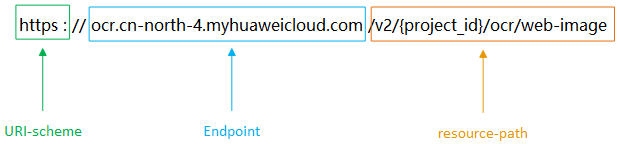

# 构造请求<a name="ocr_03_0002"></a>

本节介绍REST API请求的组成，并以调用[网络图片识别](网络图片识别.md)接口说明如何调用API。

您还可以通过这个视频教程了解如何构造请求调用API：[https://bbs.huaweicloud.com/videos/102987](https://bbs.huaweicloud.com/videos/102987)  。

## 请求URI<a name="section199601859122220"></a>

请求URI由如下部分组成。

**\{URI-scheme\} :// \{endpoint\} / \{resource-path\} ? \{query-string\}**

尽管请求URI包含在请求消息头中，但大多数语言或框架都要求您从请求消息中单独传递它，所以在此单独强调。

**表 1**  URI中的参数说明

<a name="table95142505249"></a>
<table><thead align="left"><tr id="row12515165082410"><th class="cellrowborder" valign="top" width="17.75%" id="mcps1.2.3.1.1"><p id="p551520507242"><a name="p551520507242"></a><a name="p551520507242"></a>参数</p>
</th>
<th class="cellrowborder" valign="top" width="82.25%" id="mcps1.2.3.1.2"><p id="p1151513509248"><a name="p1151513509248"></a><a name="p1151513509248"></a>说明</p>
</th>
</tr>
</thead>
<tbody><tr id="row175157507247"><td class="cellrowborder" valign="top" width="17.75%" headers="mcps1.2.3.1.1 "><p id="p8515165013244"><a name="p8515165013244"></a><a name="p8515165013244"></a><span>URI-scheme</span></p>
</td>
<td class="cellrowborder" valign="top" width="82.25%" headers="mcps1.2.3.1.2 "><p id="p92594595250"><a name="p92594595250"></a><a name="p92594595250"></a>表示用于传输请求的协议，当前所有API均采用<strong id="b1825917591257"><a name="b1825917591257"></a><a name="b1825917591257"></a>HTTPS</strong>协议。</p>
</td>
</tr>
<tr id="row1351565082412"><td class="cellrowborder" valign="top" width="17.75%" headers="mcps1.2.3.1.1 "><p id="p25154507240"><a name="p25154507240"></a><a name="p25154507240"></a><span>endpoint</span></p>
</td>
<td class="cellrowborder" valign="top" width="82.25%" headers="mcps1.2.3.1.2 "><p id="p1928291782612"><a name="p1928291782612"></a><a name="p1928291782612"></a>指定承载REST服务端点的服务器域名或IP，不同服务不同区域的endpoint不同，您可以从<a href="https://developer.huaweicloud.com/endpoint?OCR" target="_blank" rel="noopener noreferrer">地区和终端节点</a>获取。</p>
<p id="p85151503246"><a name="p85151503246"></a><a name="p85151503246"></a>例如OCR服务在<span class="parmvalue" id="parmvalue20494982100"><a name="parmvalue20494982100"></a><a name="parmvalue20494982100"></a>“华北-北京四”</span>区域的<span class="parmname" id="parmname42810122107"><a name="parmname42810122107"></a><a name="parmname42810122107"></a>“endpoint”</span>为<span class="parmvalue" id="parmvalue17768192915100"><a name="parmvalue17768192915100"></a><a name="parmvalue17768192915100"></a>“ocr.cn-north-4.myhuaweicloud.com”</span>。</p>
</td>
</tr>
<tr id="row2515750172419"><td class="cellrowborder" valign="top" width="17.75%" headers="mcps1.2.3.1.1 "><p id="p45150508244"><a name="p45150508244"></a><a name="p45150508244"></a><span>resource-path</span></p>
</td>
<td class="cellrowborder" valign="top" width="82.25%" headers="mcps1.2.3.1.2 "><p id="p15280942313"><a name="p15280942313"></a><a name="p15280942313"></a><span>资源路径，也即API访问路径。</span></p>
<p id="p951519504246"><a name="p951519504246"></a><a name="p951519504246"></a><span>从具体API的URI模块获取，例如</span><a href="网络图片识别.md">网络图片识别</a><span>API的</span><span class="parmvalue" id="parmvalue178242381109"><a name="parmvalue178242381109"></a><a name="parmvalue178242381109"></a>“resource-path”</span><span>为</span>“v2/{project_id}/ocr/web-image”<span>。</span></p>
</td>
</tr>
<tr id="row75151950162415"><td class="cellrowborder" valign="top" width="17.75%" headers="mcps1.2.3.1.1 "><p id="p2515350122410"><a name="p2515350122410"></a><a name="p2515350122410"></a><span>query-string</span></p>
</td>
<td class="cellrowborder" valign="top" width="82.25%" headers="mcps1.2.3.1.2 "><p id="p4515125062410"><a name="p4515125062410"></a><a name="p4515125062410"></a><span>查询参数，是可选部分，并不是每个API都有查询参数。查询参数前面需要带一个</span><span class="parmvalue" id="parmvalue9382121181114"><a name="parmvalue9382121181114"></a><a name="parmvalue9382121181114"></a>“？”</span><span>，形式为</span><span class="parmvalue" id="parmvalue1669415365119"><a name="parmvalue1669415365119"></a><a name="parmvalue1669415365119"></a>“参数名=参数取值”</span><span>，例如</span><span class="parmvalue" id="parmvalue469334571114"><a name="parmvalue469334571114"></a><a name="parmvalue469334571114"></a>“limit=10”</span><span>，表示查询不超过10条数据。</span></p>
</td>
</tr>
</tbody>
</table>

例如，在“华北-北京四“区域调用[网络图片识别](网络图片识别.md)API，则需使用“华北-北京四“区域的endpoint（ocr.cn-north-4.myhuaweicloud.com），拼接起来如下所示。

```
https://ocr.cn-north-4.myhuaweicloud.com/v2/{project_id}/ocr/web-image
```

**图 1**  URI示意图<a name="fig569063110402"></a>  


> **说明：** 
>为查看方便，在每个具体API的URI部分，只给出resource-path部分，并将请求方法写在一起。这是因为URI-scheme都是HTTPS，而endpoint在同一个区域也相同，所以简洁起见将这两部分省略。

## 请求方法<a name="section15275111414496"></a>

HTTP请求方法（也称为操作或动词），它告诉服务你正在请求什么类型的操作。

**表 2**  HTTP方法

<a name="table1540272718416"></a>
<table><thead align="left"><tr id="row54021627204112"><th class="cellrowborder" valign="top" width="23.549999999999997%" id="mcps1.2.3.1.1"><p id="p9402172717411"><a name="p9402172717411"></a><a name="p9402172717411"></a>方法</p>
</th>
<th class="cellrowborder" valign="top" width="76.44999999999999%" id="mcps1.2.3.1.2"><p id="p2402127204118"><a name="p2402127204118"></a><a name="p2402127204118"></a>说明</p>
</th>
</tr>
</thead>
<tbody><tr id="row1240252718417"><td class="cellrowborder" valign="top" width="23.549999999999997%" headers="mcps1.2.3.1.1 "><p id="p640252715412"><a name="p640252715412"></a><a name="p640252715412"></a><span>GET</span></p>
</td>
<td class="cellrowborder" valign="top" width="76.44999999999999%" headers="mcps1.2.3.1.2 "><p id="p10402202719419"><a name="p10402202719419"></a><a name="p10402202719419"></a><span>请求服务器返回指定资源。</span></p>
</td>
</tr>
<tr id="row1740222794112"><td class="cellrowborder" valign="top" width="23.549999999999997%" headers="mcps1.2.3.1.1 "><p id="p15402527154111"><a name="p15402527154111"></a><a name="p15402527154111"></a><span>PUT</span></p>
</td>
<td class="cellrowborder" valign="top" width="76.44999999999999%" headers="mcps1.2.3.1.2 "><p id="p040242754116"><a name="p040242754116"></a><a name="p040242754116"></a><span>请求服务器更新指定资源。</span></p>
</td>
</tr>
<tr id="row1840272711411"><td class="cellrowborder" valign="top" width="23.549999999999997%" headers="mcps1.2.3.1.1 "><p id="p154021327134111"><a name="p154021327134111"></a><a name="p154021327134111"></a><span>POST</span></p>
</td>
<td class="cellrowborder" valign="top" width="76.44999999999999%" headers="mcps1.2.3.1.2 "><p id="p2040292784113"><a name="p2040292784113"></a><a name="p2040292784113"></a><span>请求服务器新增资源或执行特殊操作。</span></p>
</td>
</tr>
<tr id="row14027272411"><td class="cellrowborder" valign="top" width="23.549999999999997%" headers="mcps1.2.3.1.1 "><p id="p15402127164110"><a name="p15402127164110"></a><a name="p15402127164110"></a><span>DELETE</span></p>
</td>
<td class="cellrowborder" valign="top" width="76.44999999999999%" headers="mcps1.2.3.1.2 "><p id="p19402162704117"><a name="p19402162704117"></a><a name="p19402162704117"></a><span>请求服务器删除指定资源，如删除对象等。</span></p>
</td>
</tr>
<tr id="row13402152717414"><td class="cellrowborder" valign="top" width="23.549999999999997%" headers="mcps1.2.3.1.1 "><p id="p2402182713411"><a name="p2402182713411"></a><a name="p2402182713411"></a><span>HEAD</span></p>
</td>
<td class="cellrowborder" valign="top" width="76.44999999999999%" headers="mcps1.2.3.1.2 "><p id="p2402192714112"><a name="p2402192714112"></a><a name="p2402192714112"></a><span>请求服务器资源头部。</span></p>
</td>
</tr>
<tr id="row2402142734117"><td class="cellrowborder" valign="top" width="23.549999999999997%" headers="mcps1.2.3.1.1 "><p id="p12402182716412"><a name="p12402182716412"></a><a name="p12402182716412"></a><span>PATCH</span></p>
</td>
<td class="cellrowborder" valign="top" width="76.44999999999999%" headers="mcps1.2.3.1.2 "><p id="p173184444212"><a name="p173184444212"></a><a name="p173184444212"></a>请求服务器更新资源的部分内容。</p>
<p id="p373544134214"><a name="p373544134214"></a><a name="p373544134214"></a>当资源不存在的时候，PATCH可能会去创建一个新的资源。</p>
</td>
</tr>
</tbody>
</table>

例如，[网络图片识别](网络图片识别.md)URI部分，您可以看到其请求方法为“POST“，则其请求为：

```
POST https://ocr.cn-north-4.myhuaweicloud.com/v2/{project_id}/ocr/web-image
```

## 请求消息头<a name="section6670105414718"></a>

附加请求头字段，如指定的URI和HTTP方法所要求的字段。例如定义消息体类型的请求头“Content-Type“，请求鉴权信息等。

-   **Content-Type**：消息体的类型（格式），必选，默认取值为“application/json”，有其他取值时会在具体接口中专门说明。
-   **X-Auth-Token**：用户Token，可选，当使用Token方式认证时，必须填充该字段。用户Token请参考[认证鉴权](认证鉴权.md)。

添加消息头后的请求如下所示。

```
POST https://ocr.cn-north-4.myhuaweicloud.com/v2/{project_id}/ocr/web-image
Content-Type: application/json
x-auth-token: MIIaBgYJKoZIhvcNAQcC…
```

## 请求消息体<a name="section188635120132"></a>

请求消息体通常以结构化格式发出，与请求消息头中Content-type对应，传递除请求消息头之外的内容。若请求消息体中参数支持中文，则中文字符必须为UTF-8编码。

每个接口的请求消息体内容不同，也并不是每个接口都需要有请求消息体（或者说消息体为空），GET、DELETE操作类型的接口就不需要消息体，消息体具体内容需要根据具体接口而定。

例如，对于[网络图片识别](网络图片识别.md)接口，您可以从接口的请求部分看到所需的请求参数及参数说明。将消息体加入后的请求如下所示。

```
POST https://ocr.cn-north-4.myhuaweicloud.com/v2/{project_id}/ocr/web-image
Request Header:   
Content-Type: application/json   
X-Auth-Token: MIINRwYJKoZIhvcNAQcCoIINODCCDTQCAQExDTALBglghkgBZQMEAgEwgguVBgkqhkiG...       
Request Body:
{
     "url":"https://BucketName.obs.xxxx.com/ObjectName"
}
```

到这里为止这个请求需要的内容就具备齐全了，您可以使用curl、Postman或直接编写代码等方式发送请求调用API。

