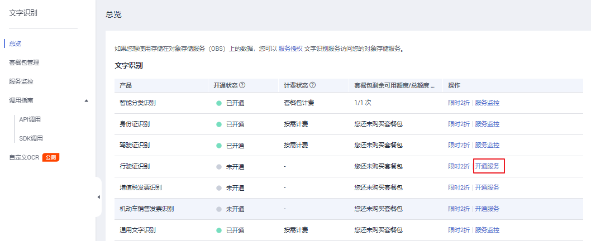

# 申请服务

使用文字识别服务之前，必须先申请并[开通服务](https://console.huaweicloud.com/ocr/?region=cn-north-4&locale=zh-cn#/ocr/management/main)，服务申请步骤如下所示。

> **说明：**   
>1.  申请文字识别服务之前，必须先申请华为云账号。  
>2.  用户首次使用文字识别服务时，需要先申请开通该服务。服务只需要开通一次即可，后面使用时无需再次申请。  

## 申请服务

1.  进入[文字识别OCR主页](https://www.huaweicloud.com/product/ocr.html)，单击“立即使用“，进入文字识别Console控制台（需要使用华为云账号登录）。

    **图 1**  文字识别OCR主页  
    

2.  选择服务所在的区域。

    系统默认显示“华北-北京四“，请根据各服务的部署区域选择对应区域，具体请参见[终端节点](终端节点.md)。

3.  在左侧服务列表中单击需要使用的服务，单击“开通服务“。

    **图 2**  开通服务  
    

4.  服务开通成功后，界面显示已开通的服务。

