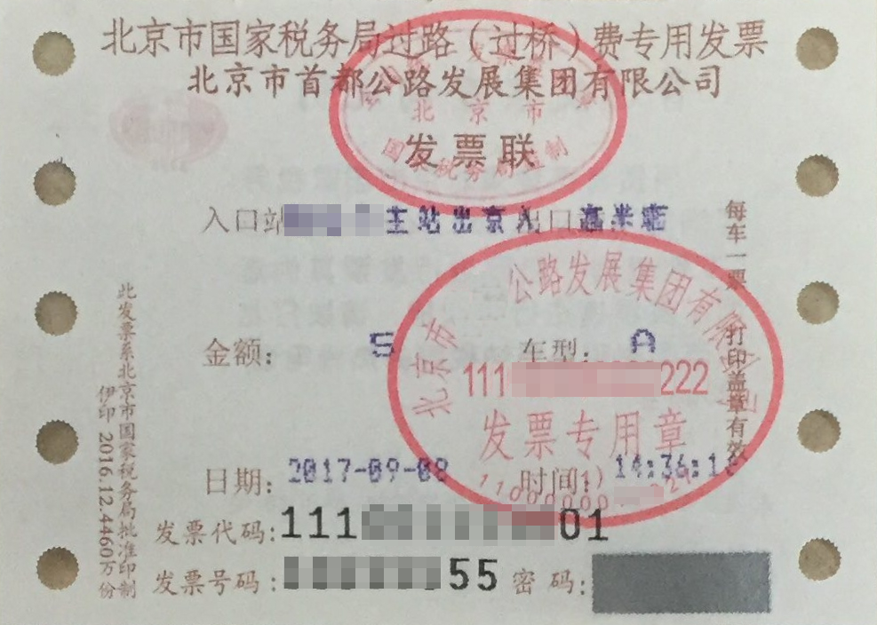

# 车辆通行费发票识别<a name="ocr_03_0100"></a>

## 功能介绍<a name="section7237135610357"></a>

识别车辆通行费发票中的关键文字信息，并以json格式返回识别的结构化结果。该接口的使用限制请参见[约束与限制](https://support.huaweicloud.com/productdesc-ocr/ocr_01_0006.html#section17)，详细使用指导请参见[OCR服务使用简介](https://support.huaweicloud.com/qs-ocr/ocr_05_0001.html)章节。

**图 1**  车辆通行费发票识别示例图<a name="fig1443210198292"></a>  


> **说明：** 
>如果图片中包含多张卡证票据，请调用[智能分类识别](智能分类识别.md)服务。

## 调试<a name="section20186520142416"></a>

您可以在[API Explorer](https://apiexplorer.developer.huaweicloud.com/apiexplorer/doc?product=OCR&api=RecognizeTollInvoice)中调试该接口。

## 前提条件<a name="section17299143617379"></a>

在使用车辆通行费发票识别之前，需要您完成服务申请和认证鉴权，具体操作流程请参见[申请服务](申请服务.md)和[认证鉴权](认证鉴权.md)章节。

> **说明：** 
>用户首次使用需要先[申请开通](https://console.huaweicloud.com/ocr/?region=cn-north-4#/ocr/overview)。服务只需要开通一次即可，后面使用时无需再次申请。如未开通服务，调用服务时会提示ModelArts.4204报错，请在调用服务前先进入控制台开通服务，并注意开通服务区域与调用服务的区域保持一致。

## URI<a name="section1416243117362"></a>

POST https://\{endpoint\}/v2/\{project\_id\}/ocr/toll-invoice

**表 1**  路径参数

<a name="table1757114411019"></a>
<table><thead align="left"><tr id="row244311551906"><th class="cellrowborder" valign="top" width="20%" id="mcps1.2.4.1.1"><p id="p15443125512018"><a name="p15443125512018"></a><a name="p15443125512018"></a>参数</p>
</th>
<th class="cellrowborder" valign="top" width="20%" id="mcps1.2.4.1.2"><p id="p14431555504"><a name="p14431555504"></a><a name="p14431555504"></a>是否必选</p>
</th>
<th class="cellrowborder" valign="top" width="60%" id="mcps1.2.4.1.3"><p id="p1444145517013"><a name="p1444145517013"></a><a name="p1444145517013"></a>说明</p>
</th>
</tr>
</thead>
<tbody><tr id="row613718443010"><td class="cellrowborder" valign="top" width="20%" headers="mcps1.2.4.1.1 "><p id="p191375441708"><a name="p191375441708"></a><a name="p191375441708"></a>endpoint</p>
</td>
<td class="cellrowborder" valign="top" width="20%" headers="mcps1.2.4.1.2 "><p id="p81375441015"><a name="p81375441015"></a><a name="p81375441015"></a>是</p>
</td>
<td class="cellrowborder" valign="top" width="60%" headers="mcps1.2.4.1.3 "><p id="p1928291782612"><a name="p1928291782612"></a><a name="p1928291782612"></a>指定承载REST服务端点的服务器域名或IP，不同服务不同区域的endpoint不同，您可以从<a href="终端节点.md">终端节点</a>中获取。</p>
<p id="p85151503246"><a name="p85151503246"></a><a name="p85151503246"></a>例如，OCR服务在<span class="parmvalue" id="parmvalue832520377716"><a name="parmvalue832520377716"></a><a name="parmvalue832520377716"></a>“华北-北京四”</span>区域的<span class="parmname" id="parmname211216411978"><a name="parmname211216411978"></a><a name="parmname211216411978"></a>“endpoint”</span>为<span class="parmvalue" id="parmvalue998414713715"><a name="parmvalue998414713715"></a><a name="parmvalue998414713715"></a>“ocr.cn-north-4.myhuaweicloud.com”</span>。</p>
</td>
</tr>
<tr id="row2048564193818"><td class="cellrowborder" valign="top" width="20%" headers="mcps1.2.4.1.1 "><p id="p154851141381"><a name="p154851141381"></a><a name="p154851141381"></a>project_id</p>
</td>
<td class="cellrowborder" valign="top" width="20%" headers="mcps1.2.4.1.2 "><p id="p248534153813"><a name="p248534153813"></a><a name="p248534153813"></a>是</p>
</td>
<td class="cellrowborder" valign="top" width="60%" headers="mcps1.2.4.1.3 "><p id="p848514463812"><a name="p848514463812"></a><a name="p848514463812"></a>项目ID，您可以从<a href="获取项目ID.md">获取项目ID</a>中获取。</p>
</td>
</tr>
</tbody>
</table>

## 请求参数<a name="section1827183217371"></a>

**表 2**  请求Header参数

<a name="table723982483111"></a>
<table><thead align="left"><tr id="row52401924193111"><th class="cellrowborder" valign="top" width="20%" id="mcps1.2.5.1.1"><p id="p1924082410316"><a name="p1924082410316"></a><a name="p1924082410316"></a>参数</p>
</th>
<th class="cellrowborder" valign="top" width="20%" id="mcps1.2.5.1.2"><p id="p12404242315"><a name="p12404242315"></a><a name="p12404242315"></a>是否必选</p>
</th>
<th class="cellrowborder" valign="top" width="20%" id="mcps1.2.5.1.3"><p id="p1924019242314"><a name="p1924019242314"></a><a name="p1924019242314"></a>参数类型</p>
</th>
<th class="cellrowborder" valign="top" width="40%" id="mcps1.2.5.1.4"><p id="p92404245319"><a name="p92404245319"></a><a name="p92404245319"></a>描述</p>
</th>
</tr>
</thead>
<tbody><tr id="row1624062423110"><td class="cellrowborder" valign="top" width="20%" headers="mcps1.2.5.1.1 "><p id="p82401524193115"><a name="p82401524193115"></a><a name="p82401524193115"></a>X-Auth-Token</p>
</td>
<td class="cellrowborder" valign="top" width="20%" headers="mcps1.2.5.1.2 "><p id="p1224017242315"><a name="p1224017242315"></a><a name="p1224017242315"></a>是</p>
</td>
<td class="cellrowborder" valign="top" width="20%" headers="mcps1.2.5.1.3 "><p id="p1424016242318"><a name="p1424016242318"></a><a name="p1424016242318"></a>String</p>
</td>
<td class="cellrowborder" valign="top" width="40%" headers="mcps1.2.5.1.4 "><p id="p62408249311"><a name="p62408249311"></a><a name="p62408249311"></a>用户Token。</p>
<p id="p87711532113213"><a name="p87711532113213"></a><a name="p87711532113213"></a>Token认证就是在调用API的时候将Token加到请求消息头，从而通过身份认证，获得操作API的权限，响应消息头中X-Subject-Token的值即为Token。</p>
</td>
</tr>
<tr id="row1419853714127"><td class="cellrowborder" valign="top" width="20%" headers="mcps1.2.5.1.1 "><p id="p620162911477"><a name="p620162911477"></a><a name="p620162911477"></a>Content-Type</p>
</td>
<td class="cellrowborder" valign="top" width="20%" headers="mcps1.2.5.1.2 "><p id="p122082984710"><a name="p122082984710"></a><a name="p122082984710"></a>是</p>
</td>
<td class="cellrowborder" valign="top" width="20%" headers="mcps1.2.5.1.3 "><p id="p12017295472"><a name="p12017295472"></a><a name="p12017295472"></a>String</p>
</td>
<td class="cellrowborder" valign="top" width="40%" headers="mcps1.2.5.1.4 "><p id="p62022944710"><a name="p62022944710"></a><a name="p62022944710"></a>发送的实体的MIME类型，参数值为“application/json”。</p>
</td>
</tr>
</tbody>
</table>

**表 3**  请求Body参数

<a name="table12874063514"></a>
<table><thead align="left"><tr id="row1132134012356"><th class="cellrowborder" valign="top" width="15.770000000000001%" id="mcps1.2.5.1.1"><p id="p2032164033519"><a name="p2032164033519"></a><a name="p2032164033519"></a>参数</p>
</th>
<th class="cellrowborder" valign="top" width="16.09%" id="mcps1.2.5.1.2"><p id="p032116403353"><a name="p032116403353"></a><a name="p032116403353"></a>是否必选</p>
</th>
<th class="cellrowborder" valign="top" width="13.270000000000001%" id="mcps1.2.5.1.3"><p id="p1432144083518"><a name="p1432144083518"></a><a name="p1432144083518"></a>参数类型</p>
</th>
<th class="cellrowborder" valign="top" width="54.87%" id="mcps1.2.5.1.4"><p id="p232115408352"><a name="p232115408352"></a><a name="p232115408352"></a>说明</p>
</th>
</tr>
</thead>
<tbody><tr id="row1232124033519"><td class="cellrowborder" valign="top" width="15.770000000000001%" headers="mcps1.2.5.1.1 "><p id="p7321124083513"><a name="p7321124083513"></a><a name="p7321124083513"></a>image</p>
</td>
<td class="cellrowborder" valign="top" width="16.09%" headers="mcps1.2.5.1.2 "><p id="p7321840163514"><a name="p7321840163514"></a><a name="p7321840163514"></a>否，该参数与url二选一</p>
</td>
<td class="cellrowborder" valign="top" width="13.270000000000001%" headers="mcps1.2.5.1.3 "><p id="p832124013517"><a name="p832124013517"></a><a name="p832124013517"></a>String</p>
</td>
<td class="cellrowborder" valign="top" width="54.87%" headers="mcps1.2.5.1.4 "><p id="p14943171191916"><a name="p14943171191916"></a><a name="p14943171191916"></a>图像数据，base64编码，要求base64编码后大小不超过10MB。</p>
<p id="p1432194023513"><a name="p1432194023513"></a><a name="p1432194023513"></a>图片最小边不小于15px，最长边不超过4096px，支持JPEG、JPG、PNG、BMP、TIFF格式。</p>
</td>
</tr>
<tr id="row4763141684718"><td class="cellrowborder" valign="top" width="15.770000000000001%" headers="mcps1.2.5.1.1 "><p id="p14453132574912"><a name="p14453132574912"></a><a name="p14453132574912"></a>url</p>
</td>
<td class="cellrowborder" valign="top" width="16.09%" headers="mcps1.2.5.1.2 "><p id="p1453192511499"><a name="p1453192511499"></a><a name="p1453192511499"></a>否，该参数与image二选一</p>
</td>
<td class="cellrowborder" valign="top" width="13.270000000000001%" headers="mcps1.2.5.1.3 "><p id="p045315256490"><a name="p045315256490"></a><a name="p045315256490"></a>String</p>
</td>
<td class="cellrowborder" valign="top" width="54.87%" headers="mcps1.2.5.1.4 "><p id="p86827584714"><a name="p86827584714"></a><a name="p86827584714"></a>图片的url路径，目前支持：</p>
<a name="ul42174521583"></a><a name="ul42174521583"></a><ul id="ul42174521583"><li>公网http/https url</li><li>OBS提供的url，使用OBS数据需要进行授权。包括对服务授权、临时授权、匿名公开授权，详情参见<a href="配置OBS访问权限.md">配置OBS访问权限</a>。</li></ul>
<div class="note" id="note1822116578284"><a name="note1822116578284"></a><a name="note1822116578284"></a><span class="notetitle"> 说明： </span><div class="notebody"><a name="ul99367258155"></a><a name="ul99367258155"></a><ul id="ul99367258155"><li>接口响应时间依赖于图片的下载时间，如果图片下载时间过长，会返回接口调用失败。</li></ul>
<a name="ul156081829151514"></a><a name="ul156081829151514"></a><ul id="ul156081829151514"><li>请保证被检测图片所在的存储服务稳定可靠，推荐使用OBS服务存储图片数据。</li></ul>
</div></div>
</td>
</tr>
</tbody>
</table>

## 响应参数<a name="section48624912510"></a>

根据识别的结果，可能有不同的HTTP响应状态码（status code），状态码和响应参数说明如下。

**状态码： 200**

**表 4**  响应Body参数

<a name="responseParameter"></a>
<table><thead align="left"><tr id="row1579163511129"><th class="cellrowborder" valign="top" width="24.05%" id="mcps1.2.4.1.1"><p id="p5790355125"><a name="p5790355125"></a><a name="p5790355125"></a>参数</p>
</th>
<th class="cellrowborder" valign="top" width="16.57%" id="mcps1.2.4.1.2"><p id="p980163516126"><a name="p980163516126"></a><a name="p980163516126"></a>参数类型</p>
</th>
<th class="cellrowborder" valign="top" width="59.38%" id="mcps1.2.4.1.3"><p id="p780435161213"><a name="p780435161213"></a><a name="p780435161213"></a>描述</p>
</th>
</tr>
</thead>
<tbody><tr id="row177973512120"><td class="cellrowborder" valign="top" width="24.05%" headers="mcps1.2.4.1.1 "><p id="p1780123551220"><a name="p1780123551220"></a><a name="p1780123551220"></a>result</p>
</td>
<td class="cellrowborder" valign="top" width="16.57%" headers="mcps1.2.4.1.2 "><p id="p880193581220"><a name="p880193581220"></a><a name="p880193581220"></a><a href="#response_TollInvoiceResultBody">TollInvoiceResult</a> object</p>
</td>
<td class="cellrowborder" valign="top" width="59.38%" headers="mcps1.2.4.1.3 "><p id="p1980183511127"><a name="p1980183511127"></a><a name="p1980183511127"></a>调用成功时表示调用结果。</p>
<p id="p780203571220"><a name="p780203571220"></a><a name="p780203571220"></a>调用失败时无此字段。</p>
</td>
</tr>
</tbody>
</table>

**表 5**  TollInvoiceResult

<a name="response_TollInvoiceResultBody"></a>
<table><thead align="left"><tr id="row0811735141211"><th class="cellrowborder" valign="top" width="24.05%" id="mcps1.2.4.1.1"><p id="p198123511124"><a name="p198123511124"></a><a name="p198123511124"></a>参数</p>
</th>
<th class="cellrowborder" valign="top" width="16.57%" id="mcps1.2.4.1.2"><p id="p48183531213"><a name="p48183531213"></a><a name="p48183531213"></a>参数类型</p>
</th>
<th class="cellrowborder" valign="top" width="59.38%" id="mcps1.2.4.1.3"><p id="p10826358123"><a name="p10826358123"></a><a name="p10826358123"></a>描述</p>
</th>
</tr>
</thead>
<tbody><tr id="row188173581220"><td class="cellrowborder" valign="top" width="24.05%" headers="mcps1.2.4.1.1 "><p id="p158243515122"><a name="p158243515122"></a><a name="p158243515122"></a>code</p>
</td>
<td class="cellrowborder" valign="top" width="16.57%" headers="mcps1.2.4.1.2 "><p id="p2824354122"><a name="p2824354122"></a><a name="p2824354122"></a>String</p>
</td>
<td class="cellrowborder" valign="top" width="59.38%" headers="mcps1.2.4.1.3 "><p id="p48273513123"><a name="p48273513123"></a><a name="p48273513123"></a>发票代码。</p>
</td>
</tr>
<tr id="row9816359124"><td class="cellrowborder" valign="top" width="24.05%" headers="mcps1.2.4.1.1 "><p id="p3827359121"><a name="p3827359121"></a><a name="p3827359121"></a>number</p>
</td>
<td class="cellrowborder" valign="top" width="16.57%" headers="mcps1.2.4.1.2 "><p id="p208233591219"><a name="p208233591219"></a><a name="p208233591219"></a>String</p>
</td>
<td class="cellrowborder" valign="top" width="59.38%" headers="mcps1.2.4.1.3 "><p id="p1482133511122"><a name="p1482133511122"></a><a name="p1482133511122"></a>发票号码。</p>
</td>
</tr>
<tr id="row15811635181213"><td class="cellrowborder" valign="top" width="24.05%" headers="mcps1.2.4.1.1 "><p id="p18333581210"><a name="p18333581210"></a><a name="p18333581210"></a>entry</p>
</td>
<td class="cellrowborder" valign="top" width="16.57%" headers="mcps1.2.4.1.2 "><p id="p168311356126"><a name="p168311356126"></a><a name="p168311356126"></a>String</p>
</td>
<td class="cellrowborder" valign="top" width="59.38%" headers="mcps1.2.4.1.3 "><p id="p1483173518123"><a name="p1483173518123"></a><a name="p1483173518123"></a>入口。</p>
</td>
</tr>
<tr id="row198120352120"><td class="cellrowborder" valign="top" width="24.05%" headers="mcps1.2.4.1.1 "><p id="p18310351128"><a name="p18310351128"></a><a name="p18310351128"></a>exit</p>
</td>
<td class="cellrowborder" valign="top" width="16.57%" headers="mcps1.2.4.1.2 "><p id="p483163521212"><a name="p483163521212"></a><a name="p483163521212"></a>String</p>
</td>
<td class="cellrowborder" valign="top" width="59.38%" headers="mcps1.2.4.1.3 "><p id="p14835357123"><a name="p14835357123"></a><a name="p14835357123"></a>出口。</p>
</td>
</tr>
<tr id="row581935171212"><td class="cellrowborder" valign="top" width="24.05%" headers="mcps1.2.4.1.1 "><p id="p1383635161215"><a name="p1383635161215"></a><a name="p1383635161215"></a>amount</p>
</td>
<td class="cellrowborder" valign="top" width="16.57%" headers="mcps1.2.4.1.2 "><p id="p1684103541214"><a name="p1684103541214"></a><a name="p1684103541214"></a>String</p>
</td>
<td class="cellrowborder" valign="top" width="59.38%" headers="mcps1.2.4.1.3 "><p id="p6842352122"><a name="p6842352122"></a><a name="p6842352122"></a>收费金额。</p>
</td>
</tr>
<tr id="row18113591215"><td class="cellrowborder" valign="top" width="24.05%" headers="mcps1.2.4.1.1 "><p id="p58463515129"><a name="p58463515129"></a><a name="p58463515129"></a>cashier</p>
</td>
<td class="cellrowborder" valign="top" width="16.57%" headers="mcps1.2.4.1.2 "><p id="p1284153510129"><a name="p1284153510129"></a><a name="p1284153510129"></a>String</p>
</td>
<td class="cellrowborder" valign="top" width="59.38%" headers="mcps1.2.4.1.3 "><p id="p17842035181210"><a name="p17842035181210"></a><a name="p17842035181210"></a>收费员。</p>
</td>
</tr>
<tr id="row281153514127"><td class="cellrowborder" valign="top" width="24.05%" headers="mcps1.2.4.1.1 "><p id="p178416357129"><a name="p178416357129"></a><a name="p178416357129"></a>vehicle_type</p>
</td>
<td class="cellrowborder" valign="top" width="16.57%" headers="mcps1.2.4.1.2 "><p id="p4842035191214"><a name="p4842035191214"></a><a name="p4842035191214"></a>String</p>
</td>
<td class="cellrowborder" valign="top" width="59.38%" headers="mcps1.2.4.1.3 "><p id="p128553541218"><a name="p128553541218"></a><a name="p128553541218"></a>车辆类型。</p>
</td>
</tr>
<tr id="row981173531216"><td class="cellrowborder" valign="top" width="24.05%" headers="mcps1.2.4.1.1 "><p id="p178583511212"><a name="p178583511212"></a><a name="p178583511212"></a>date</p>
</td>
<td class="cellrowborder" valign="top" width="16.57%" headers="mcps1.2.4.1.2 "><p id="p68523581217"><a name="p68523581217"></a><a name="p68523581217"></a>String</p>
</td>
<td class="cellrowborder" valign="top" width="59.38%" headers="mcps1.2.4.1.3 "><p id="p1085103512123"><a name="p1085103512123"></a><a name="p1085103512123"></a>日期。</p>
</td>
</tr>
<tr id="row98183511125"><td class="cellrowborder" valign="top" width="24.05%" headers="mcps1.2.4.1.1 "><p id="p6855352123"><a name="p6855352123"></a><a name="p6855352123"></a>time</p>
</td>
<td class="cellrowborder" valign="top" width="16.57%" headers="mcps1.2.4.1.2 "><p id="p185235141215"><a name="p185235141215"></a><a name="p185235141215"></a>String</p>
</td>
<td class="cellrowborder" valign="top" width="59.38%" headers="mcps1.2.4.1.3 "><p id="p3859359120"><a name="p3859359120"></a><a name="p3859359120"></a>时间。</p>
</td>
</tr>
<tr id="row19810353126"><td class="cellrowborder" valign="top" width="24.05%" headers="mcps1.2.4.1.1 "><p id="p1886163501211"><a name="p1886163501211"></a><a name="p1886163501211"></a>confidence</p>
</td>
<td class="cellrowborder" valign="top" width="16.57%" headers="mcps1.2.4.1.2 "><p id="p3861835141217"><a name="p3861835141217"></a><a name="p3861835141217"></a>Object</p>
</td>
<td class="cellrowborder" valign="top" width="59.38%" headers="mcps1.2.4.1.3 "><p id="p17483835415"><a name="p17483835415"></a><a name="p17483835415"></a>相关字段的置信度信息，置信度越大，表示本次识别的对应字段的可靠性越高，在统计意义上，置信度越大，准确率越高。</p>
<p id="p4483153154114"><a name="p4483153154114"></a><a name="p4483153154114"></a>置信度由算法给出，不直接等价于对应字段的准确率。</p>
</td>
</tr>
</tbody>
</table>

**状态码： 400**

**表 6**  响应Body参数

<a name="table7331440133519"></a>
<table><thead align="left"><tr id="row4321140143513"><th class="cellrowborder" valign="top" width="24.05%" id="mcps1.2.4.1.1"><p id="p2321124017355"><a name="p2321124017355"></a><a name="p2321124017355"></a>参数</p>
</th>
<th class="cellrowborder" valign="top" width="16.57%" id="mcps1.2.4.1.2"><p id="p33211840163519"><a name="p33211840163519"></a><a name="p33211840163519"></a>参数类型</p>
</th>
<th class="cellrowborder" valign="top" width="59.38%" id="mcps1.2.4.1.3"><p id="p232116400354"><a name="p232116400354"></a><a name="p232116400354"></a>说明</p>
</th>
</tr>
</thead>
<tbody><tr id="row10704202319372"><td class="cellrowborder" valign="top" width="24.05%" headers="mcps1.2.4.1.1 "><p id="p1736072643720"><a name="p1736072643720"></a><a name="p1736072643720"></a>error_code</p>
</td>
<td class="cellrowborder" valign="top" width="16.57%" headers="mcps1.2.4.1.2 "><p id="p11360182612375"><a name="p11360182612375"></a><a name="p11360182612375"></a>String</p>
</td>
<td class="cellrowborder" valign="top" width="59.38%" headers="mcps1.2.4.1.3 "><p id="p4360226163717"><a name="p4360226163717"></a><a name="p4360226163717"></a>调用失败时的错误码，具体请参见<a href="错误码.md">错误码</a>。</p>
<p id="p143717550113"><a name="p143717550113"></a><a name="p143717550113"></a>当出现错误码<span class="parmname" id="parmname179861912181220"><a name="parmname179861912181220"></a><a name="parmname179861912181220"></a>“ModelArts.4204”</span>时，请参考<a href="https://support.huaweicloud.com/ocr_faq/ocr_01_0031.html" target="_blank" rel="noopener noreferrer">为什么调用API时提示“ModelArts.4204”？</a>章节。</p>
<p id="p436018268372"><a name="p436018268372"></a><a name="p436018268372"></a>调用成功时无此字段。</p>
</td>
</tr>
<tr id="row157057238376"><td class="cellrowborder" valign="top" width="24.05%" headers="mcps1.2.4.1.1 "><p id="p836052619378"><a name="p836052619378"></a><a name="p836052619378"></a>error_msg</p>
</td>
<td class="cellrowborder" valign="top" width="16.57%" headers="mcps1.2.4.1.2 "><p id="p1936092693714"><a name="p1936092693714"></a><a name="p1936092693714"></a>String</p>
</td>
<td class="cellrowborder" valign="top" width="59.38%" headers="mcps1.2.4.1.3 "><p id="p13605265377"><a name="p13605265377"></a><a name="p13605265377"></a>调用失败时的错误信息。</p>
<p id="p1936042616376"><a name="p1936042616376"></a><a name="p1936042616376"></a>调用成功时无此字段。</p>
</td>
</tr>
</tbody>
</table>

## 请求示例<a name="section542713755519"></a>

> **说明：** 
>-   “endpoint“即调用API的请求地址，不同服务不同区域的“endpoint“不同，具体请参见[终端节点](终端节点.md)。
>    例如，车辆通行费发票识别服务部署在“华北-北京四“区域的“endpoint“为“ocr.cn-north-4.myhuaweicloud.com“，请求URL为“https://ocr.cn-north-4.myhuaweicloud.com/v2/\{project\_id\}/ocr/toll-invoice“，“project\_id“为项目ID，获取方法请参见[获取项目ID](获取项目ID.md)
>-   如何获取Token具体操作请参见[构造请求](构造请求.md)。

-   请求示例（方式一：使用图片的base64编码）

    ```
    POST https://{endpoint}/v2/{project_id}/ocr/toll-invoice
    Request Header:
    Content-Type: application/json
    X-Auth-Token: MIINRwYJKoZIhvcNAQcCoIINODCCDTQCAQExDTALBglghkgBZQMEAgEwgguVBgkqhkiG...
    Request Body: 
    {
        "image":"/9j/4AAQSkZJRgABAgEASABIAAD/4RFZRXhpZgAATU0AKgAAAAgAB..."
    }
    ```

-   请求示例（方式二：使用图片URL）

    ```
    POST https://{endpoint}/v2/{project_id}/ocr/toll-invoice
    Request Header:
    Content-Type: application/json
    X-Auth-Token: MIINRwYJKoZIhvcNAQcCoIINODCCDTQCAQExDTALBglghkgBZQMEAgEwgguVBgkqhkiG...
    Request Body: 
    {
        "url":"https://BucketName.obs.xxxx.com/ObjectName"
    }
    ```

-   Python3语言请求代码示例（其他语言参照下列示例编写或使用OCR SDK）

    ```
    # encoding:utf-8
    
    import requests
    import base64
    
    url = "https://{endpoint}/v2/{project_id}/ocr/toll-invoice"
    token = "用户获取得到的实际token值"
    headers = {'Content-Type': 'application/json', 'X-Auth-Token': token}
    
    imagepath = r'./data/toll-invoice-demo.png'
    with open(imagepath, "rb") as bin_data:
        image_data = bin_data.read()
    image_base64 = base64.b64encode(image_data).decode("utf-8")  # 使用图片的base64编码
    payload = {"image": image_base64} # url与image参数二选一
    response = requests.post(url, headers=headers, json=payload)
    print(response.text)
    ```


## 响应示例<a name="section13297192056"></a>

**状态码：200**

成功响应示例

```
{
    "result": {
        "code": "11XXXXXXXX88", 
        "number": "56XXXXX08", 
        "entry": "吴各庄南线出京", 
        "exit": "顺义城站", 
        "cashier": "213", 
        "vehicle_type": "A", 
        "date": "2017-12-04", 
        "time": "18:45:10", 
        "amount": "15", 
        "confidence": {
            "code": 0.9957, 
            "number": 0.9497, 
            "exit": 0.9662, 
            "cashier": 0.987, 
            "vehicle_type": 0.9639, 
            "entry": 0.9985, 
            "date": 0.9974, 
            "time": 0.9984, 
            "amount": 0.9943
        }
    }
}
```

**状态码：400**

失败响应示例

```
{
    "error_code": "AIS.0103", 
    "error_msg": "The image size does not meet the requirements." 
}
```

## 状态码<a name="section671793814815"></a>

<a name="table59811812815"></a>
<table><thead align="left"><tr id="row109811881280"><th class="cellrowborder" valign="top" width="30%" id="mcps1.1.3.1.1"><p id="p6981987818"><a name="p6981987818"></a><a name="p6981987818"></a>状态码</p>
</th>
<th class="cellrowborder" valign="top" width="70%" id="mcps1.1.3.1.2"><p id="p39821086818"><a name="p39821086818"></a><a name="p39821086818"></a>描述</p>
</th>
</tr>
</thead>
<tbody><tr id="row99821816814"><td class="cellrowborder" valign="top" width="30%" headers="mcps1.1.3.1.1 "><p id="p39821881387"><a name="p39821881387"></a><a name="p39821881387"></a>200</p>
</td>
<td class="cellrowborder" valign="top" width="70%" headers="mcps1.1.3.1.2 "><p id="p20982189818"><a name="p20982189818"></a><a name="p20982189818"></a>成功响应。</p>
</td>
</tr>
<tr id="row477317212816"><td class="cellrowborder" valign="top" width="30%" headers="mcps1.1.3.1.1 "><p id="p577317219819"><a name="p577317219819"></a><a name="p577317219819"></a>400</p>
</td>
<td class="cellrowborder" valign="top" width="70%" headers="mcps1.1.3.1.2 "><p id="p177311219818"><a name="p177311219818"></a><a name="p177311219818"></a>失败响应。</p>
</td>
</tr>
</tbody>
</table>

状态码请参见[状态码](状态码.md)。

## 错误码<a name="section545533743312"></a>

错误码请参见[错误码](错误码.md)。

