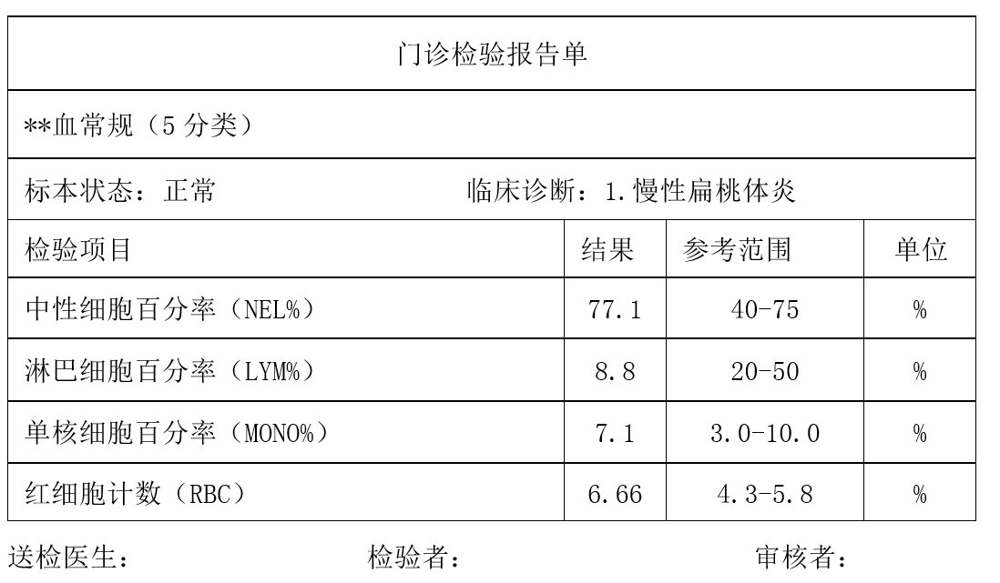

# 通用表格识别<a name="ocr_03_0031"></a>

## 功能介绍<a name="section86877162233"></a>

识别表格图片中的文字内容，并将识别的结果以json格式返回给用户。返回结果将图片区域（words\_region）划分为两类：纯文本区（text）和表格区（table），并返回表格结构（row, column）和文本信息。该接口的使用限制请参见[约束与限制](https://support.huaweicloud.com/productdesc-ocr/ocr_01_0006.html#section0)，详细使用指导请参见[OCR服务使用简介](https://support.huaweicloud.com/qs-ocr/ocr_05_0001.html)章节。

**对于相同板式的图片**，可以使用ModelArts Pro服务提供的[文字识别套件](https://support.huaweicloud.com/usermanual-modelartspro/modelartspro_01_0007.html)，零代码搭建出专属的API，详细操作请参见[视频指导](https://support.huaweicloud.com/modelartspro_video/index.html)。

**图 1**  通用表格识别示例图<a name="fig298142915589"></a>  


## 调试<a name="section791310511500"></a>

您可以在[API Explorer](https://apiexplorer.developer.huaweicloud.com/apiexplorer/doc?product=OCR&api=RecognizeGeneralTable)中调试该接口。

## 前提条件<a name="section17299143617379"></a>

在使用通用表格识别之前，需要您完成服务申请和认证鉴权，具体操作流程请参见[申请服务](申请服务.md)和[认证鉴权](认证鉴权.md)章节。

> **说明：** 
>用户首次使用需要先[申请开通](https://console.huaweicloud.com/ocr/?region=cn-north-4#/ocr/overview)。服务只需要开通一次即可，后面使用时无需再次申请。如未开通服务，调用服务时会提示ModelArts.4204报错，请在调用服务前先进入控制台开通服务，并注意开通服务区域与调用服务的区域保持一致。

## URI<a name="zh-cn_topic_0085429343_section5596537"></a>

POST https://\{endpoint\}/v2/\{project\_id\}/ocr/general-table

**表 1**  路径参数

<a name="table1757114411019"></a>
<table><thead align="left"><tr id="row244311551906"><th class="cellrowborder" valign="top" width="20%" id="mcps1.2.4.1.1"><p id="p15443125512018"><a name="p15443125512018"></a><a name="p15443125512018"></a>参数</p>
</th>
<th class="cellrowborder" valign="top" width="20%" id="mcps1.2.4.1.2"><p id="p14431555504"><a name="p14431555504"></a><a name="p14431555504"></a>是否必选</p>
</th>
<th class="cellrowborder" valign="top" width="60%" id="mcps1.2.4.1.3"><p id="p1444145517013"><a name="p1444145517013"></a><a name="p1444145517013"></a>说明</p>
</th>
</tr>
</thead>
<tbody><tr id="row613718443010"><td class="cellrowborder" valign="top" width="20%" headers="mcps1.2.4.1.1 "><p id="p191375441708"><a name="p191375441708"></a><a name="p191375441708"></a>endpoint</p>
</td>
<td class="cellrowborder" valign="top" width="20%" headers="mcps1.2.4.1.2 "><p id="p81375441015"><a name="p81375441015"></a><a name="p81375441015"></a>是</p>
</td>
<td class="cellrowborder" valign="top" width="60%" headers="mcps1.2.4.1.3 "><p id="p1928291782612"><a name="p1928291782612"></a><a name="p1928291782612"></a>指定承载REST服务端点的服务器域名或IP，不同服务不同区域的endpoint不同，您可以从<a href="终端节点.md">终端节点</a>中获取。</p>
<p id="p85151503246"><a name="p85151503246"></a><a name="p85151503246"></a>例如，OCR服务在<span class="parmvalue" id="parmvalue832520377716"><a name="parmvalue832520377716"></a><a name="parmvalue832520377716"></a>“华北-北京四”</span>区域的<span class="parmname" id="parmname211216411978"><a name="parmname211216411978"></a><a name="parmname211216411978"></a>“endpoint”</span>为<span class="parmvalue" id="parmvalue998414713715"><a name="parmvalue998414713715"></a><a name="parmvalue998414713715"></a>“ocr.cn-north-4.myhuaweicloud.com”</span>。</p>
</td>
</tr>
<tr id="row293114143016"><td class="cellrowborder" valign="top" width="20%" headers="mcps1.2.4.1.1 "><p id="p1294144113015"><a name="p1294144113015"></a><a name="p1294144113015"></a>project_id</p>
</td>
<td class="cellrowborder" valign="top" width="20%" headers="mcps1.2.4.1.2 "><p id="p129411443019"><a name="p129411443019"></a><a name="p129411443019"></a>是</p>
</td>
<td class="cellrowborder" valign="top" width="60%" headers="mcps1.2.4.1.3 "><p id="p1694644308"><a name="p1694644308"></a><a name="p1694644308"></a>项目ID，您可以从<a href="获取项目ID.md">获取项目ID</a>中获取。</p>
</td>
</tr>
</tbody>
</table>

## 请求参数<a name="zh-cn_topic_0085429343_section50368838"></a>

**表 2**  请求Header参数

<a name="table2731132781012"></a>
<table><thead align="left"><tr id="row4732122761020"><th class="cellrowborder" valign="top" width="20%" id="mcps1.2.5.1.1"><p id="p97321227111012"><a name="p97321227111012"></a><a name="p97321227111012"></a>参数</p>
</th>
<th class="cellrowborder" valign="top" width="20%" id="mcps1.2.5.1.2"><p id="p10732132710108"><a name="p10732132710108"></a><a name="p10732132710108"></a>是否必选</p>
</th>
<th class="cellrowborder" valign="top" width="20%" id="mcps1.2.5.1.3"><p id="p37321627141016"><a name="p37321627141016"></a><a name="p37321627141016"></a>参数类型</p>
</th>
<th class="cellrowborder" valign="top" width="40%" id="mcps1.2.5.1.4"><p id="p107323279109"><a name="p107323279109"></a><a name="p107323279109"></a>描述</p>
</th>
</tr>
</thead>
<tbody><tr id="row1732172711104"><td class="cellrowborder" valign="top" width="20%" headers="mcps1.2.5.1.1 "><p id="p47321427151017"><a name="p47321427151017"></a><a name="p47321427151017"></a>X-Auth-Token</p>
</td>
<td class="cellrowborder" valign="top" width="20%" headers="mcps1.2.5.1.2 "><p id="p1173272715101"><a name="p1173272715101"></a><a name="p1173272715101"></a>是</p>
</td>
<td class="cellrowborder" valign="top" width="20%" headers="mcps1.2.5.1.3 "><p id="p1373272781010"><a name="p1373272781010"></a><a name="p1373272781010"></a>String</p>
</td>
<td class="cellrowborder" valign="top" width="40%" headers="mcps1.2.5.1.4 "><p id="p62408249311"><a name="p62408249311"></a><a name="p62408249311"></a>用户Token。</p>
<p id="p87711532113213"><a name="p87711532113213"></a><a name="p87711532113213"></a>Token认证就是在调用API的时候将Token加到请求消息头，从而通过身份认证，获得操作API的权限，响应消息头中X-Subject-Token的值即为Token。</p>
</td>
</tr>
<tr id="row102010293472"><td class="cellrowborder" valign="top" width="20%" headers="mcps1.2.5.1.1 "><p id="p620162911477"><a name="p620162911477"></a><a name="p620162911477"></a>Content-Type</p>
</td>
<td class="cellrowborder" valign="top" width="20%" headers="mcps1.2.5.1.2 "><p id="p122082984710"><a name="p122082984710"></a><a name="p122082984710"></a>是</p>
</td>
<td class="cellrowborder" valign="top" width="20%" headers="mcps1.2.5.1.3 "><p id="p12017295472"><a name="p12017295472"></a><a name="p12017295472"></a>String</p>
</td>
<td class="cellrowborder" valign="top" width="40%" headers="mcps1.2.5.1.4 "><p id="p62022944710"><a name="p62022944710"></a><a name="p62022944710"></a>发送的实体的MIME类型，参数值为“application/json”。</p>
</td>
</tr>
</tbody>
</table>

**表 3**  请求Body参数

<a name="zh-cn_topic_0085429343_table49879860151539"></a>
<table><thead align="left"><tr id="zh-cn_topic_0085429343_row953289151539"><th class="cellrowborder" valign="top" width="15.770000000000001%" id="mcps1.2.5.1.1"><p id="zh-cn_topic_0085429343_p10107569151539"><a name="zh-cn_topic_0085429343_p10107569151539"></a><a name="zh-cn_topic_0085429343_p10107569151539"></a>参数</p>
</th>
<th class="cellrowborder" valign="top" width="16.09%" id="mcps1.2.5.1.2"><p id="zh-cn_topic_0085429343_p13406737151539"><a name="zh-cn_topic_0085429343_p13406737151539"></a><a name="zh-cn_topic_0085429343_p13406737151539"></a>是否必选</p>
</th>
<th class="cellrowborder" valign="top" width="13.270000000000001%" id="mcps1.2.5.1.3"><p id="zh-cn_topic_0085429343_p12203922151539"><a name="zh-cn_topic_0085429343_p12203922151539"></a><a name="zh-cn_topic_0085429343_p12203922151539"></a>类型</p>
</th>
<th class="cellrowborder" valign="top" width="54.87%" id="mcps1.2.5.1.4"><p id="zh-cn_topic_0085429343_p48993627151539"><a name="zh-cn_topic_0085429343_p48993627151539"></a><a name="zh-cn_topic_0085429343_p48993627151539"></a>说明</p>
</th>
</tr>
</thead>
<tbody><tr id="zh-cn_topic_0085429343_row9060885151539"><td class="cellrowborder" valign="top" width="15.770000000000001%" headers="mcps1.2.5.1.1 "><p id="zh-cn_topic_0085429343_p62843112151539"><a name="zh-cn_topic_0085429343_p62843112151539"></a><a name="zh-cn_topic_0085429343_p62843112151539"></a>image</p>
</td>
<td class="cellrowborder" valign="top" width="16.09%" headers="mcps1.2.5.1.2 "><p id="p1128343444516"><a name="p1128343444516"></a><a name="p1128343444516"></a>否，该参数与url二选一</p>
</td>
<td class="cellrowborder" valign="top" width="13.270000000000001%" headers="mcps1.2.5.1.3 "><p id="zh-cn_topic_0085429343_p63907830151539"><a name="zh-cn_topic_0085429343_p63907830151539"></a><a name="zh-cn_topic_0085429343_p63907830151539"></a>String</p>
</td>
<td class="cellrowborder" valign="top" width="54.87%" headers="mcps1.2.5.1.4 "><p id="zh-cn_topic_0085429343_p9151746151539"><a name="zh-cn_topic_0085429343_p9151746151539"></a><a name="zh-cn_topic_0085429343_p9151746151539"></a>图像数据，base64编码，要求base64编码后大小不超过10MB。图片最小边不小于15px，最长边不超过8192px，支持JPEG、JPG、PNG、BMP、TIFF格式。</p>
</td>
</tr>
<tr id="zh-cn_topic_0085429343_row9018009195224"><td class="cellrowborder" valign="top" width="15.770000000000001%" headers="mcps1.2.5.1.1 "><p id="zh-cn_topic_0082818466_p14053218195224"><a name="zh-cn_topic_0082818466_p14053218195224"></a><a name="zh-cn_topic_0082818466_p14053218195224"></a>url</p>
</td>
<td class="cellrowborder" valign="top" width="16.09%" headers="mcps1.2.5.1.2 "><p id="p880573714459"><a name="p880573714459"></a><a name="p880573714459"></a>否，该参数与image二选一</p>
</td>
<td class="cellrowborder" valign="top" width="13.270000000000001%" headers="mcps1.2.5.1.3 "><p id="zh-cn_topic_0082818466_p62698574195224"><a name="zh-cn_topic_0082818466_p62698574195224"></a><a name="zh-cn_topic_0082818466_p62698574195224"></a>String</p>
</td>
<td class="cellrowborder" valign="top" width="54.87%" headers="mcps1.2.5.1.4 "><p id="p86827584714"><a name="p86827584714"></a><a name="p86827584714"></a>图片的url路径，目前支持：</p>
<a name="ul173951181519"></a><a name="ul173951181519"></a><ul id="ul173951181519"><li>公网http/https url</li><li>OBS提供的url，使用OBS数据需要进行授权。包括对服务授权、临时授权、匿名公开授权，详情参见<a href="配置OBS访问权限.md">配置OBS访问权限</a>。</li></ul>
<div class="note" id="note1822116578284"><a name="note1822116578284"></a><a name="note1822116578284"></a><span class="notetitle"> 说明： </span><div class="notebody"><a name="ul99367258155"></a><a name="ul99367258155"></a><ul id="ul99367258155"><li>接口响应时间依赖于图片的下载时间，如果图片下载时间过长，会返回接口调用失败。</li></ul>
<a name="ul156081829151514"></a><a name="ul156081829151514"></a><ul id="ul156081829151514"><li>请保证被检测图片所在的存储服务稳定可靠，推荐使用OBS服务存储图片数据。</li></ul>
</div></div>
</td>
</tr>
<tr id="row1246661219483"><td class="cellrowborder" valign="top" width="15.770000000000001%" headers="mcps1.2.5.1.1 "><p id="p139172312480"><a name="p139172312480"></a><a name="p139172312480"></a>return_text_location</p>
</td>
<td class="cellrowborder" valign="top" width="16.09%" headers="mcps1.2.5.1.2 "><p id="p13911123174818"><a name="p13911123174818"></a><a name="p13911123174818"></a>否</p>
</td>
<td class="cellrowborder" valign="top" width="13.270000000000001%" headers="mcps1.2.5.1.3 "><p id="p13391162320487"><a name="p13391162320487"></a><a name="p13391162320487"></a>Boolean</p>
</td>
<td class="cellrowborder" valign="top" width="54.87%" headers="mcps1.2.5.1.4 "><p id="p18391172334814"><a name="p18391172334814"></a><a name="p18391172334814"></a>返回文本块坐标及单元格坐标信息，可选值如下所示。</p>
<a name="ul9718144112812"></a><a name="ul9718144112812"></a><ul id="ul9718144112812"><li>true：返回文本块和单元格坐标</li><li>false：不返回</li></ul>
<p id="p1139119235480"><a name="p1139119235480"></a><a name="p1139119235480"></a>如果未传入该参数时默认为false，即不返回。</p>
</td>
</tr>
<tr id="row14282142511312"><td class="cellrowborder" valign="top" width="15.770000000000001%" headers="mcps1.2.5.1.1 "><p id="p134601272318"><a name="p134601272318"></a><a name="p134601272318"></a>return_confidence</p>
</td>
<td class="cellrowborder" valign="top" width="16.09%" headers="mcps1.2.5.1.2 "><p id="p19460162733116"><a name="p19460162733116"></a><a name="p19460162733116"></a>否</p>
</td>
<td class="cellrowborder" valign="top" width="13.270000000000001%" headers="mcps1.2.5.1.3 "><p id="p64601327133115"><a name="p64601327133115"></a><a name="p64601327133115"></a>Boolean</p>
</td>
<td class="cellrowborder" valign="top" width="54.87%" headers="mcps1.2.5.1.4 "><p id="p3460527153110"><a name="p3460527153110"></a><a name="p3460527153110"></a>是否返回置信度的开关，可选值如下所示。</p>
<a name="ul4213824152717"></a><a name="ul4213824152717"></a><ul id="ul4213824152717"><li>true：返回置信度</li><li>false：不返回置信度</li></ul>
<p id="p1746016274311"><a name="p1746016274311"></a><a name="p1746016274311"></a>如果未传入该参数，系统默认为<span class="parmvalue" id="parmvalue195212916211"><a name="parmvalue195212916211"></a><a name="parmvalue195212916211"></a>“false”</span>，即不返回置信度。</p>
</td>
</tr>
<tr id="row1613313817151"><td class="cellrowborder" valign="top" width="15.770000000000001%" headers="mcps1.2.5.1.1 "><p id="p182721152131611"><a name="p182721152131611"></a><a name="p182721152131611"></a>return_excel</p>
</td>
<td class="cellrowborder" valign="top" width="16.09%" headers="mcps1.2.5.1.2 "><p id="p15272652201612"><a name="p15272652201612"></a><a name="p15272652201612"></a>否</p>
</td>
<td class="cellrowborder" valign="top" width="13.270000000000001%" headers="mcps1.2.5.1.3 "><p id="p202720524165"><a name="p202720524165"></a><a name="p202720524165"></a>Boolean</p>
</td>
<td class="cellrowborder" valign="top" width="54.87%" headers="mcps1.2.5.1.4 "><p id="p11272165281612"><a name="p11272165281612"></a><a name="p11272165281612"></a>是否返回表格转换Microsoft Excel的base64编码字段。可选值包括：</p>
<a name="ul24483019515"></a><a name="ul24483019515"></a><ul id="ul24483019515"><li>true:  返回'excel'字段，表示xlsx格式的表格识别结果的base64编码</li><li>false: 不返回。默认为false</li></ul>
<p id="p4272452191620"><a name="p4272452191620"></a><a name="p4272452191620"></a>对返回的Excel编码，可用Python函数 base64.b64decode解码后保存为.xlsx文件。</p>
</td>
</tr>
</tbody>
</table>

## 响应参数<a name="zh-cn_topic_0085429343_section50666366"></a>

根据识别的结果，可能有不同的HTTP响应状态码（status code），状态码和响应参数说明如下。

**状态码： 200**

**表 4**  响应Body参数

<a name="responseParameter"></a>
<table><thead align="left"><tr id="row245025775414"><th class="cellrowborder" valign="top" width="24.05%" id="mcps1.2.4.1.1"><p id="p0450357135411"><a name="p0450357135411"></a><a name="p0450357135411"></a>参数</p>
</th>
<th class="cellrowborder" valign="top" width="16.57%" id="mcps1.2.4.1.2"><p id="p124506571544"><a name="p124506571544"></a><a name="p124506571544"></a>参数类型</p>
</th>
<th class="cellrowborder" valign="top" width="59.38%" id="mcps1.2.4.1.3"><p id="p245135717547"><a name="p245135717547"></a><a name="p245135717547"></a>描述</p>
</th>
</tr>
</thead>
<tbody><tr id="row145075795420"><td class="cellrowborder" valign="top" width="24.05%" headers="mcps1.2.4.1.1 "><p id="p04517573544"><a name="p04517573544"></a><a name="p04517573544"></a>result</p>
</td>
<td class="cellrowborder" valign="top" width="16.57%" headers="mcps1.2.4.1.2 "><p id="p144511157135417"><a name="p144511157135417"></a><a name="p144511157135417"></a><a href="#response_RecognizeGeneralTableResultResponse">GeneralTableResult</a> object</p>
</td>
<td class="cellrowborder" valign="top" width="59.38%" headers="mcps1.2.4.1.3 "><p id="p10451195712546"><a name="p10451195712546"></a><a name="p10451195712546"></a>调用成功时表示调用结果。</p>
<p id="p54514574548"><a name="p54514574548"></a><a name="p54514574548"></a>调用失败时无此字段。</p>
</td>
</tr>
</tbody>
</table>

**表 5**  GeneralTableResult

<a name="response_RecognizeGeneralTableResultResponse"></a>
<table><thead align="left"><tr id="row44511574543"><th class="cellrowborder" valign="top" width="24.05%" id="mcps1.2.4.1.1"><p id="p445215785416"><a name="p445215785416"></a><a name="p445215785416"></a>参数</p>
</th>
<th class="cellrowborder" valign="top" width="16.57%" id="mcps1.2.4.1.2"><p id="p44522573542"><a name="p44522573542"></a><a name="p44522573542"></a>参数类型</p>
</th>
<th class="cellrowborder" valign="top" width="59.38%" id="mcps1.2.4.1.3"><p id="p184529576545"><a name="p184529576545"></a><a name="p184529576545"></a>描述</p>
</th>
</tr>
</thead>
<tbody><tr id="row134522057165414"><td class="cellrowborder" valign="top" width="24.05%" headers="mcps1.2.4.1.1 "><p id="p64523579543"><a name="p64523579543"></a><a name="p64523579543"></a>words_region_count</p>
</td>
<td class="cellrowborder" valign="top" width="16.57%" headers="mcps1.2.4.1.2 "><p id="p1453957165419"><a name="p1453957165419"></a><a name="p1453957165419"></a>Integer</p>
</td>
<td class="cellrowborder" valign="top" width="59.38%" headers="mcps1.2.4.1.3 "><p id="p9453857185416"><a name="p9453857185416"></a><a name="p9453857185416"></a>文字区域数目。</p>
</td>
</tr>
<tr id="row12452155715418"><td class="cellrowborder" valign="top" width="24.05%" headers="mcps1.2.4.1.1 "><p id="p2045319573549"><a name="p2045319573549"></a><a name="p2045319573549"></a>words_region_list</p>
</td>
<td class="cellrowborder" valign="top" width="16.57%" headers="mcps1.2.4.1.2 "><p id="p3251153318134"><a name="p3251153318134"></a><a name="p3251153318134"></a>Array of <a href="#response_RecognizeGeneralTableItemsResponse">WordsRegionList</a> objects</p>
</td>
<td class="cellrowborder" valign="top" width="59.38%" headers="mcps1.2.4.1.3 "><p id="p74531957185417"><a name="p74531957185417"></a><a name="p74531957185417"></a>文字区域识别结果列表，输出顺序从左到右，先上后下。</p>
</td>
</tr>
</tbody>
</table>

**表 6**  WordsRegionList

<a name="response_RecognizeGeneralTableItemsResponse"></a>
<table><thead align="left"><tr id="row13453157195410"><th class="cellrowborder" valign="top" width="24.05%" id="mcps1.2.4.1.1"><p id="p16454185715415"><a name="p16454185715415"></a><a name="p16454185715415"></a>参数</p>
</th>
<th class="cellrowborder" valign="top" width="16.57%" id="mcps1.2.4.1.2"><p id="p19454157155415"><a name="p19454157155415"></a><a name="p19454157155415"></a>参数类型</p>
</th>
<th class="cellrowborder" valign="top" width="59.38%" id="mcps1.2.4.1.3"><p id="p14541857195410"><a name="p14541857195410"></a><a name="p14541857195410"></a>描述</p>
</th>
</tr>
</thead>
<tbody><tr id="row134549577542"><td class="cellrowborder" valign="top" width="24.05%" headers="mcps1.2.4.1.1 "><p id="p10454145745413"><a name="p10454145745413"></a><a name="p10454145745413"></a>type</p>
</td>
<td class="cellrowborder" valign="top" width="16.57%" headers="mcps1.2.4.1.2 "><p id="p245520573549"><a name="p245520573549"></a><a name="p245520573549"></a>String</p>
</td>
<td class="cellrowborder" valign="top" width="59.38%" headers="mcps1.2.4.1.3 "><p id="p144551576543"><a name="p144551576543"></a><a name="p144551576543"></a>文字识别区域类型。</p>
<a name="ul1445515755415"></a><a name="ul1445515755415"></a><ul id="ul1445515755415"><li>text：文本识别区域;</li><li>table：表格识别区域。</li></ul>
</td>
</tr>
<tr id="row34540574544"><td class="cellrowborder" valign="top" width="24.05%" headers="mcps1.2.4.1.1 "><p id="p24551457175412"><a name="p24551457175412"></a><a name="p24551457175412"></a>words_block_count</p>
</td>
<td class="cellrowborder" valign="top" width="16.57%" headers="mcps1.2.4.1.2 "><p id="p1245595719545"><a name="p1245595719545"></a><a name="p1245595719545"></a>String</p>
</td>
<td class="cellrowborder" valign="top" width="59.38%" headers="mcps1.2.4.1.3 "><p id="p14551357195414"><a name="p14551357195414"></a><a name="p14551357195414"></a>子区域识别文字块数目。</p>
</td>
</tr>
<tr id="row1945445715417"><td class="cellrowborder" valign="top" width="24.05%" headers="mcps1.2.4.1.1 "><p id="p7456657165417"><a name="p7456657165417"></a><a name="p7456657165417"></a>words_block_list</p>
</td>
<td class="cellrowborder" valign="top" width="16.57%" headers="mcps1.2.4.1.2 "><p id="p13456757105418"><a name="p13456757105418"></a><a name="p13456757105418"></a>Array of <a href="#response_RecognizeGeneralTableItems2Response">GeneralTableWordsBlockList</a> objects</p>
</td>
<td class="cellrowborder" valign="top" width="59.38%" headers="mcps1.2.4.1.3 "><p id="p154568570547"><a name="p154568570547"></a><a name="p154568570547"></a>子区域识别文字块列表，输出顺序从左到右，先上后下。</p>
</td>
</tr>
</tbody>
</table>

**表 7**  GeneralTableWordsBlockList

<a name="response_RecognizeGeneralTableItems2Response"></a>
<table><thead align="left"><tr id="row2045615735415"><th class="cellrowborder" valign="top" width="24.05%" id="mcps1.2.4.1.1"><p id="p44571757125417"><a name="p44571757125417"></a><a name="p44571757125417"></a>参数</p>
</th>
<th class="cellrowborder" valign="top" width="16.57%" id="mcps1.2.4.1.2"><p id="p1457115717546"><a name="p1457115717546"></a><a name="p1457115717546"></a>参数类型</p>
</th>
<th class="cellrowborder" valign="top" width="59.38%" id="mcps1.2.4.1.3"><p id="p16457115714546"><a name="p16457115714546"></a><a name="p16457115714546"></a>描述</p>
</th>
</tr>
</thead>
<tbody><tr id="row18456757125413"><td class="cellrowborder" valign="top" width="24.05%" headers="mcps1.2.4.1.1 "><p id="p10457195710540"><a name="p10457195710540"></a><a name="p10457195710540"></a>words</p>
</td>
<td class="cellrowborder" valign="top" width="16.57%" headers="mcps1.2.4.1.2 "><p id="p1045715575546"><a name="p1045715575546"></a><a name="p1045715575546"></a>String</p>
</td>
<td class="cellrowborder" valign="top" width="59.38%" headers="mcps1.2.4.1.3 "><p id="p74583578548"><a name="p74583578548"></a><a name="p74583578548"></a>文字<span class="keyword" id="keyword15716114311710"><a name="keyword15716114311710"></a><a name="keyword15716114311710"></a>识别</span>结果。当入参"return_text_location"为false时，每个单元格返回一个文本值，不同行文本由换行符 "\n" 拼接。</p>
</td>
</tr>
<tr id="row362612561449"><td class="cellrowborder" valign="top" width="24.05%" headers="mcps1.2.4.1.1 "><p id="p76261356448"><a name="p76261356448"></a><a name="p76261356448"></a>words_list</p>
</td>
<td class="cellrowborder" valign="top" width="16.57%" headers="mcps1.2.4.1.2 "><p id="p14881721754"><a name="p14881721754"></a><a name="p14881721754"></a>Array of Objects</p>
</td>
<td class="cellrowborder" valign="top" width="59.38%" headers="mcps1.2.4.1.3 "><p id="p86268569418"><a name="p86268569418"></a><a name="p86268569418"></a>单元格内文字段列表。输出顺序从左到右，从上到下。仅当入参"return_text_location"为true时存在。</p>
</td>
</tr>
<tr id="row1745617572542"><td class="cellrowborder" valign="top" width="24.05%" headers="mcps1.2.4.1.1 "><p id="p345816574544"><a name="p345816574544"></a><a name="p345816574544"></a>rows</p>
</td>
<td class="cellrowborder" valign="top" width="16.57%" headers="mcps1.2.4.1.2 "><p id="p5458165716548"><a name="p5458165716548"></a><a name="p5458165716548"></a>Array of integers</p>
</td>
<td class="cellrowborder" valign="top" width="59.38%" headers="mcps1.2.4.1.3 "><p id="p12458105716542"><a name="p12458105716542"></a><a name="p12458105716542"></a>文字占用的行信息，编号从0开始，列表形式，数据类型为<span class="parmvalue" id="parmvalue103035519217"><a name="parmvalue103035519217"></a><a name="parmvalue103035519217"></a>“Integer”</span>。仅在表格区域内有效，即<span class="parmname" id="parmname183016551829"><a name="parmname183016551829"></a><a name="parmname183016551829"></a>“type”</span>字段为<span class="parmvalue" id="parmvalue1130555421"><a name="parmvalue1130555421"></a><a name="parmvalue1130555421"></a>“table”</span>时该字段有效。多个连续值表示参数值涉及多行(行列以表格内最小单元格来划分)。例如：rows：[0, 1, 2]，表示这个参数值总共涉及三行。</p>
</td>
</tr>
<tr id="row15456115717543"><td class="cellrowborder" valign="top" width="24.05%" headers="mcps1.2.4.1.1 "><p id="p13458145795415"><a name="p13458145795415"></a><a name="p13458145795415"></a>columns</p>
</td>
<td class="cellrowborder" valign="top" width="16.57%" headers="mcps1.2.4.1.2 "><p id="p64581657205411"><a name="p64581657205411"></a><a name="p64581657205411"></a>Array of integers</p>
</td>
<td class="cellrowborder" valign="top" width="59.38%" headers="mcps1.2.4.1.3 "><p id="p2459957105416"><a name="p2459957105416"></a><a name="p2459957105416"></a>文字占用的列信息，编号从0开始，列表形式，数据类型为<span class="parmvalue" id="parmvalue7527134012518"><a name="parmvalue7527134012518"></a><a name="parmvalue7527134012518"></a>“Integer”</span>。仅在表格区域内有效，即<span class="parmname" id="parmname523355214"><a name="parmname523355214"></a><a name="parmname523355214"></a>“type”</span>字段为<span class="parmvalue" id="parmvalue34548446219"><a name="parmvalue34548446219"></a><a name="parmvalue34548446219"></a>“table”</span>时该字段有效。多个连续值表示参数值涉及多列(行列以表格内最小单元格来划分)。例如：cols: [0, 1, 2]，表示这个参数值总共涉及三列。</p>
</td>
</tr>
<tr id="row173781615617"><td class="cellrowborder" valign="top" width="24.05%" headers="mcps1.2.4.1.1 "><p id="p15386161961"><a name="p15386161961"></a><a name="p15386161961"></a>location</p>
</td>
<td class="cellrowborder" valign="top" width="16.57%" headers="mcps1.2.4.1.2 "><p id="p179681221664"><a name="p179681221664"></a><a name="p179681221664"></a>Array of objects</p>
</td>
<td class="cellrowborder" valign="top" width="59.38%" headers="mcps1.2.4.1.3 "><p id="p1381316766"><a name="p1381316766"></a><a name="p1381316766"></a>文字块位置信息，列表形式，分别表示文字块4个顶点的x, y坐标；采用图像坐标系，坐标原点为图片左上角，x轴沿水平方向，y轴沿竖直方向。</p>
</td>
</tr>
<tr id="row197601115678"><td class="cellrowborder" valign="top" width="24.05%" headers="mcps1.2.4.1.1 "><p id="p176351616779"><a name="p176351616779"></a><a name="p176351616779"></a>cell_location</p>
</td>
<td class="cellrowborder" valign="top" width="16.57%" headers="mcps1.2.4.1.2 "><p id="p16760415274"><a name="p16760415274"></a><a name="p16760415274"></a>Array of objects</p>
</td>
<td class="cellrowborder" valign="top" width="59.38%" headers="mcps1.2.4.1.3 "><p id="p276041519719"><a name="p276041519719"></a><a name="p276041519719"></a>单元格位置信息，列表形式，分别表示单元格4个顶点的x, y坐标；采用图像坐标系，坐标原点为图片左上角，x轴沿水平方向，y轴沿竖直方向。</p>
</td>
</tr>
<tr id="row86001348201415"><td class="cellrowborder" valign="top" width="24.05%" headers="mcps1.2.4.1.1 "><p id="p760154818149"><a name="p760154818149"></a><a name="p760154818149"></a>excel</p>
</td>
<td class="cellrowborder" valign="top" width="16.57%" headers="mcps1.2.4.1.2 "><p id="p18601204831417"><a name="p18601204831417"></a><a name="p18601204831417"></a>String</p>
</td>
<td class="cellrowborder" valign="top" width="59.38%" headers="mcps1.2.4.1.3 "><p id="p136011048191413"><a name="p136011048191413"></a><a name="p136011048191413"></a>表格图像转换为excel的base64编码，图像中的文字和表格按位置写入excel。对返回的excel编码可用base64.b64decode解码并保存为.xlsx文件。</p>
</td>
</tr>
<tr id="row1845655785417"><td class="cellrowborder" valign="top" width="24.05%" headers="mcps1.2.4.1.1 "><p id="p34591957115410"><a name="p34591957115410"></a><a name="p34591957115410"></a>confidence</p>
</td>
<td class="cellrowborder" valign="top" width="16.57%" headers="mcps1.2.4.1.2 "><p id="p5459557205419"><a name="p5459557205419"></a><a name="p5459557205419"></a>Float</p>
</td>
<td class="cellrowborder" valign="top" width="59.38%" headers="mcps1.2.4.1.3 "><p id="p518674324110"><a name="p518674324110"></a><a name="p518674324110"></a>相关字段的置信度信息，取值范围0~1。</p>
<p id="p122717233125"><a name="p122717233125"></a><a name="p122717233125"></a>置信度越大，表示本次识别的对应字段的可靠性越高，在统计意义上，置信度越大，准确率越高。</p>
<p id="p1762722915313"><a name="p1762722915313"></a><a name="p1762722915313"></a>置信度由算法给出，不直接等价于对应字段的准确率。</p>
</td>
</tr>
</tbody>
</table>

**状态码： 400**

**表 8**  响应Body参数

<a name="table1445945785412"></a>
<table><thead align="left"><tr id="row046019577549"><th class="cellrowborder" valign="top" width="24.05%" id="mcps1.2.4.1.1"><p id="p34601579547"><a name="p34601579547"></a><a name="p34601579547"></a>参数</p>
</th>
<th class="cellrowborder" valign="top" width="16.57%" id="mcps1.2.4.1.2"><p id="p12460195785412"><a name="p12460195785412"></a><a name="p12460195785412"></a>参数类型</p>
</th>
<th class="cellrowborder" valign="top" width="59.38%" id="mcps1.2.4.1.3"><p id="p1146045716548"><a name="p1146045716548"></a><a name="p1146045716548"></a>描述</p>
</th>
</tr>
</thead>
<tbody><tr id="row746019574546"><td class="cellrowborder" valign="top" width="24.05%" headers="mcps1.2.4.1.1 "><p id="p4461357195416"><a name="p4461357195416"></a><a name="p4461357195416"></a>error_code</p>
</td>
<td class="cellrowborder" valign="top" width="16.57%" headers="mcps1.2.4.1.2 "><p id="p19461115795416"><a name="p19461115795416"></a><a name="p19461115795416"></a>String</p>
</td>
<td class="cellrowborder" valign="top" width="59.38%" headers="mcps1.2.4.1.3 "><p id="p537742117585"><a name="p537742117585"></a><a name="p537742117585"></a>调用失败时的错误码，具体请参见<a href="错误码.md">错误码</a>。</p>
<p id="p153771214588"><a name="p153771214588"></a><a name="p153771214588"></a>当出现错误码<span class="parmname" id="parmname19377621195815"><a name="parmname19377621195815"></a><a name="parmname19377621195815"></a>“ModelArts.4204”</span>时，请参考<a href="https://support.huaweicloud.com/ocr_faq/ocr_01_0031.html" target="_blank" rel="noopener noreferrer">为什么调用API时提示“ModelArts.4204”？</a>章节。</p>
<p id="p6377021165819"><a name="p6377021165819"></a><a name="p6377021165819"></a>调用成功时无此字段。</p>
</td>
</tr>
<tr id="row44601857205417"><td class="cellrowborder" valign="top" width="24.05%" headers="mcps1.2.4.1.1 "><p id="p7461155705414"><a name="p7461155705414"></a><a name="p7461155705414"></a>error_msg</p>
</td>
<td class="cellrowborder" valign="top" width="16.57%" headers="mcps1.2.4.1.2 "><p id="p1146125718542"><a name="p1146125718542"></a><a name="p1146125718542"></a>String</p>
</td>
<td class="cellrowborder" valign="top" width="59.38%" headers="mcps1.2.4.1.3 "><p id="p19390132512584"><a name="p19390132512584"></a><a name="p19390132512584"></a>调用失败时的错误信息。</p>
<p id="p53906258581"><a name="p53906258581"></a><a name="p53906258581"></a>调用成功时无此字段。</p>
</td>
</tr>
</tbody>
</table>

## 请求示例<a name="section14768102655511"></a>

> **说明：** 
>-   “endpoint“即调用API的请求地址，不同服务不同区域的“endpoint“不同，具体请参见[终端节点](终端节点.md)。
>    例如，通用表格识别服务部署在“华北-北京四“区域的“endpoint“为“ocr.cn-north-4.myhuaweicloud.com“，请求URL为“https://ocr.cn-north-4.myhuaweicloud.com/v2/\{project\_id\}/ocr/general-table“，“project\_id“为项目ID，获取方法请参见[获取项目ID](获取项目ID.md)。
>-   如何获取Token具体操作请参见[构造请求](构造请求.md)。

-   请求示例（方式一：使用图片的base64编码）

    ```
    POST https://{endpoint}/v2/{project_id}/ocr/general-table
     Request Header:   
     Content-Type: application/json   
     X-Auth-Token: MIINRwYJKoZIhvcNAQcCoIINODCCDTQCAQExDTALBglghkgBZQMEAgEwgguVBgkqhkiG...      
     Request Body:
     {   
        "image":"/9j/4AAQSkZJRgABAgEASABIAAD/4RFZRXhpZgAATU0AKgAAAAg...",
        "return_text_location": true,
        "return_excel": true,
        "return_confidence":true
      }
    ```


-   请求示例（方式二：使用图片URL）

    ```
    POST https://{endpoint}/v2/{project_id}/ocr/general-table
     Request Header:   
     Content-Type: application/json   
     X-Auth-Token: MIINRwYJKoZIhvcNAQcCoIINODCCDTQCAQExDTALBglghkgBZQMEAgEwgguVBgkqhkiG...      
     Request Body:
     {
         "url":"https://BucketName.obs.xxxx.com/ObjectName",
         "return_confidence":false
      }
    ```

-   Python3语言请求代码示例（其他语言参照下列示例编写或使用OCR SDK）

    ```
    # encoding:utf-8
    
    import requests
    import base64
    
    url = "https://{endpoint}/v2/{project_id}/ocr/general-table"
    token = "用户获取得到的实际token值"
    headers = {'Content-Type': 'application/json', 'X-Auth-Token': token}
    
    imagepath = r'./data/general-table-demo.png'
    with open(imagepath, "rb") as bin_data:
        image_data = bin_data.read()
    image_base64 = base64.b64encode(image_data).decode("utf-8")  # 使用图片的base64编码
    payload = {"image": image_base64}  # url与image参数二选一
    
    response = requests.post(url, headers=headers, json=payload)
    print(response.text)
    ```


## 响应示例<a name="section103111491508"></a>

成功响应示例

当入参“return\_text\_location“为“false“时，不返回坐标信息。

```
{
    "result": {
        "words_region_count": 2,
        "words_region_list": [
            {
               "type": "text",
               "words_block_count": 1,
               "words_block_list": [  
                    {
                       "words":"文字区域识别文字块1",
                       "confidence": 0.9991
                    }
               ]
            },
            {
               "type": "table",
               "words_block_count": 2,
               "words_block_list": [
                   {
                        "words":"表格区域识别文字块1",
                        "confidence": 0.9942,
                        "rows":[0],
                        "columns":[0]
                    },
                    {
                        "words":"表格区域识别文字块2",
                        "confidence": 0.9140,
                        "rows":[0],
                        "columns":[1,2]
                    }
                ]
            }
        ],
        "excel": "/1a/AEASABIAAD/4RFZRXhpZgAATU0AKgAAAAg..."
    }
}
```

当入参“return\_text\_location“为“true“时，返回文本块坐标和单元格坐标，单元格内文本信息的返回为字典列表“words\_list“。

```
{
    "result": {
        "words_region_count": 2,
        "words_region_list": [
            {
               "type": "text",
               "words_block_count": 1,
               "words_block_list": [  
                    {
                       "words":"文字区域识别文字块1",
                       "location": [[13,476],
                                   [91, 476],
                                   [91, 560],
                                   [13, 560]],
                       "confidence": 0.9991
                    }
               ]
            },
            {
               "type": "table",
               "words_block_count": 1,
               "words_block_list": [
                   {
                       "rows": [0], 
                       "columns": [0], 
                       "cell_location": [[1042, 525],
                                        [1843, 525],
                                        [1843, 664],
                                        [1042, 664]],
 
                       "words_list": [{
                           "words":"单元格识别文字块1",
                           "confidence": 0.9942,
                           "location":  [[1053, 575],
                                        [1223, 575],
                                        [1223, 633],
                                        [1053, 633]]

                       },
                       {
                           "words":"单元格识别文字块2",
                           "confidence": 0.9140,
                           "location":  [[1678, 587],
                                        [1774, 587],
                                        [1774, 645],
                                        [1678, 645]]
                       }]
                    }
                ]
            }
        ]
        "excel": "/1a/AEASABIAAD/4RFZRXhpZgAATU0AKgAAAAg..."
    }
}
```

**状态码：400**

失败响应示例

```
{
    "error_code": "AIS.0103",
    "error_msg": "The image size does not meet the requirements."
}
```

## 状态码<a name="zh-cn_topic_0085429343_section59700980145140"></a>

<a name="table7498018733"></a>
<table><thead align="left"><tr id="row049812181638"><th class="cellrowborder" valign="top" width="30%" id="mcps1.1.3.1.1"><p id="p64981918239"><a name="p64981918239"></a><a name="p64981918239"></a>状态码</p>
</th>
<th class="cellrowborder" valign="top" width="70%" id="mcps1.1.3.1.2"><p id="p14498718133"><a name="p14498718133"></a><a name="p14498718133"></a>描述</p>
</th>
</tr>
</thead>
<tbody><tr id="row249891810316"><td class="cellrowborder" valign="top" width="30%" headers="mcps1.1.3.1.1 "><p id="p104983181237"><a name="p104983181237"></a><a name="p104983181237"></a>200</p>
</td>
<td class="cellrowborder" valign="top" width="70%" headers="mcps1.1.3.1.2 "><p id="p114986184318"><a name="p114986184318"></a><a name="p114986184318"></a>成功响应。</p>
</td>
</tr>
<tr id="row10498318935"><td class="cellrowborder" valign="top" width="30%" headers="mcps1.1.3.1.1 "><p id="p184981518331"><a name="p184981518331"></a><a name="p184981518331"></a>400</p>
</td>
<td class="cellrowborder" valign="top" width="70%" headers="mcps1.1.3.1.2 "><p id="p44985181838"><a name="p44985181838"></a><a name="p44985181838"></a>失败响应。</p>
</td>
</tr>
</tbody>
</table>

状态码请参见[状态码](状态码.md)。

## 错误码<a name="section545533743312"></a>

错误码请参见[错误码](错误码.md)。

