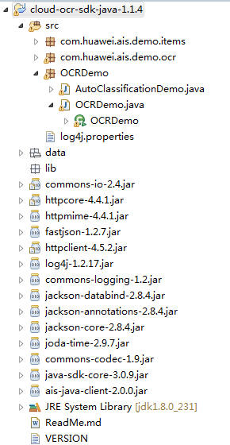

# Java开发环境配置

## 操作场景

文字识别服务JAVA SDK支持Windows、Linux、Mac等操作系统。本节以Windows系统为例进行环境配置，要求的操作环境请参见[表1](#table129385511897)。

**表 1**  准备环境

<table><thead align="left"><tr id="row129391511996"><th class="cellrowborder" valign="top" width="40.02%" id="mcps1.2.3.1.1">
准备环境

</th>
<th class="cellrowborder" valign="top" width="59.98%" id="mcps1.2.3.1.2">
说明

</th>
</tr>
</thead>
<tbody><tr id="row275091831015"><td class="cellrowborder" valign="top" width="40.02%" headers="mcps1.2.3.1.1 ">
操作系统

</td>
<td class="cellrowborder" valign="top" width="59.98%" headers="mcps1.2.3.1.2 ">
Windows系统，推荐Windows 7及以上版本。

</td>
</tr>
<tr id="row1093995110917"><td class="cellrowborder" valign="top" width="40.02%" headers="mcps1.2.3.1.1 ">
安装JDK

</td>
<td class="cellrowborder" valign="top" width="59.98%" headers="mcps1.2.3.1.2 ">
开发环境的基本配置。JDK版本必须不低于JDK8。

</td>
</tr>
<tr id="row109392051892"><td class="cellrowborder" valign="top" width="40.02%" headers="mcps1.2.3.1.1 ">
安装和配置Eclipse

</td>
<td class="cellrowborder" valign="top" width="59.98%" headers="mcps1.2.3.1.2 ">
用于开发OCR应用程序的工具。

</td>
</tr>
</tbody>
</table>

## 操作步骤

以下步骤以win7环境配置JDK8 64位为例，已经下载JDK并配置好环境请跳过步骤1-4。以eclipse工具为例给出文字识别服务SDK工程导入步骤，如果使用其他IDE工具，请参照处理。

1.  下载JDK文件：[https://www.oracle.com/technetwork/java/javase/downloads/jdk8-downloads-2133151.html](https://www.oracle.com/technetwork/java/javase/downloads/jdk8-downloads-2133151.html)。
2.  下载完成后按照提示安装，位置自选，例如安装到本地C:\\Program Files\\Java\\jdk1.8.0\_131。
3.  配置Java环境变量：右键“计算机\>属性\>高级系统设置\>环境变量”，进行如下操作。
    1.  新建系统变量JAVA\_HOME，变量值为实际JDK安装位置。
    2.  在Path中添加%JAVA\_HOME%\\bin;%JAVA\_HOME%\\jre\\bin （注意用英文分号分隔）。

4.  打开命令行窗口，输入“java -version”，显示如[图1](#fig9887837131416)表示配置成功。

    **图 1**  Java版本信息  
    

5.  Eclipse安装，在[https://www.eclipse.org/downloads/packages/](https://www.eclipse.org/downloads/packages/  )下载对应平台的eclipse版本，比如：eclipse-jee-mars-R-win32-x86\_64.zip。解压后直接打开eclipse。确保“Window\>Preferences\>Java\>Installed JREs”配置正确的JRE路径。
6.  JAVA SDK工程导入，在左侧“Package Explorer”页面右键，单击“Import”，选择“General\>Existing Projects into Workspace”，单击“Next”，单击“Browse”，选择文字识别服务SDK包所在路径。单击Finish，导入demo，导入后打开工程，工程目录如下：

    **图 2**  工程目录  
    

