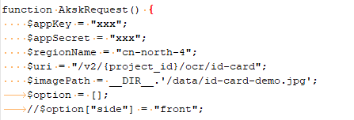
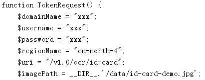

# PHP SDK<a name="ocr_04_0034"></a>

用户使用服务的认证方式有Token和AK/SK两种，获取认证消息请参考[认证鉴权](https://support.huaweicloud.com/api-ocr/ocr_03_0005.html)。本章节主要包含Token和AK/SK两种方式使用SDK进行示例说明。

下载[OCR PHP SDK开发工具包](https://mirrors.huaweicloud.com/mirrors_sdk/ocr-sdk/ocr-php-sdk/cloud-ocr-sdk-php-1.0.6.rar)。

> **说明：** 
>-   SDK中涉及到的所有图像均为合成的非真实图像，仅供示例参考使用。
>-   用户首次使用需要先[申请开通](https://console.huaweicloud.com/ocr/?region=cn-north-4&locale=zh-cn#/ocr/management/main)该服务。服务只需要开通一次即可，后面使用时无需再次申请。如未开通服务，调用服务时会提示ModelArts.4204报错，请在调用服务前先进入控制台开通服务，并注意开通服务区域与调用服务的区域保持一致。

## AK/SK认证方式<a name="section12946831204312"></a>

本节以身份证识别服务为例介绍如何以AK/SK认证方式使用SDK。

1.  获取AK/SK，具体步骤请参见[认证鉴权\>AK/SK](https://support.huaweicloud.com/api-ocr/ocr_03_0005.html#section1)。
2.  配置PHP SDK的AK/SK。

    根据获取的AK/SK，修改Demo工程“OcrDemo.php”文件中AkskRequest函数的“appKey”和“appSecret”的值，请参见[图1](#fig1050804516300)。

    **图 1**  修改OcrDemo.php文件参数<a name="fig1050804516300"></a>  
    

3.  修改输入参数。

    如使用本地图片文件进行识别，修改OcrDemo.php文件参数"imagePath"为本地图片路径，请参见[图1](#fig1050804516300)。如使用SDK默认图片则不需要进行修改。

4.  执行OcrDemo.php文件，控制台输出200即表示程序执行成功。身份证识别服务的结果可以采用json编辑器展示。

    ```
    {
        "result": {
            "name": "xx", 
            "sex": "女", 
            "ethnicity": "满", 
            "birth": "1990-xx-xx", 
            "address": "河北省承德市围场满族蒙古族自治县金车路", 
            "number": "3892011990012xxxxx"
        }
    }
    ```

    > **说明：** 
    >如想调用OCR其他识别服务，只需要把AkskRequest函数的"uri"参数改成对应的URI即可。URI列表请参见[表1 接口与API对应关系表](文字识别SDK简介.md#table47650414583)。


## Token认证方式<a name="section13503195884516"></a>

本节以身份证识别服务为例介绍如何以Token认证方式使用SDK。

1.  打开OcrDemo.php文件，修改TokenRequest函数中的username、password和domainname为系统中实际注册的用户名、密码和账号名（如果用户为非IAM用户，账号名与用户名一致），请参见[图2](#fig7108192719536)。

    **图 2**  修改OcrDemo.php文件中的用户名、密码和账号名<a name="fig7108192719536"></a>  
    

2.  执行相应代码，在控制台可看到使用Token方式身份证识别服务的识别结果。

## 状态码<a name="zh-cn_topic_0085429345_section59700980145140"></a>

状态码请参见[状态码](https://support.huaweicloud.com/api-ocr/ocr_03_0090.html)。

## 错误码<a name="section545533743312"></a>

错误码请参见[错误码](https://support.huaweicloud.com/api-ocr/ocr_03_0028.html)。

