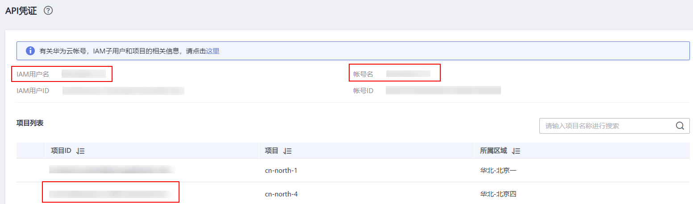
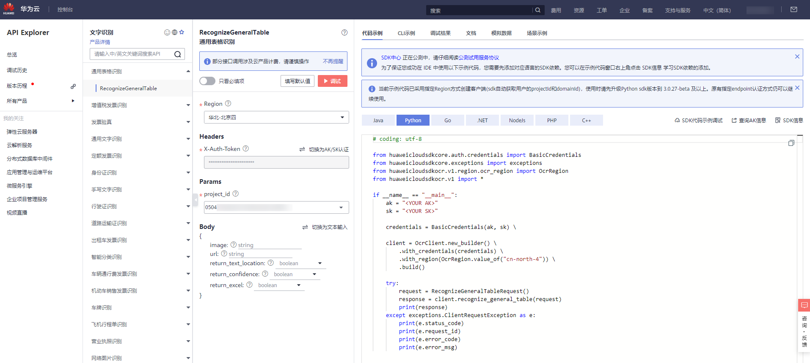

# Python SDK<a name="ocr_04_0006"></a>

本章节介绍新版Python SDK，您可以参考本章节进行快速集成开发。

## 准备工作<a name="section13676174884"></a>

-   已注册华为云帐号，并完成实名认证，帐号不能处于欠费或冻结状态。
-   已具备开发环境，支持Python3及以上版本。
-   登录“[我的凭证](https://console.huaweicloud.com/iam/#/myCredential)  \> 访问秘钥”页面，获取Access Key（AK）和Secret Access Key（SK）。
-   登录“[我的凭证](https://console.huaweicloud.com/iam/#/myCredential)”页面，获取“IAM用户名““、帐号名“以及待使用区域的“项目ID“。调用服务时会用到这些信息，请提前保存。

    本样例以“华北-北京四“区域为例，获取对应的项目ID（project\_id）。

    **图 1**  我的凭证<a name="fig1670852583312"></a>  
    


## 安装SDK<a name="section1415016131919"></a>

支持Python3及以上版本，执行**python --version**检查当前Python的版本信息。

使用SDK前，需要安装“huaweicloudsdkcore”和“huaweicloudsdkocr”，有两种安装方式，分别如下。

-   使用pip安装

    ```
    # 安装核心库
    pip install huaweicloudsdkcore
    
    # 安装OCR服务库
    pip install huaweicloudsdkocr
    ```

-   使用源码安装

    ```
    # 安装核心库
    cd huaweicloudsdkcore-${version}
    python setup.py install
    
    # 安装OCR服务库
    cd huaweicloudsdkocr-${version}
    python setup.py install
    ```


## 开始使用<a name="section159304015213"></a>

详细的SDK介绍，使用异步客户端，配置日志请参见[SDK中心](https://sdkcenter.developer.huaweicloud.com/)、[Python SDK使用指导](https://github.com/huaweicloud/huaweicloud-sdk-python-v3/blob/master/README_CN.md)、[Python SDK使用视频](https://res-static.hc-cdn.cn/cloudbu-site/china/zh-cn/support/sdk-video/1622768970747088213.mp4)。

1.  导入依赖模块

    ```
    from huaweicloudsdkcore.auth.credentials import BasicCredentials
    from huaweicloudsdkcore.exceptions import exceptions
    # 导入指定云服务的库 huaweicloudsdk{service}
    from huaweicloudsdkocr.v1.region.ocr_region import OcrRegion
    from huaweicloudsdkocr.v1 import *
    ```

2.  配置客户端连接参数
    -   默认配置

        ```
        # 使用默认配置
        config = HttpConfig.get_default_config()
        ```

    -   网络代理（可选）

        ```
        # 根据需要配置网络代理
        config.proxy_protocol = 'http'
        config.proxy_host = 'proxy.huaweicloud.com'
        config.proxy_port = 80
        config.proxy_user = 'username'
        config.proxy_password = 'password'
        ```

    -   超时配置（可选）

        ```
        # 默认连接超时时间为60秒，读取超时时间为120秒，支持统一指定超时时长timeout=timeout，或分别指定超时时长timeout=(connect timeout, read timeout)
        config.timeout = 120
        ```

    -   SSL配置（可选）

        ```
        # 根据需要配置是否跳过SSL证书校验
        config.ignore_ssl_verification = True
        # 配置服务器端CA证书，用于SDK验证服务端证书合法性
        config.ssl_ca_cert = ssl_ca_cert
        ```

3.  配置认证信息

    配置AK、SK、project\_id信息。华为云通过AK识别用户的身份，通过SK对请求数据进行签名验证，用于确保请求的机密性、完整性和请求者身份的正确性。

    -   使用永久AK和SK

        ```
        credentials = BasicCredentials(ak, sk, project_id)
        ```

    -   使用临时AK和SK

        ```
        credentials = BasicCredentials(ak, sk, project_id).with_security_token(security_token)
        ```

    认证参数说明：

    -   ak、sk：访问秘钥信息，获取方法请参见[准备工作](#section13676174884)。
    -   project\_id：华为云项目ID，获取方法请参见[准备工作](#section13676174884)。
    -   security\_token：采用临时AK、SK 认证场景下的安全票据，可以[通过token获取](https://support.huaweicloud.com/api-iam/iam_04_0002.html)或者[通过委托授权获取](https://support.huaweicloud.com/api-iam/iam_04_0101.html)。

4.  初始化客户端
    -   指定region方式（推荐）

        ```
        # 增加region依赖
        from huaweicloudsdkocr.v1.region.ocr_region import OcrRegion
        
        # 初始化指定云服务的客户端 {Service}Client ，以初始化OCR服务的 OcrClient 为例
        client = OcrClient.new_builder() \
            .with_http_config(config) \
            .with_credentials(credentials) \
            .with_region(OcrRegion.value_of("cn-north-4")) \
            .build()
        ```

    -   指定云服务endpoint方式

        ```
        # 指定终端节点，以 OCR 服务北京四的 endpoint 为例
        endpoint = "https://ocr.cn-north-4.myhuaweicloud.com"
        
        # 初始化指定云服务的客户端 {Service}Client ，以初始化OCR服务的 OcrClient 为例
        client = OcrClient.new_builder() \
            .with_http_config(config) \
            .with_credentials(credentials) \
            .with_endpoint(endpoint) \
            .build()
        ```

        endpoint是华为云各服务应用区域和各服务的终端节点，详情请查看  [地区和终端节点](https://developer.huaweicloud.com/endpoint)  。

5.  发送请求并查看响应

    ```
    # 以调用通用表格识别接口 RecognizeGeneralTable 为例
    request = RecognizeGeneralTableRequest()
    
    response = client.recognize_general_table(request)
    print(response)
    ```

6.  异常处理

    **表 1**  异常处理

    <a name="table9330172021416"></a>
    <table><thead align="left"><tr id="row233002081414"><th class="cellrowborder" valign="top" width="26.66733326667333%" id="mcps1.2.5.1.1"><p id="p9330162081413"><a name="p9330162081413"></a><a name="p9330162081413"></a>一级分类</p>
    </th>
    <th class="cellrowborder" valign="top" width="19.998000199980005%" id="mcps1.2.5.1.2"><p id="p14330182041411"><a name="p14330182041411"></a><a name="p14330182041411"></a>一级分类说明</p>
    </th>
    <th class="cellrowborder" valign="top" width="26.66733326667333%" id="mcps1.2.5.1.3"><p id="p10330112014147"><a name="p10330112014147"></a><a name="p10330112014147"></a>二级分类</p>
    </th>
    <th class="cellrowborder" valign="top" width="26.66733326667333%" id="mcps1.2.5.1.4"><p id="p153301320171414"><a name="p153301320171414"></a><a name="p153301320171414"></a>二级分类说明</p>
    </th>
    </tr>
    </thead>
    <tbody><tr id="row63306200141"><td class="cellrowborder" rowspan="2" valign="top" width="26.66733326667333%" headers="mcps1.2.5.1.1 "><p id="p1073971611617"><a name="p1073971611617"></a><a name="p1073971611617"></a>ConnectionException</p>
    </td>
    <td class="cellrowborder" rowspan="2" valign="top" width="19.998000199980005%" headers="mcps1.2.5.1.2 "><p id="p145771454171511"><a name="p145771454171511"></a><a name="p145771454171511"></a>连接类异常</p>
    </td>
    <td class="cellrowborder" valign="top" width="26.66733326667333%" headers="mcps1.2.5.1.3 "><p id="p433022019145"><a name="p433022019145"></a><a name="p433022019145"></a>HostUnreachableException</p>
    </td>
    <td class="cellrowborder" valign="top" width="26.66733326667333%" headers="mcps1.2.5.1.4 "><p id="p1433017207149"><a name="p1433017207149"></a><a name="p1433017207149"></a>网络不可达、被拒绝。</p>
    </td>
    </tr>
    <tr id="row863385712140"><td class="cellrowborder" valign="top" headers="mcps1.2.5.1.1 "><p id="p86336575141"><a name="p86336575141"></a><a name="p86336575141"></a>SslHandShakeException</p>
    </td>
    <td class="cellrowborder" valign="top" headers="mcps1.2.5.1.2 "><p id="p5633145771416"><a name="p5633145771416"></a><a name="p5633145771416"></a>SSL认证异常。</p>
    </td>
    </tr>
    <tr id="row123301820121413"><td class="cellrowborder" rowspan="2" valign="top" width="26.66733326667333%" headers="mcps1.2.5.1.1 "><p id="p12515018166"><a name="p12515018166"></a><a name="p12515018166"></a>RequestTimeoutException</p>
    </td>
    <td class="cellrowborder" rowspan="2" valign="top" width="19.998000199980005%" headers="mcps1.2.5.1.2 "><p id="p16141354181617"><a name="p16141354181617"></a><a name="p16141354181617"></a>响应超时异常</p>
    </td>
    <td class="cellrowborder" valign="top" width="26.66733326667333%" headers="mcps1.2.5.1.3 "><p id="p1233122031419"><a name="p1233122031419"></a><a name="p1233122031419"></a>CallTimeoutException</p>
    </td>
    <td class="cellrowborder" valign="top" width="26.66733326667333%" headers="mcps1.2.5.1.4 "><p id="p33311020131415"><a name="p33311020131415"></a><a name="p33311020131415"></a>单次请求，服务器处理超时未返回。</p>
    </td>
    </tr>
    <tr id="row1661754321619"><td class="cellrowborder" valign="top" headers="mcps1.2.5.1.1 "><p id="p11617184351614"><a name="p11617184351614"></a><a name="p11617184351614"></a>RetryOutageException</p>
    </td>
    <td class="cellrowborder" valign="top" headers="mcps1.2.5.1.2 "><p id="p661774341615"><a name="p661774341615"></a><a name="p661774341615"></a>在重试策略消耗完成后，仍无有效的响应。</p>
    </td>
    </tr>
    <tr id="row174881121121814"><td class="cellrowborder" rowspan="2" valign="top" width="26.66733326667333%" headers="mcps1.2.5.1.1 "><p id="p156113301189"><a name="p156113301189"></a><a name="p156113301189"></a>ServiceResponseException</p>
    </td>
    <td class="cellrowborder" rowspan="2" valign="top" width="19.998000199980005%" headers="mcps1.2.5.1.2 "><p id="p157971240101813"><a name="p157971240101813"></a><a name="p157971240101813"></a>服务器响应异常</p>
    </td>
    <td class="cellrowborder" valign="top" width="26.66733326667333%" headers="mcps1.2.5.1.3 "><p id="p5489122181813"><a name="p5489122181813"></a><a name="p5489122181813"></a>ServerResponseException</p>
    </td>
    <td class="cellrowborder" valign="top" width="26.66733326667333%" headers="mcps1.2.5.1.4 "><p id="p1948952110182"><a name="p1948952110182"></a><a name="p1948952110182"></a>服务端内部错误，Http响应码：[500,]。</p>
    </td>
    </tr>
    <tr id="row1315282512183"><td class="cellrowborder" valign="top" headers="mcps1.2.5.1.1 "><p id="p0152625161812"><a name="p0152625161812"></a><a name="p0152625161812"></a>ClientRequestException</p>
    </td>
    <td class="cellrowborder" valign="top" headers="mcps1.2.5.1.2 "><p id="p13152025101814"><a name="p13152025101814"></a><a name="p13152025101814"></a>请求参数不合法，Http响应码：[400, 500)</p>
    </td>
    </tr>
    </tbody>
    </table>

    ```
    # 异常处理
    try:
        request = RecognizeGeneralTableRequest()
        response = client.recognize_general_table(request)
        print(response)
    except exception.ClientResponseException as e:
        print(e.status_code)
        print(e.request_id)
        print(e.error_code)
        print(e.error_msg)
    ```


## 代码示例自动生成<a name="section1346410530212"></a>

[API Explorer](https://apiexplorer.developer.huaweicloud.com/apiexplorer/sdk?product=OCR&api=RecognizeGeneralTable)提供API检索及平台调试，支持全量快速检索、可视化调试、帮助文档查看、在线咨询。

您只需要在API Explorer中修改接口参数，即可自动生成对应的代码示例。同时，可在集成开发环境CloudIDE中完成代码的构建、调试、运行等操作。

**图 2**  API Explorer<a name="fig1090919291395"></a>  


