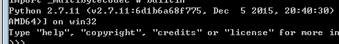
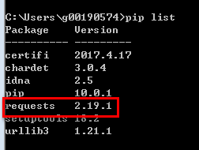

# Python 开发环境配置<a name="ocr_04_0030"></a>

## 操作场景<a name="section1560105320810"></a>

文字识别服务Python SDK支持Windows、Linux、Mac等操作系统。本节以Windows系统为例进行环境配置，要求的操作环境请参见[表1](#table129385511897)。

**表 1**  准备环境

<a name="table129385511897"></a>
<table><thead align="left"><tr id="row129391511996"><th class="cellrowborder" valign="top" width="40.02%" id="mcps1.2.3.1.1"><p id="p95932451011"><a name="p95932451011"></a><a name="p95932451011"></a>准备环境</p>
</th>
<th class="cellrowborder" valign="top" width="59.98%" id="mcps1.2.3.1.2"><p id="p1858114312102"><a name="p1858114312102"></a><a name="p1858114312102"></a>说明</p>
</th>
</tr>
</thead>
<tbody><tr id="row275091831015"><td class="cellrowborder" valign="top" width="40.02%" headers="mcps1.2.3.1.1 "><p id="p256912101317"><a name="p256912101317"></a><a name="p256912101317"></a>操作系统</p>
</td>
<td class="cellrowborder" valign="top" width="59.98%" headers="mcps1.2.3.1.2 "><p id="p35709231310"><a name="p35709231310"></a><a name="p35709231310"></a>Windows系统，推荐Windows 7及以上版本。</p>
</td>
</tr>
<tr id="row1093995110917"><td class="cellrowborder" valign="top" width="40.02%" headers="mcps1.2.3.1.1 "><p id="p057017221319"><a name="p057017221319"></a><a name="p057017221319"></a>安装Python</p>
</td>
<td class="cellrowborder" valign="top" width="59.98%" headers="mcps1.2.3.1.2 "><p id="p157217261311"><a name="p157217261311"></a><a name="p157217261311"></a>Python版本建议使用2.7及以上版本。</p>
</td>
</tr>
<tr id="row109392051892"><td class="cellrowborder" valign="top" width="40.02%" headers="mcps1.2.3.1.1 "><p id="p135728211132"><a name="p135728211132"></a><a name="p135728211132"></a>安装Python依赖库</p>
</td>
<td class="cellrowborder" valign="top" width="59.98%" headers="mcps1.2.3.1.2 "><p id="p0573152141313"><a name="p0573152141313"></a><a name="p0573152141313"></a>OCR Python SDK依赖第三方库requests 2.18.2包。</p>
</td>
</tr>
</tbody>
</table>

## 操作步骤<a name="section636542121215"></a>

以下步骤以win7环境配置Python 2.7为例，已配置好Python2.7及更高版本并且安装了requests 2.18.2包请跳过本章节。

1.  根据系统环境下载Python安装包：[https://www.python.org/downloads/release/python-2711/](https://www.python.org/downloads/release/python-2711/)。
2.  下载完成后按照提示安装，位置自选，默认位置为C:\\Python27。
3.  配置Python环境变量: 右键“计算机\>属性\>高级系统设置\>环境变量”，在path中添加C:\\Python27;C:\\Python27\\Scripts。
4.  打开命令行窗口，输入“python –v”，显示如[图1](#fig650192210132)表示配置成功。

    **图 1**  Python版本信息<a name="fig650192210132"></a>  
    

5.  通过PIP在线安装依赖包requests, 在新打开的CMD窗口执行如下命令。

    ```
    pip install -i https://pypi.tuna.tsinghua.edu.cn/simple requests --trusted-host https://pypi.tuna.tsinghua.edu.cn/simple
    ```

6.  安装完成后通过PIP命令确认requests正确安装，如[图2](#fig14644343191414)所示。

    **图 2**  requests安装确认<a name="fig14644343191414"></a>  
    


