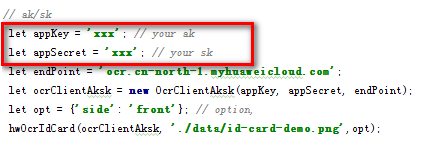
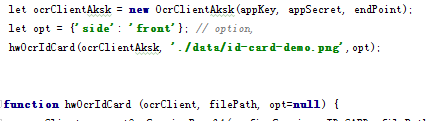
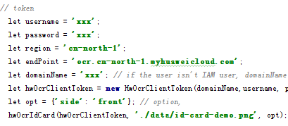

# 使用SDK（Node.js）<a name="ocr_04_0029"></a>

用户使用服务的认证方式有Token和AK/SK两种，获取认证消息请参考[认证鉴权](https://support.huaweicloud.com/api-ocr/ocr_03_0005.html)。本章节主要包含Token和AK/SK两种方式使用SDK进行示例说明。

在OCR SDK开发工具包地址：[https://developer.huaweicloud.com/sdk?OCR](https://developer.huaweicloud.com/sdk?OCR)，选择OCR Node.js SDK工具包下载并解压。

> **说明：**   
>用户首次使用需要先[申请开通](https://console.huaweicloud.com/ocr/?region=cn-north-4&locale=zh-cn#/ocr/management/main)该服务。（服务只需要开通一次即可，后面使用时无需再次申请。）  

## AK/SK认证方式<a name="section20574102575613"></a>

本节以身份证识别服务为例介绍如何以AK/SK认证方式使用SDK。

1.  获取AK/SK，具体步骤请参见[认证鉴权\>AK/SK认证](https://support.huaweicloud.com/api-ocr/ocr_03_0005.html#section1)。
2.  配置Node.js SDK的AK/SK。

    根据获取的AK/SK，修改Demo工程“demo.js”文件中“appKey”和“appSecret”的值，请参见[图1](#fig13304156387)。

    **图 1**  修改demo.js文件<a name="fig13304156387"></a>  
    

3.  如使用本地图片文件进行识别，修改demo.js文件参数为本地图片路径，请参见[图2](#fig58863658)。如使用SDK默认图片则不需要进行修改。

    **图 2**  Node.js SDK入参数据路径<a name="fig58863658"></a>  
    

4.  执行demo.js文件，控制台输出200即表示程序执行成功。身份证服务的结果可以采用json编辑器展示。

    ```
    {
        "result": {
            "name": "李蓝", 
            "sex": "女", 
            "ethnicity": "满", 
            "birth": "1990-01-24", 
            "address": "河北省承德市围场满族蒙古族自治县金车路", 
            "number": "389201199001245580"
        }
    }
    ```

    > **说明：**   
    >如想调用OCR其他识别服务，只需要把requestOcrServiceBase64函数的第一个参数改成对应的URI即可。URI列表请参见[表1 接口与API对应关系表](文字识别SDK简介.md#table47650414583)。  


## Token认证方式<a name="section10576225195619"></a>

本节以身份证识别服务为例介绍如何以Token认证方式使用SDK。

1.  打开demo.js文件，修改main函数中的username、password和domainName为系统中实际注册的用户名、密码和域名（如果用户为非IAM用户，域名与用户名一致），请参见[图3](#fig1796585814413)。

    **图 3**  修改demo.js文件中用户名、密码和域名<a name="fig1796585814413"></a>  
    

2.  直接执行相应代码，在控制台可看到使用Token方式身份证识别服务的识别结果。

